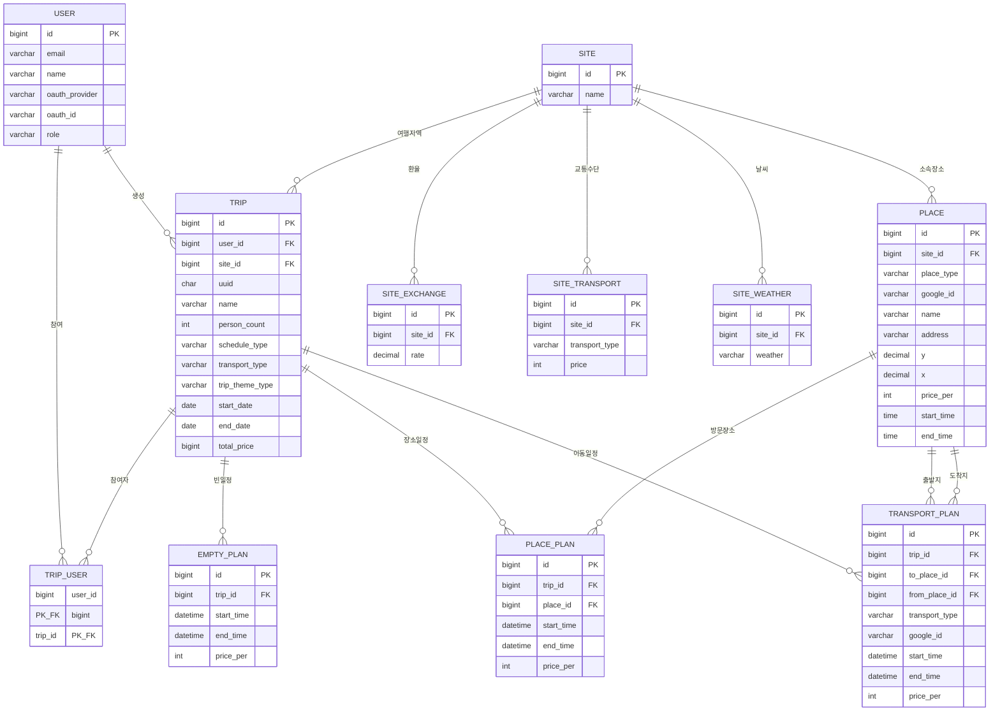

# ARUBI (NoDam) — AI 여행 플래너 백엔드

> 최소한의 정보 입력만으로 AI가 최적의 여행 일정을 자동으로 만들어주는 여행 플래너, **ARUBI**의 백엔드 서버입니다.

---

## 목차

- [프로젝트 소개](#프로젝트-소개)
- [주요 기능](#주요-기능)
- [기술 스택](#기술-스택)
- [ERD](#erd)
- [향후 개발 계획](#향후-개발-계획)
- [팀원](#팀원)

---

## 프로젝트 소개

여행을 준비할 때는 항공, 숙소, 관광지 정보를 각각 따로 검색해야 하는 번거로움이 있고, 그 정보를 모아 하나의 일정으로 엮어내는 과정에서 많은 시간과 심리적 피로가 발생합니다.

**ARUBI**는 이 문제를 해결하기 위해, 사용자가 지역·날짜·인원 등 최소한의 정보만 입력하면 AI가 검증된 장소 데이터를 바탕으로 동선까지 고려한 맞춤형 여행 일정을 자동으로 생성해주는 서비스입니다.

- 사용자는 필수 정보(지역, 날짜, 인원)와 선택 정보(여행 스타일, 예산, 항공/호텔 카테고리)를 입력합니다.
- AI가 날짜별로 지역을 배정하고, 검증된 장소 후보를 조회하여 가중치 기반으로 추천한 뒤, 동선과 시간을 최적화해 일정을 완성합니다.
- 완성된 일정은 사용자가 장소·이동 수단을 직접 추가/수정/삭제하며 자유롭게 편집할 수 있습니다.

---

## 주요 기능

### AI 여행 일정 자동 생성
- 지역 · 날짜 · 인원 등 필수 정보와 여행 스타일 · 예산 · 항공 · 호텔 등 선택 정보를 입력받아 여행 일정을 즉시 생성합니다.
- 날짜별 지역 배정 → 검증된 장소 후보 조회 → 가중치 기반 추천 → 동선/시간 최적화 순으로 일정을 구성합니다.
- 일정 중 장소를 변경하면 주변 장소를 다시 추천하고 이동 정보를 즉시 재계산합니다.

### 일정 관리
- 생성된 일정에 장소 일정(PlacePlan), 이동 수단 일정(TransportPlan)을 자유롭게 추가 · 순서 변경 · 삭제할 수 있습니다.
- 여행을 즐겨찾기(고정)하여 관리할 수 있습니다.

### 장소 추천 및 검색
- 좌표 기반으로 장소 정보를 저장하고, 여행 테마(음식 · 힐링 · 랜드마크 · 액티비티)에 맞는 장소를 추천합니다.

### 항공 · 숙소 정보 조회
- 항공편 정보를 조회합니다.
- 지역별 숙소 요금 정보를 조회합니다.

### 지역 정보 제공
- 여행 지역의 날씨, 원화 환율, 교통 수단별 평균 요금 정보를 제공합니다.

### 사용자 인증
- OAuth 기반 소셜 로그인 및 회원가입을 지원합니다.

---

## 기술 스택

| 구분 | 기술 |
|------|------|
| Language / Framework | Java 21, Spring Boot 3.5.7 |
| Security | Spring Security, JWT |
| Persistence | JPA (Hibernate), QueryDSL, MySQL 8.0 |
| Docs | Swagger (springdoc-openapi) |
| Test | JUnit, Mockito |
| AI | Google Gemini (2.5 Flash) |
| 외부 연동 | Google Places API, AirLabs API(항공), Xotelo API(숙소) |
| Infra / CI-CD | Docker, GitHub Actions, AWS EC2 |

---

## ERD

| 테이블 | 설명 |
|--------|------|
| `user` | 회원 정보 (OAuth 기반) |
| `site` | 여행 지역 정보 |
| `trip` | 여행(여행 일정의 단위) 정보 |
| `trip_user` | 한 여행에 참여하는 사용자 매핑 (다중 인원 여행 지원) |
| `place` | 좌표 기반 장소 정보 |
| `place_plan` | 여행에 배정된 장소 일정 |
| `transport_plan` | 장소 간 이동 일정 |
| `empty_plan` | 일정 중 비어있는 시간대 |
| `site_weather` | 지역 날씨 정보 |
| `site_exchange` | 지역 환율 정보 |
| `site_transport` | 지역 교통 수단별 평균 요금 정보 |

---

## 향후 개발 계획

- 실시간 위치 처리
- Trip 공유 및 실시간 공동 편집
- AI 일정 생성 속도 및 안정성 개선

---

## 팀원

**TEAM. NODAM**

| 이름 | 역할 |
|------|------|
| 최진솔 | Backend |
| 이권희 | Backend |
| 민도현 | Frontend |
| 육나윤 | Frontend |
