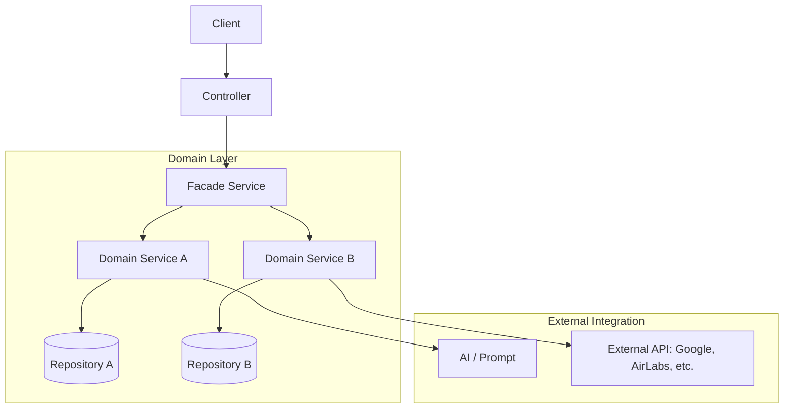

# NoDam Project Architecture

본 프로젝트는 **Facade + Domain Service Layered Architecture** 패턴을 따릅니다.
기존 `Architecture.md`에 정의된 원칙을 기반으로 시스템 구조를 설명합니다.

## 1. 계층 구조 (Layered Structure)

### 📂 Controller (Web Layer)
- **역할**: HTTP 요청/응답 처리 및 DTO 변환
- **규칙**: 오직 **Facade Service**만 호출하며, 비즈니스 로직을 포함하지 않습니다.

### 📂 Facade Service (Orchestration Layer)
- **역할**: 여러 도메인 서비스를 조합하여 하나의 기능을 완성 (비즈니스 흐름 제어)
- **규칙**: 로직 직접 수행 금지(위임만 수행), **Repository 직접 참조 금지**.

### 📂 Domain Service (Domain Layer)
- **역할**: 핵심 비즈니스 로직 수행 및 데이터 정합성 유지
- **규칙**: 자신의 도메인 **Repository**만 참조하며, 타 도메인과의 협력은 Facade를 통하거나 필요한 경우에만 제한적으로 수행합니다.

### 📂 Repository (Data Access Layer)
- **역할**: DB 접근 및 데이터 영속화 (Spring Data JPA 사용)

---

## 2. 컴포넌트 다이어그램

---

## 3. 도메인 모듈 구성

| 모듈 | 설명 |
| :--- | :--- |
| **ai** | AI 서비스 연동 및 프롬프트 관리 |
| **flight** | 항공권 정보 조회 (AirLabs API 연동) |
| **place** | 장소 정보 및 추천 (Google Maps API 연동) |
| **plan** | 여행 일정 생성, 관리, 경로 최적화 |
| **trip** | 여행 전체 메타데이터 관리 |
| **stay** | 숙박 정보 조회 (Xotelo API 연동) |
| **user** | 사용자 인증/인가 (OAuth2, JWT) |
| **weather** | 날씨 정보 연동 |
| **common** | 공통 예외 처리, 유틸리티, 상수 정의 |

---

## 4. 핵심 원칙 (Core Rules)

1. **단방향 의존성**: Controller → Facade → Domain Service → Repository 순서로 의존합니다.
2. **Facade의 순수성**: Facade는 "무엇을 할지(Flow)"만 결정하고, "어떻게 할지(Logic)"는 Domain Service가 담당합니다.
3. **도메인 격리**: 각 도메인 서비스는 독립적으로 테스트 가능해야 하며, 타 도메인의 Repository를 직접 주입받지 않습니다.
4. **결과 중심**: 비즈니스 로직의 결과물은 항상 도메인 모델 혹은 정제된 DTO 형태로 전달합니다.

## 섹션 3011 - 작업 기록

### 개요

작업 구역 301의 1번째 변경 내역입니다.

### 상세 내용

#### 1. 기능 설계 및 구조 정의

- 항목 1: 기능 설계 및 구조 정의 관련 세부 작업 내용 기술
- 항목 2: 기능 설계 및 구조 정의 관련 세부 작업 내용 기술
- 항목 3: 기능 설계 및 구조 정의 관련 세부 작업 내용 기술
- 항목 4: 기능 설계 및 구조 정의 관련 세부 작업 내용 기술
- 항목 5: 기능 설계 및 구조 정의 관련 세부 작업 내용 기술
- 항목 6: 기능 설계 및 구조 정의 관련 세부 작업 내용 기술
- 항목 7: 기능 설계 및 구조 정의 관련 세부 작업 내용 기술
- 항목 8: 기능 설계 및 구조 정의 관련 세부 작업 내용 기술
- 항목 9: 기능 설계 및 구조 정의 관련 세부 작업 내용 기술
- 항목 10: 기능 설계 및 구조 정의 관련 세부 작업 내용 기술
- 항목 11: 기능 설계 및 구조 정의 관련 세부 작업 내용 기술
- 항목 12: 기능 설계 및 구조 정의 관련 세부 작업 내용 기술
- 항목 13: 기능 설계 및 구조 정의 관련 세부 작업 내용 기술
- 항목 14: 기능 설계 및 구조 정의 관련 세부 작업 내용 기술
- 항목 15: 기능 설계 및 구조 정의 관련 세부 작업 내용 기술

#### 2. 도메인 모델 구성

- 항목 16: 도메인 모델 구성 관련 세부 작업 내용 기술
- 항목 17: 도메인 모델 구성 관련 세부 작업 내용 기술
- 항목 18: 도메인 모델 구성 관련 세부 작업 내용 기술
- 항목 19: 도메인 모델 구성 관련 세부 작업 내용 기술
- 항목 20: 도메인 모델 구성 관련 세부 작업 내용 기술
- 항목 21: 도메인 모델 구성 관련 세부 작업 내용 기술
- 항목 22: 도메인 모델 구성 관련 세부 작업 내용 기술
- 항목 23: 도메인 모델 구성 관련 세부 작업 내용 기술
- 항목 24: 도메인 모델 구성 관련 세부 작업 내용 기술
- 항목 25: 도메인 모델 구성 관련 세부 작업 내용 기술
- 항목 26: 도메인 모델 구성 관련 세부 작업 내용 기술
- 항목 27: 도메인 모델 구성 관련 세부 작업 내용 기술
- 항목 28: 도메인 모델 구성 관련 세부 작업 내용 기술
- 항목 29: 도메인 모델 구성 관련 세부 작업 내용 기술
- 항목 30: 도메인 모델 구성 관련 세부 작업 내용 기술

#### 3. 서비스 레이어 구현

- 항목 31: 서비스 레이어 구현 관련 세부 작업 내용 기술
- 항목 32: 서비스 레이어 구현 관련 세부 작업 내용 기술
- 항목 33: 서비스 레이어 구현 관련 세부 작업 내용 기술
- 항목 34: 서비스 레이어 구현 관련 세부 작업 내용 기술
- 항목 35: 서비스 레이어 구현 관련 세부 작업 내용 기술
- 항목 36: 서비스 레이어 구현 관련 세부 작업 내용 기술
- 항목 37: 서비스 레이어 구현 관련 세부 작업 내용 기술
- 항목 38: 서비스 레이어 구현 관련 세부 작업 내용 기술
- 항목 39: 서비스 레이어 구현 관련 세부 작업 내용 기술
- 항목 40: 서비스 레이어 구현 관련 세부 작업 내용 기술
- 항목 41: 서비스 레이어 구현 관련 세부 작업 내용 기술
- 항목 42: 서비스 레이어 구현 관련 세부 작업 내용 기술
- 항목 43: 서비스 레이어 구현 관련 세부 작업 내용 기술
- 항목 44: 서비스 레이어 구현 관련 세부 작업 내용 기술
- 항목 45: 서비스 레이어 구현 관련 세부 작업 내용 기술

#### 4. API 엔드포인트 작성

- 항목 46: API 엔드포인트 작성 관련 세부 작업 내용 기술
- 항목 47: API 엔드포인트 작성 관련 세부 작업 내용 기술
- 항목 48: API 엔드포인트 작성 관련 세부 작업 내용 기술
- 항목 49: API 엔드포인트 작성 관련 세부 작업 내용 기술
- 항목 50: API 엔드포인트 작성 관련 세부 작업 내용 기술
- 항목 51: API 엔드포인트 작성 관련 세부 작업 내용 기술
- 항목 52: API 엔드포인트 작성 관련 세부 작업 내용 기술
- 항목 53: API 엔드포인트 작성 관련 세부 작업 내용 기술
- 항목 54: API 엔드포인트 작성 관련 세부 작업 내용 기술
- 항목 55: API 엔드포인트 작성 관련 세부 작업 내용 기술
- 항목 56: API 엔드포인트 작성 관련 세부 작업 내용 기술
- 항목 57: API 엔드포인트 작성 관련 세부 작업 내용 기술
- 항목 58: API 엔드포인트 작성 관련 세부 작업 내용 기술
- 항목 59: API 엔드포인트 작성 관련 세부 작업 내용 기술
- 항목 60: API 엔드포인트 작성 관련 세부 작업 내용 기술

#### 5. 데이터베이스 연동

- 항목 61: 데이터베이스 연동 관련 세부 작업 내용 기술
- 항목 62: 데이터베이스 연동 관련 세부 작업 내용 기술
- 항목 63: 데이터베이스 연동 관련 세부 작업 내용 기술
- 항목 64: 데이터베이스 연동 관련 세부 작업 내용 기술
- 항목 65: 데이터베이스 연동 관련 세부 작업 내용 기술
- 항목 66: 데이터베이스 연동 관련 세부 작업 내용 기술
- 항목 67: 데이터베이스 연동 관련 세부 작업 내용 기술
- 항목 68: 데이터베이스 연동 관련 세부 작업 내용 기술
- 항목 69: 데이터베이스 연동 관련 세부 작업 내용 기술
- 항목 70: 데이터베이스 연동 관련 세부 작업 내용 기술
- 항목 71: 데이터베이스 연동 관련 세부 작업 내용 기술
- 항목 72: 데이터베이스 연동 관련 세부 작업 내용 기술
- 항목 73: 데이터베이스 연동 관련 세부 작업 내용 기술
- 항목 74: 데이터베이스 연동 관련 세부 작업 내용 기술
- 항목 75: 데이터베이스 연동 관련 세부 작업 내용 기술

#### 6. 예외 처리 추가

- 항목 76: 예외 처리 추가 관련 세부 작업 내용 기술
- 항목 77: 예외 처리 추가 관련 세부 작업 내용 기술
- 항목 78: 예외 처리 추가 관련 세부 작업 내용 기술
- 항목 79: 예외 처리 추가 관련 세부 작업 내용 기술
- 항목 80: 예외 처리 추가 관련 세부 작업 내용 기술
- 항목 81: 예외 처리 추가 관련 세부 작업 내용 기술
- 항목 82: 예외 처리 추가 관련 세부 작업 내용 기술
- 항목 83: 예외 처리 추가 관련 세부 작업 내용 기술
- 항목 84: 예외 처리 추가 관련 세부 작업 내용 기술
- 항목 85: 예외 처리 추가 관련 세부 작업 내용 기술
- 항목 86: 예외 처리 추가 관련 세부 작업 내용 기술
- 항목 87: 예외 처리 추가 관련 세부 작업 내용 기술
- 항목 88: 예외 처리 추가 관련 세부 작업 내용 기술
- 항목 89: 예외 처리 추가 관련 세부 작업 내용 기술
- 항목 90: 예외 처리 추가 관련 세부 작업 내용 기술

#### 7. 보안 설정 확인

- 항목 91: 보안 설정 확인 관련 세부 작업 내용 기술
- 항목 92: 보안 설정 확인 관련 세부 작업 내용 기술
- 항목 93: 보안 설정 확인 관련 세부 작업 내용 기술
- 항목 94: 보안 설정 확인 관련 세부 작업 내용 기술
- 항목 95: 보안 설정 확인 관련 세부 작업 내용 기술
- 항목 96: 보안 설정 확인 관련 세부 작업 내용 기술
- 항목 97: 보안 설정 확인 관련 세부 작업 내용 기술
- 항목 98: 보안 설정 확인 관련 세부 작업 내용 기술
- 항목 99: 보안 설정 확인 관련 세부 작업 내용 기술
- 항목 100: 보안 설정 확인 관련 세부 작업 내용 기술
- 항목 101: 보안 설정 확인 관련 세부 작업 내용 기술
- 항목 102: 보안 설정 확인 관련 세부 작업 내용 기술
- 항목 103: 보안 설정 확인 관련 세부 작업 내용 기술
- 항목 104: 보안 설정 확인 관련 세부 작업 내용 기술
- 항목 105: 보안 설정 확인 관련 세부 작업 내용 기술

#### 8. 성능 최적화

- 항목 106: 성능 최적화 관련 세부 작업 내용 기술
- 항목 107: 성능 최적화 관련 세부 작업 내용 기술
- 항목 108: 성능 최적화 관련 세부 작업 내용 기술
- 항목 109: 성능 최적화 관련 세부 작업 내용 기술
- 항목 110: 성능 최적화 관련 세부 작업 내용 기술
- 항목 111: 성능 최적화 관련 세부 작업 내용 기술
- 항목 112: 성능 최적화 관련 세부 작업 내용 기술
- 항목 113: 성능 최적화 관련 세부 작업 내용 기술
- 항목 114: 성능 최적화 관련 세부 작업 내용 기술
- 항목 115: 성능 최적화 관련 세부 작업 내용 기술
- 항목 116: 성능 최적화 관련 세부 작업 내용 기술
- 항목 117: 성능 최적화 관련 세부 작업 내용 기술
- 항목 118: 성능 최적화 관련 세부 작업 내용 기술
- 항목 119: 성능 최적화 관련 세부 작업 내용 기술
- 항목 120: 성능 최적화 관련 세부 작업 내용 기술

#### 9. 코드 리뷰 반영

- 항목 121: 코드 리뷰 반영 관련 세부 작업 내용 기술
- 항목 122: 코드 리뷰 반영 관련 세부 작업 내용 기술
- 항목 123: 코드 리뷰 반영 관련 세부 작업 내용 기술
- 항목 124: 코드 리뷰 반영 관련 세부 작업 내용 기술
- 항목 125: 코드 리뷰 반영 관련 세부 작업 내용 기술
- 항목 126: 코드 리뷰 반영 관련 세부 작업 내용 기술
- 항목 127: 코드 리뷰 반영 관련 세부 작업 내용 기술
- 항목 128: 코드 리뷰 반영 관련 세부 작업 내용 기술
- 항목 129: 코드 리뷰 반영 관련 세부 작업 내용 기술
- 항목 130: 코드 리뷰 반영 관련 세부 작업 내용 기술
- 항목 131: 코드 리뷰 반영 관련 세부 작업 내용 기술
- 항목 132: 코드 리뷰 반영 관련 세부 작업 내용 기술
- 항목 133: 코드 리뷰 반영 관련 세부 작업 내용 기술
- 항목 134: 코드 리뷰 반영 관련 세부 작업 내용 기술
- 항목 135: 코드 리뷰 반영 관련 세부 작업 내용 기술

#### 10. 문서화 업데이트

- 항목 136: 문서화 업데이트 관련 세부 작업 내용 기술
- 항목 137: 문서화 업데이트 관련 세부 작업 내용 기술
- 항목 138: 문서화 업데이트 관련 세부 작업 내용 기술
- 항목 139: 문서화 업데이트 관련 세부 작업 내용 기술
- 항목 140: 문서화 업데이트 관련 세부 작업 내용 기술
- 항목 141: 문서화 업데이트 관련 세부 작업 내용 기술
- 항목 142: 문서화 업데이트 관련 세부 작업 내용 기술
- 항목 143: 문서화 업데이트 관련 세부 작업 내용 기술
- 항목 144: 문서화 업데이트 관련 세부 작업 내용 기술
- 항목 145: 문서화 업데이트 관련 세부 작업 내용 기술
- 항목 146: 문서화 업데이트 관련 세부 작업 내용 기술
- 항목 147: 문서화 업데이트 관련 세부 작업 내용 기술
- 항목 148: 문서화 업데이트 관련 세부 작업 내용 기술
- 항목 149: 문서화 업데이트 관련 세부 작업 내용 기술
- 항목 150: 문서화 업데이트 관련 세부 작업 내용 기술

### 체크리스트

- [ ] 체크리스트 항목 1
- [ ] 체크리스트 항목 2
- [ ] 체크리스트 항목 3
- [ ] 체크리스트 항목 4
- [ ] 체크리스트 항목 5
- [ ] 체크리스트 항목 6
- [ ] 체크리스트 항목 7
- [ ] 체크리스트 항목 8
- [ ] 체크리스트 항목 9
- [ ] 체크리스트 항목 10
- [ ] 체크리스트 항목 11
- [ ] 체크리스트 항목 12
- [ ] 체크리스트 항목 13
- [ ] 체크리스트 항목 14
- [ ] 체크리스트 항목 15
- [ ] 체크리스트 항목 16
- [ ] 체크리스트 항목 17
- [ ] 체크리스트 항목 18
- [ ] 체크리스트 항목 19
- [ ] 체크리스트 항목 20

## 섹션 3012 - 작업 기록

### 개요

작업 구역 301의 2번째 변경 내역입니다.

### 상세 내용

#### 1. 기능 설계 및 구조 정의

- 항목 1: 기능 설계 및 구조 정의 관련 세부 작업 내용 기술
- 항목 2: 기능 설계 및 구조 정의 관련 세부 작업 내용 기술
- 항목 3: 기능 설계 및 구조 정의 관련 세부 작업 내용 기술
- 항목 4: 기능 설계 및 구조 정의 관련 세부 작업 내용 기술
- 항목 5: 기능 설계 및 구조 정의 관련 세부 작업 내용 기술
- 항목 6: 기능 설계 및 구조 정의 관련 세부 작업 내용 기술
- 항목 7: 기능 설계 및 구조 정의 관련 세부 작업 내용 기술
- 항목 8: 기능 설계 및 구조 정의 관련 세부 작업 내용 기술
- 항목 9: 기능 설계 및 구조 정의 관련 세부 작업 내용 기술
- 항목 10: 기능 설계 및 구조 정의 관련 세부 작업 내용 기술
- 항목 11: 기능 설계 및 구조 정의 관련 세부 작업 내용 기술
- 항목 12: 기능 설계 및 구조 정의 관련 세부 작업 내용 기술
- 항목 13: 기능 설계 및 구조 정의 관련 세부 작업 내용 기술
- 항목 14: 기능 설계 및 구조 정의 관련 세부 작업 내용 기술
- 항목 15: 기능 설계 및 구조 정의 관련 세부 작업 내용 기술

#### 2. 도메인 모델 구성

- 항목 16: 도메인 모델 구성 관련 세부 작업 내용 기술
- 항목 17: 도메인 모델 구성 관련 세부 작업 내용 기술
- 항목 18: 도메인 모델 구성 관련 세부 작업 내용 기술
- 항목 19: 도메인 모델 구성 관련 세부 작업 내용 기술
- 항목 20: 도메인 모델 구성 관련 세부 작업 내용 기술
- 항목 21: 도메인 모델 구성 관련 세부 작업 내용 기술
- 항목 22: 도메인 모델 구성 관련 세부 작업 내용 기술
- 항목 23: 도메인 모델 구성 관련 세부 작업 내용 기술
- 항목 24: 도메인 모델 구성 관련 세부 작업 내용 기술
- 항목 25: 도메인 모델 구성 관련 세부 작업 내용 기술
- 항목 26: 도메인 모델 구성 관련 세부 작업 내용 기술
- 항목 27: 도메인 모델 구성 관련 세부 작업 내용 기술
- 항목 28: 도메인 모델 구성 관련 세부 작업 내용 기술
- 항목 29: 도메인 모델 구성 관련 세부 작업 내용 기술
- 항목 30: 도메인 모델 구성 관련 세부 작업 내용 기술

#### 3. 서비스 레이어 구현

- 항목 31: 서비스 레이어 구현 관련 세부 작업 내용 기술
- 항목 32: 서비스 레이어 구현 관련 세부 작업 내용 기술
- 항목 33: 서비스 레이어 구현 관련 세부 작업 내용 기술
- 항목 34: 서비스 레이어 구현 관련 세부 작업 내용 기술
- 항목 35: 서비스 레이어 구현 관련 세부 작업 내용 기술
- 항목 36: 서비스 레이어 구현 관련 세부 작업 내용 기술
- 항목 37: 서비스 레이어 구현 관련 세부 작업 내용 기술
- 항목 38: 서비스 레이어 구현 관련 세부 작업 내용 기술
- 항목 39: 서비스 레이어 구현 관련 세부 작업 내용 기술
- 항목 40: 서비스 레이어 구현 관련 세부 작업 내용 기술
- 항목 41: 서비스 레이어 구현 관련 세부 작업 내용 기술
- 항목 42: 서비스 레이어 구현 관련 세부 작업 내용 기술
- 항목 43: 서비스 레이어 구현 관련 세부 작업 내용 기술
- 항목 44: 서비스 레이어 구현 관련 세부 작업 내용 기술
- 항목 45: 서비스 레이어 구현 관련 세부 작업 내용 기술

#### 4. API 엔드포인트 작성

- 항목 46: API 엔드포인트 작성 관련 세부 작업 내용 기술
- 항목 47: API 엔드포인트 작성 관련 세부 작업 내용 기술
- 항목 48: API 엔드포인트 작성 관련 세부 작업 내용 기술
- 항목 49: API 엔드포인트 작성 관련 세부 작업 내용 기술
- 항목 50: API 엔드포인트 작성 관련 세부 작업 내용 기술
- 항목 51: API 엔드포인트 작성 관련 세부 작업 내용 기술
- 항목 52: API 엔드포인트 작성 관련 세부 작업 내용 기술
- 항목 53: API 엔드포인트 작성 관련 세부 작업 내용 기술
- 항목 54: API 엔드포인트 작성 관련 세부 작업 내용 기술
- 항목 55: API 엔드포인트 작성 관련 세부 작업 내용 기술
- 항목 56: API 엔드포인트 작성 관련 세부 작업 내용 기술
- 항목 57: API 엔드포인트 작성 관련 세부 작업 내용 기술
- 항목 58: API 엔드포인트 작성 관련 세부 작업 내용 기술
- 항목 59: API 엔드포인트 작성 관련 세부 작업 내용 기술
- 항목 60: API 엔드포인트 작성 관련 세부 작업 내용 기술

#### 5. 데이터베이스 연동

- 항목 61: 데이터베이스 연동 관련 세부 작업 내용 기술
- 항목 62: 데이터베이스 연동 관련 세부 작업 내용 기술
- 항목 63: 데이터베이스 연동 관련 세부 작업 내용 기술
- 항목 64: 데이터베이스 연동 관련 세부 작업 내용 기술
- 항목 65: 데이터베이스 연동 관련 세부 작업 내용 기술
- 항목 66: 데이터베이스 연동 관련 세부 작업 내용 기술
- 항목 67: 데이터베이스 연동 관련 세부 작업 내용 기술
- 항목 68: 데이터베이스 연동 관련 세부 작업 내용 기술
- 항목 69: 데이터베이스 연동 관련 세부 작업 내용 기술
- 항목 70: 데이터베이스 연동 관련 세부 작업 내용 기술
- 항목 71: 데이터베이스 연동 관련 세부 작업 내용 기술
- 항목 72: 데이터베이스 연동 관련 세부 작업 내용 기술
- 항목 73: 데이터베이스 연동 관련 세부 작업 내용 기술
- 항목 74: 데이터베이스 연동 관련 세부 작업 내용 기술
- 항목 75: 데이터베이스 연동 관련 세부 작업 내용 기술

#### 6. 예외 처리 추가

- 항목 76: 예외 처리 추가 관련 세부 작업 내용 기술
- 항목 77: 예외 처리 추가 관련 세부 작업 내용 기술
- 항목 78: 예외 처리 추가 관련 세부 작업 내용 기술
- 항목 79: 예외 처리 추가 관련 세부 작업 내용 기술
- 항목 80: 예외 처리 추가 관련 세부 작업 내용 기술
- 항목 81: 예외 처리 추가 관련 세부 작업 내용 기술
- 항목 82: 예외 처리 추가 관련 세부 작업 내용 기술
- 항목 83: 예외 처리 추가 관련 세부 작업 내용 기술
- 항목 84: 예외 처리 추가 관련 세부 작업 내용 기술
- 항목 85: 예외 처리 추가 관련 세부 작업 내용 기술
- 항목 86: 예외 처리 추가 관련 세부 작업 내용 기술
- 항목 87: 예외 처리 추가 관련 세부 작업 내용 기술
- 항목 88: 예외 처리 추가 관련 세부 작업 내용 기술
- 항목 89: 예외 처리 추가 관련 세부 작업 내용 기술
- 항목 90: 예외 처리 추가 관련 세부 작업 내용 기술

#### 7. 보안 설정 확인

- 항목 91: 보안 설정 확인 관련 세부 작업 내용 기술
- 항목 92: 보안 설정 확인 관련 세부 작업 내용 기술
- 항목 93: 보안 설정 확인 관련 세부 작업 내용 기술
- 항목 94: 보안 설정 확인 관련 세부 작업 내용 기술
- 항목 95: 보안 설정 확인 관련 세부 작업 내용 기술
- 항목 96: 보안 설정 확인 관련 세부 작업 내용 기술
- 항목 97: 보안 설정 확인 관련 세부 작업 내용 기술
- 항목 98: 보안 설정 확인 관련 세부 작업 내용 기술
- 항목 99: 보안 설정 확인 관련 세부 작업 내용 기술
- 항목 100: 보안 설정 확인 관련 세부 작업 내용 기술
- 항목 101: 보안 설정 확인 관련 세부 작업 내용 기술
- 항목 102: 보안 설정 확인 관련 세부 작업 내용 기술
- 항목 103: 보안 설정 확인 관련 세부 작업 내용 기술
- 항목 104: 보안 설정 확인 관련 세부 작업 내용 기술
- 항목 105: 보안 설정 확인 관련 세부 작업 내용 기술

#### 8. 성능 최적화

- 항목 106: 성능 최적화 관련 세부 작업 내용 기술
- 항목 107: 성능 최적화 관련 세부 작업 내용 기술
- 항목 108: 성능 최적화 관련 세부 작업 내용 기술
- 항목 109: 성능 최적화 관련 세부 작업 내용 기술
- 항목 110: 성능 최적화 관련 세부 작업 내용 기술
- 항목 111: 성능 최적화 관련 세부 작업 내용 기술
- 항목 112: 성능 최적화 관련 세부 작업 내용 기술
- 항목 113: 성능 최적화 관련 세부 작업 내용 기술
- 항목 114: 성능 최적화 관련 세부 작업 내용 기술
- 항목 115: 성능 최적화 관련 세부 작업 내용 기술
- 항목 116: 성능 최적화 관련 세부 작업 내용 기술
- 항목 117: 성능 최적화 관련 세부 작업 내용 기술
- 항목 118: 성능 최적화 관련 세부 작업 내용 기술
- 항목 119: 성능 최적화 관련 세부 작업 내용 기술
- 항목 120: 성능 최적화 관련 세부 작업 내용 기술

#### 9. 코드 리뷰 반영

- 항목 121: 코드 리뷰 반영 관련 세부 작업 내용 기술
- 항목 122: 코드 리뷰 반영 관련 세부 작업 내용 기술
- 항목 123: 코드 리뷰 반영 관련 세부 작업 내용 기술
- 항목 124: 코드 리뷰 반영 관련 세부 작업 내용 기술
- 항목 125: 코드 리뷰 반영 관련 세부 작업 내용 기술
- 항목 126: 코드 리뷰 반영 관련 세부 작업 내용 기술
- 항목 127: 코드 리뷰 반영 관련 세부 작업 내용 기술
- 항목 128: 코드 리뷰 반영 관련 세부 작업 내용 기술
- 항목 129: 코드 리뷰 반영 관련 세부 작업 내용 기술
- 항목 130: 코드 리뷰 반영 관련 세부 작업 내용 기술
- 항목 131: 코드 리뷰 반영 관련 세부 작업 내용 기술
- 항목 132: 코드 리뷰 반영 관련 세부 작업 내용 기술
- 항목 133: 코드 리뷰 반영 관련 세부 작업 내용 기술
- 항목 134: 코드 리뷰 반영 관련 세부 작업 내용 기술
- 항목 135: 코드 리뷰 반영 관련 세부 작업 내용 기술

#### 10. 문서화 업데이트

- 항목 136: 문서화 업데이트 관련 세부 작업 내용 기술
- 항목 137: 문서화 업데이트 관련 세부 작업 내용 기술
- 항목 138: 문서화 업데이트 관련 세부 작업 내용 기술
- 항목 139: 문서화 업데이트 관련 세부 작업 내용 기술
- 항목 140: 문서화 업데이트 관련 세부 작업 내용 기술
- 항목 141: 문서화 업데이트 관련 세부 작업 내용 기술
- 항목 142: 문서화 업데이트 관련 세부 작업 내용 기술
- 항목 143: 문서화 업데이트 관련 세부 작업 내용 기술
- 항목 144: 문서화 업데이트 관련 세부 작업 내용 기술
- 항목 145: 문서화 업데이트 관련 세부 작업 내용 기술
- 항목 146: 문서화 업데이트 관련 세부 작업 내용 기술
- 항목 147: 문서화 업데이트 관련 세부 작업 내용 기술
- 항목 148: 문서화 업데이트 관련 세부 작업 내용 기술
- 항목 149: 문서화 업데이트 관련 세부 작업 내용 기술
- 항목 150: 문서화 업데이트 관련 세부 작업 내용 기술

### 체크리스트

- [ ] 체크리스트 항목 1
- [ ] 체크리스트 항목 2
- [ ] 체크리스트 항목 3
- [ ] 체크리스트 항목 4
- [ ] 체크리스트 항목 5
- [ ] 체크리스트 항목 6
- [ ] 체크리스트 항목 7
- [ ] 체크리스트 항목 8
- [ ] 체크리스트 항목 9
- [ ] 체크리스트 항목 10
- [ ] 체크리스트 항목 11
- [ ] 체크리스트 항목 12
- [ ] 체크리스트 항목 13
- [ ] 체크리스트 항목 14
- [ ] 체크리스트 항목 15
- [ ] 체크리스트 항목 16
- [ ] 체크리스트 항목 17
- [ ] 체크리스트 항목 18
- [ ] 체크리스트 항목 19
- [ ] 체크리스트 항목 20

## 섹션 3013 - 작업 기록

### 개요

작업 구역 301의 3번째 변경 내역입니다.

### 상세 내용

#### 1. 기능 설계 및 구조 정의

- 항목 1: 기능 설계 및 구조 정의 관련 세부 작업 내용 기술
- 항목 2: 기능 설계 및 구조 정의 관련 세부 작업 내용 기술
- 항목 3: 기능 설계 및 구조 정의 관련 세부 작업 내용 기술
- 항목 4: 기능 설계 및 구조 정의 관련 세부 작업 내용 기술
- 항목 5: 기능 설계 및 구조 정의 관련 세부 작업 내용 기술
- 항목 6: 기능 설계 및 구조 정의 관련 세부 작업 내용 기술
- 항목 7: 기능 설계 및 구조 정의 관련 세부 작업 내용 기술
- 항목 8: 기능 설계 및 구조 정의 관련 세부 작업 내용 기술
- 항목 9: 기능 설계 및 구조 정의 관련 세부 작업 내용 기술
- 항목 10: 기능 설계 및 구조 정의 관련 세부 작업 내용 기술
- 항목 11: 기능 설계 및 구조 정의 관련 세부 작업 내용 기술
- 항목 12: 기능 설계 및 구조 정의 관련 세부 작업 내용 기술
- 항목 13: 기능 설계 및 구조 정의 관련 세부 작업 내용 기술
- 항목 14: 기능 설계 및 구조 정의 관련 세부 작업 내용 기술
- 항목 15: 기능 설계 및 구조 정의 관련 세부 작업 내용 기술

#### 2. 도메인 모델 구성

- 항목 16: 도메인 모델 구성 관련 세부 작업 내용 기술
- 항목 17: 도메인 모델 구성 관련 세부 작업 내용 기술
- 항목 18: 도메인 모델 구성 관련 세부 작업 내용 기술
- 항목 19: 도메인 모델 구성 관련 세부 작업 내용 기술
- 항목 20: 도메인 모델 구성 관련 세부 작업 내용 기술
- 항목 21: 도메인 모델 구성 관련 세부 작업 내용 기술
- 항목 22: 도메인 모델 구성 관련 세부 작업 내용 기술
- 항목 23: 도메인 모델 구성 관련 세부 작업 내용 기술
- 항목 24: 도메인 모델 구성 관련 세부 작업 내용 기술
- 항목 25: 도메인 모델 구성 관련 세부 작업 내용 기술
- 항목 26: 도메인 모델 구성 관련 세부 작업 내용 기술
- 항목 27: 도메인 모델 구성 관련 세부 작업 내용 기술
- 항목 28: 도메인 모델 구성 관련 세부 작업 내용 기술
- 항목 29: 도메인 모델 구성 관련 세부 작업 내용 기술
- 항목 30: 도메인 모델 구성 관련 세부 작업 내용 기술

#### 3. 서비스 레이어 구현

- 항목 31: 서비스 레이어 구현 관련 세부 작업 내용 기술
- 항목 32: 서비스 레이어 구현 관련 세부 작업 내용 기술
- 항목 33: 서비스 레이어 구현 관련 세부 작업 내용 기술
- 항목 34: 서비스 레이어 구현 관련 세부 작업 내용 기술
- 항목 35: 서비스 레이어 구현 관련 세부 작업 내용 기술
- 항목 36: 서비스 레이어 구현 관련 세부 작업 내용 기술
- 항목 37: 서비스 레이어 구현 관련 세부 작업 내용 기술
- 항목 38: 서비스 레이어 구현 관련 세부 작업 내용 기술
- 항목 39: 서비스 레이어 구현 관련 세부 작업 내용 기술
- 항목 40: 서비스 레이어 구현 관련 세부 작업 내용 기술
- 항목 41: 서비스 레이어 구현 관련 세부 작업 내용 기술
- 항목 42: 서비스 레이어 구현 관련 세부 작업 내용 기술
- 항목 43: 서비스 레이어 구현 관련 세부 작업 내용 기술
- 항목 44: 서비스 레이어 구현 관련 세부 작업 내용 기술
- 항목 45: 서비스 레이어 구현 관련 세부 작업 내용 기술

#### 4. API 엔드포인트 작성

- 항목 46: API 엔드포인트 작성 관련 세부 작업 내용 기술
- 항목 47: API 엔드포인트 작성 관련 세부 작업 내용 기술
- 항목 48: API 엔드포인트 작성 관련 세부 작업 내용 기술
- 항목 49: API 엔드포인트 작성 관련 세부 작업 내용 기술
- 항목 50: API 엔드포인트 작성 관련 세부 작업 내용 기술
- 항목 51: API 엔드포인트 작성 관련 세부 작업 내용 기술
- 항목 52: API 엔드포인트 작성 관련 세부 작업 내용 기술
- 항목 53: API 엔드포인트 작성 관련 세부 작업 내용 기술
- 항목 54: API 엔드포인트 작성 관련 세부 작업 내용 기술
- 항목 55: API 엔드포인트 작성 관련 세부 작업 내용 기술
- 항목 56: API 엔드포인트 작성 관련 세부 작업 내용 기술
- 항목 57: API 엔드포인트 작성 관련 세부 작업 내용 기술
- 항목 58: API 엔드포인트 작성 관련 세부 작업 내용 기술
- 항목 59: API 엔드포인트 작성 관련 세부 작업 내용 기술
- 항목 60: API 엔드포인트 작성 관련 세부 작업 내용 기술

#### 5. 데이터베이스 연동

- 항목 61: 데이터베이스 연동 관련 세부 작업 내용 기술
- 항목 62: 데이터베이스 연동 관련 세부 작업 내용 기술
- 항목 63: 데이터베이스 연동 관련 세부 작업 내용 기술
- 항목 64: 데이터베이스 연동 관련 세부 작업 내용 기술
- 항목 65: 데이터베이스 연동 관련 세부 작업 내용 기술
- 항목 66: 데이터베이스 연동 관련 세부 작업 내용 기술
- 항목 67: 데이터베이스 연동 관련 세부 작업 내용 기술
- 항목 68: 데이터베이스 연동 관련 세부 작업 내용 기술
- 항목 69: 데이터베이스 연동 관련 세부 작업 내용 기술
- 항목 70: 데이터베이스 연동 관련 세부 작업 내용 기술
- 항목 71: 데이터베이스 연동 관련 세부 작업 내용 기술
- 항목 72: 데이터베이스 연동 관련 세부 작업 내용 기술
- 항목 73: 데이터베이스 연동 관련 세부 작업 내용 기술
- 항목 74: 데이터베이스 연동 관련 세부 작업 내용 기술
- 항목 75: 데이터베이스 연동 관련 세부 작업 내용 기술

#### 6. 예외 처리 추가

- 항목 76: 예외 처리 추가 관련 세부 작업 내용 기술
- 항목 77: 예외 처리 추가 관련 세부 작업 내용 기술
- 항목 78: 예외 처리 추가 관련 세부 작업 내용 기술
- 항목 79: 예외 처리 추가 관련 세부 작업 내용 기술
- 항목 80: 예외 처리 추가 관련 세부 작업 내용 기술
- 항목 81: 예외 처리 추가 관련 세부 작업 내용 기술
- 항목 82: 예외 처리 추가 관련 세부 작업 내용 기술
- 항목 83: 예외 처리 추가 관련 세부 작업 내용 기술
- 항목 84: 예외 처리 추가 관련 세부 작업 내용 기술
- 항목 85: 예외 처리 추가 관련 세부 작업 내용 기술
- 항목 86: 예외 처리 추가 관련 세부 작업 내용 기술
- 항목 87: 예외 처리 추가 관련 세부 작업 내용 기술
- 항목 88: 예외 처리 추가 관련 세부 작업 내용 기술
- 항목 89: 예외 처리 추가 관련 세부 작업 내용 기술
- 항목 90: 예외 처리 추가 관련 세부 작업 내용 기술

#### 7. 보안 설정 확인

- 항목 91: 보안 설정 확인 관련 세부 작업 내용 기술
- 항목 92: 보안 설정 확인 관련 세부 작업 내용 기술
- 항목 93: 보안 설정 확인 관련 세부 작업 내용 기술
- 항목 94: 보안 설정 확인 관련 세부 작업 내용 기술
- 항목 95: 보안 설정 확인 관련 세부 작업 내용 기술
- 항목 96: 보안 설정 확인 관련 세부 작업 내용 기술
- 항목 97: 보안 설정 확인 관련 세부 작업 내용 기술
- 항목 98: 보안 설정 확인 관련 세부 작업 내용 기술
- 항목 99: 보안 설정 확인 관련 세부 작업 내용 기술
- 항목 100: 보안 설정 확인 관련 세부 작업 내용 기술
- 항목 101: 보안 설정 확인 관련 세부 작업 내용 기술
- 항목 102: 보안 설정 확인 관련 세부 작업 내용 기술
- 항목 103: 보안 설정 확인 관련 세부 작업 내용 기술
- 항목 104: 보안 설정 확인 관련 세부 작업 내용 기술
- 항목 105: 보안 설정 확인 관련 세부 작업 내용 기술

#### 8. 성능 최적화

- 항목 106: 성능 최적화 관련 세부 작업 내용 기술
- 항목 107: 성능 최적화 관련 세부 작업 내용 기술
- 항목 108: 성능 최적화 관련 세부 작업 내용 기술
- 항목 109: 성능 최적화 관련 세부 작업 내용 기술
- 항목 110: 성능 최적화 관련 세부 작업 내용 기술
- 항목 111: 성능 최적화 관련 세부 작업 내용 기술
- 항목 112: 성능 최적화 관련 세부 작업 내용 기술
- 항목 113: 성능 최적화 관련 세부 작업 내용 기술
- 항목 114: 성능 최적화 관련 세부 작업 내용 기술
- 항목 115: 성능 최적화 관련 세부 작업 내용 기술
- 항목 116: 성능 최적화 관련 세부 작업 내용 기술
- 항목 117: 성능 최적화 관련 세부 작업 내용 기술
- 항목 118: 성능 최적화 관련 세부 작업 내용 기술
- 항목 119: 성능 최적화 관련 세부 작업 내용 기술
- 항목 120: 성능 최적화 관련 세부 작업 내용 기술

#### 9. 코드 리뷰 반영

- 항목 121: 코드 리뷰 반영 관련 세부 작업 내용 기술
- 항목 122: 코드 리뷰 반영 관련 세부 작업 내용 기술
- 항목 123: 코드 리뷰 반영 관련 세부 작업 내용 기술
- 항목 124: 코드 리뷰 반영 관련 세부 작업 내용 기술
- 항목 125: 코드 리뷰 반영 관련 세부 작업 내용 기술
- 항목 126: 코드 리뷰 반영 관련 세부 작업 내용 기술
- 항목 127: 코드 리뷰 반영 관련 세부 작업 내용 기술
- 항목 128: 코드 리뷰 반영 관련 세부 작업 내용 기술
- 항목 129: 코드 리뷰 반영 관련 세부 작업 내용 기술
- 항목 130: 코드 리뷰 반영 관련 세부 작업 내용 기술
- 항목 131: 코드 리뷰 반영 관련 세부 작업 내용 기술
- 항목 132: 코드 리뷰 반영 관련 세부 작업 내용 기술
- 항목 133: 코드 리뷰 반영 관련 세부 작업 내용 기술
- 항목 134: 코드 리뷰 반영 관련 세부 작업 내용 기술
- 항목 135: 코드 리뷰 반영 관련 세부 작업 내용 기술

#### 10. 문서화 업데이트

- 항목 136: 문서화 업데이트 관련 세부 작업 내용 기술
- 항목 137: 문서화 업데이트 관련 세부 작업 내용 기술
- 항목 138: 문서화 업데이트 관련 세부 작업 내용 기술
- 항목 139: 문서화 업데이트 관련 세부 작업 내용 기술
- 항목 140: 문서화 업데이트 관련 세부 작업 내용 기술
- 항목 141: 문서화 업데이트 관련 세부 작업 내용 기술
- 항목 142: 문서화 업데이트 관련 세부 작업 내용 기술
- 항목 143: 문서화 업데이트 관련 세부 작업 내용 기술
- 항목 144: 문서화 업데이트 관련 세부 작업 내용 기술
- 항목 145: 문서화 업데이트 관련 세부 작업 내용 기술
- 항목 146: 문서화 업데이트 관련 세부 작업 내용 기술
- 항목 147: 문서화 업데이트 관련 세부 작업 내용 기술
- 항목 148: 문서화 업데이트 관련 세부 작업 내용 기술
- 항목 149: 문서화 업데이트 관련 세부 작업 내용 기술
- 항목 150: 문서화 업데이트 관련 세부 작업 내용 기술

### 체크리스트

- [ ] 체크리스트 항목 1
- [ ] 체크리스트 항목 2
- [ ] 체크리스트 항목 3
- [ ] 체크리스트 항목 4
- [ ] 체크리스트 항목 5
- [ ] 체크리스트 항목 6
- [ ] 체크리스트 항목 7
- [ ] 체크리스트 항목 8
- [ ] 체크리스트 항목 9
- [ ] 체크리스트 항목 10
- [ ] 체크리스트 항목 11
- [ ] 체크리스트 항목 12
- [ ] 체크리스트 항목 13
- [ ] 체크리스트 항목 14
- [ ] 체크리스트 항목 15
- [ ] 체크리스트 항목 16
- [ ] 체크리스트 항목 17
- [ ] 체크리스트 항목 18
- [ ] 체크리스트 항목 19
- [ ] 체크리스트 항목 20

## 섹션 3014 - 작업 기록

### 개요

작업 구역 301의 4번째 변경 내역입니다.

### 상세 내용

#### 1. 기능 설계 및 구조 정의

- 항목 1: 기능 설계 및 구조 정의 관련 세부 작업 내용 기술
- 항목 2: 기능 설계 및 구조 정의 관련 세부 작업 내용 기술
- 항목 3: 기능 설계 및 구조 정의 관련 세부 작업 내용 기술
- 항목 4: 기능 설계 및 구조 정의 관련 세부 작업 내용 기술
- 항목 5: 기능 설계 및 구조 정의 관련 세부 작업 내용 기술
- 항목 6: 기능 설계 및 구조 정의 관련 세부 작업 내용 기술
- 항목 7: 기능 설계 및 구조 정의 관련 세부 작업 내용 기술
- 항목 8: 기능 설계 및 구조 정의 관련 세부 작업 내용 기술
- 항목 9: 기능 설계 및 구조 정의 관련 세부 작업 내용 기술
- 항목 10: 기능 설계 및 구조 정의 관련 세부 작업 내용 기술
- 항목 11: 기능 설계 및 구조 정의 관련 세부 작업 내용 기술
- 항목 12: 기능 설계 및 구조 정의 관련 세부 작업 내용 기술
- 항목 13: 기능 설계 및 구조 정의 관련 세부 작업 내용 기술
- 항목 14: 기능 설계 및 구조 정의 관련 세부 작업 내용 기술
- 항목 15: 기능 설계 및 구조 정의 관련 세부 작업 내용 기술

#### 2. 도메인 모델 구성

- 항목 16: 도메인 모델 구성 관련 세부 작업 내용 기술
- 항목 17: 도메인 모델 구성 관련 세부 작업 내용 기술
- 항목 18: 도메인 모델 구성 관련 세부 작업 내용 기술
- 항목 19: 도메인 모델 구성 관련 세부 작업 내용 기술
- 항목 20: 도메인 모델 구성 관련 세부 작업 내용 기술
- 항목 21: 도메인 모델 구성 관련 세부 작업 내용 기술
- 항목 22: 도메인 모델 구성 관련 세부 작업 내용 기술
- 항목 23: 도메인 모델 구성 관련 세부 작업 내용 기술
- 항목 24: 도메인 모델 구성 관련 세부 작업 내용 기술
- 항목 25: 도메인 모델 구성 관련 세부 작업 내용 기술
- 항목 26: 도메인 모델 구성 관련 세부 작업 내용 기술
- 항목 27: 도메인 모델 구성 관련 세부 작업 내용 기술
- 항목 28: 도메인 모델 구성 관련 세부 작업 내용 기술
- 항목 29: 도메인 모델 구성 관련 세부 작업 내용 기술
- 항목 30: 도메인 모델 구성 관련 세부 작업 내용 기술

#### 3. 서비스 레이어 구현

- 항목 31: 서비스 레이어 구현 관련 세부 작업 내용 기술
- 항목 32: 서비스 레이어 구현 관련 세부 작업 내용 기술
- 항목 33: 서비스 레이어 구현 관련 세부 작업 내용 기술
- 항목 34: 서비스 레이어 구현 관련 세부 작업 내용 기술
- 항목 35: 서비스 레이어 구현 관련 세부 작업 내용 기술
- 항목 36: 서비스 레이어 구현 관련 세부 작업 내용 기술
- 항목 37: 서비스 레이어 구현 관련 세부 작업 내용 기술
- 항목 38: 서비스 레이어 구현 관련 세부 작업 내용 기술
- 항목 39: 서비스 레이어 구현 관련 세부 작업 내용 기술
- 항목 40: 서비스 레이어 구현 관련 세부 작업 내용 기술
- 항목 41: 서비스 레이어 구현 관련 세부 작업 내용 기술
- 항목 42: 서비스 레이어 구현 관련 세부 작업 내용 기술
- 항목 43: 서비스 레이어 구현 관련 세부 작업 내용 기술
- 항목 44: 서비스 레이어 구현 관련 세부 작업 내용 기술
- 항목 45: 서비스 레이어 구현 관련 세부 작업 내용 기술

#### 4. API 엔드포인트 작성

- 항목 46: API 엔드포인트 작성 관련 세부 작업 내용 기술
- 항목 47: API 엔드포인트 작성 관련 세부 작업 내용 기술
- 항목 48: API 엔드포인트 작성 관련 세부 작업 내용 기술
- 항목 49: API 엔드포인트 작성 관련 세부 작업 내용 기술
- 항목 50: API 엔드포인트 작성 관련 세부 작업 내용 기술
- 항목 51: API 엔드포인트 작성 관련 세부 작업 내용 기술
- 항목 52: API 엔드포인트 작성 관련 세부 작업 내용 기술
- 항목 53: API 엔드포인트 작성 관련 세부 작업 내용 기술
- 항목 54: API 엔드포인트 작성 관련 세부 작업 내용 기술
- 항목 55: API 엔드포인트 작성 관련 세부 작업 내용 기술
- 항목 56: API 엔드포인트 작성 관련 세부 작업 내용 기술
- 항목 57: API 엔드포인트 작성 관련 세부 작업 내용 기술
- 항목 58: API 엔드포인트 작성 관련 세부 작업 내용 기술
- 항목 59: API 엔드포인트 작성 관련 세부 작업 내용 기술
- 항목 60: API 엔드포인트 작성 관련 세부 작업 내용 기술

#### 5. 데이터베이스 연동

- 항목 61: 데이터베이스 연동 관련 세부 작업 내용 기술
- 항목 62: 데이터베이스 연동 관련 세부 작업 내용 기술
- 항목 63: 데이터베이스 연동 관련 세부 작업 내용 기술
- 항목 64: 데이터베이스 연동 관련 세부 작업 내용 기술
- 항목 65: 데이터베이스 연동 관련 세부 작업 내용 기술
- 항목 66: 데이터베이스 연동 관련 세부 작업 내용 기술
- 항목 67: 데이터베이스 연동 관련 세부 작업 내용 기술
- 항목 68: 데이터베이스 연동 관련 세부 작업 내용 기술
- 항목 69: 데이터베이스 연동 관련 세부 작업 내용 기술
- 항목 70: 데이터베이스 연동 관련 세부 작업 내용 기술
- 항목 71: 데이터베이스 연동 관련 세부 작업 내용 기술
- 항목 72: 데이터베이스 연동 관련 세부 작업 내용 기술
- 항목 73: 데이터베이스 연동 관련 세부 작업 내용 기술
- 항목 74: 데이터베이스 연동 관련 세부 작업 내용 기술
- 항목 75: 데이터베이스 연동 관련 세부 작업 내용 기술

#### 6. 예외 처리 추가

- 항목 76: 예외 처리 추가 관련 세부 작업 내용 기술
- 항목 77: 예외 처리 추가 관련 세부 작업 내용 기술
- 항목 78: 예외 처리 추가 관련 세부 작업 내용 기술
- 항목 79: 예외 처리 추가 관련 세부 작업 내용 기술
- 항목 80: 예외 처리 추가 관련 세부 작업 내용 기술
- 항목 81: 예외 처리 추가 관련 세부 작업 내용 기술
- 항목 82: 예외 처리 추가 관련 세부 작업 내용 기술
- 항목 83: 예외 처리 추가 관련 세부 작업 내용 기술
- 항목 84: 예외 처리 추가 관련 세부 작업 내용 기술
- 항목 85: 예외 처리 추가 관련 세부 작업 내용 기술
- 항목 86: 예외 처리 추가 관련 세부 작업 내용 기술
- 항목 87: 예외 처리 추가 관련 세부 작업 내용 기술
- 항목 88: 예외 처리 추가 관련 세부 작업 내용 기술
- 항목 89: 예외 처리 추가 관련 세부 작업 내용 기술
- 항목 90: 예외 처리 추가 관련 세부 작업 내용 기술

#### 7. 보안 설정 확인

- 항목 91: 보안 설정 확인 관련 세부 작업 내용 기술
- 항목 92: 보안 설정 확인 관련 세부 작업 내용 기술
- 항목 93: 보안 설정 확인 관련 세부 작업 내용 기술
- 항목 94: 보안 설정 확인 관련 세부 작업 내용 기술
- 항목 95: 보안 설정 확인 관련 세부 작업 내용 기술
- 항목 96: 보안 설정 확인 관련 세부 작업 내용 기술
- 항목 97: 보안 설정 확인 관련 세부 작업 내용 기술
- 항목 98: 보안 설정 확인 관련 세부 작업 내용 기술
- 항목 99: 보안 설정 확인 관련 세부 작업 내용 기술
- 항목 100: 보안 설정 확인 관련 세부 작업 내용 기술
- 항목 101: 보안 설정 확인 관련 세부 작업 내용 기술
- 항목 102: 보안 설정 확인 관련 세부 작업 내용 기술
- 항목 103: 보안 설정 확인 관련 세부 작업 내용 기술
- 항목 104: 보안 설정 확인 관련 세부 작업 내용 기술
- 항목 105: 보안 설정 확인 관련 세부 작업 내용 기술

#### 8. 성능 최적화

- 항목 106: 성능 최적화 관련 세부 작업 내용 기술
- 항목 107: 성능 최적화 관련 세부 작업 내용 기술
- 항목 108: 성능 최적화 관련 세부 작업 내용 기술
- 항목 109: 성능 최적화 관련 세부 작업 내용 기술
- 항목 110: 성능 최적화 관련 세부 작업 내용 기술
- 항목 111: 성능 최적화 관련 세부 작업 내용 기술
- 항목 112: 성능 최적화 관련 세부 작업 내용 기술
- 항목 113: 성능 최적화 관련 세부 작업 내용 기술
- 항목 114: 성능 최적화 관련 세부 작업 내용 기술
- 항목 115: 성능 최적화 관련 세부 작업 내용 기술
- 항목 116: 성능 최적화 관련 세부 작업 내용 기술
- 항목 117: 성능 최적화 관련 세부 작업 내용 기술
- 항목 118: 성능 최적화 관련 세부 작업 내용 기술
- 항목 119: 성능 최적화 관련 세부 작업 내용 기술
- 항목 120: 성능 최적화 관련 세부 작업 내용 기술

#### 9. 코드 리뷰 반영

- 항목 121: 코드 리뷰 반영 관련 세부 작업 내용 기술
- 항목 122: 코드 리뷰 반영 관련 세부 작업 내용 기술
- 항목 123: 코드 리뷰 반영 관련 세부 작업 내용 기술
- 항목 124: 코드 리뷰 반영 관련 세부 작업 내용 기술
- 항목 125: 코드 리뷰 반영 관련 세부 작업 내용 기술
- 항목 126: 코드 리뷰 반영 관련 세부 작업 내용 기술
- 항목 127: 코드 리뷰 반영 관련 세부 작업 내용 기술
- 항목 128: 코드 리뷰 반영 관련 세부 작업 내용 기술
- 항목 129: 코드 리뷰 반영 관련 세부 작업 내용 기술
- 항목 130: 코드 리뷰 반영 관련 세부 작업 내용 기술
- 항목 131: 코드 리뷰 반영 관련 세부 작업 내용 기술
- 항목 132: 코드 리뷰 반영 관련 세부 작업 내용 기술
- 항목 133: 코드 리뷰 반영 관련 세부 작업 내용 기술
- 항목 134: 코드 리뷰 반영 관련 세부 작업 내용 기술
- 항목 135: 코드 리뷰 반영 관련 세부 작업 내용 기술

#### 10. 문서화 업데이트

- 항목 136: 문서화 업데이트 관련 세부 작업 내용 기술
- 항목 137: 문서화 업데이트 관련 세부 작업 내용 기술
- 항목 138: 문서화 업데이트 관련 세부 작업 내용 기술
- 항목 139: 문서화 업데이트 관련 세부 작업 내용 기술
- 항목 140: 문서화 업데이트 관련 세부 작업 내용 기술
- 항목 141: 문서화 업데이트 관련 세부 작업 내용 기술
- 항목 142: 문서화 업데이트 관련 세부 작업 내용 기술
- 항목 143: 문서화 업데이트 관련 세부 작업 내용 기술
- 항목 144: 문서화 업데이트 관련 세부 작업 내용 기술
- 항목 145: 문서화 업데이트 관련 세부 작업 내용 기술
- 항목 146: 문서화 업데이트 관련 세부 작업 내용 기술
- 항목 147: 문서화 업데이트 관련 세부 작업 내용 기술
- 항목 148: 문서화 업데이트 관련 세부 작업 내용 기술
- 항목 149: 문서화 업데이트 관련 세부 작업 내용 기술
- 항목 150: 문서화 업데이트 관련 세부 작업 내용 기술

### 체크리스트

- [ ] 체크리스트 항목 1
- [ ] 체크리스트 항목 2
- [ ] 체크리스트 항목 3
- [ ] 체크리스트 항목 4
- [ ] 체크리스트 항목 5
- [ ] 체크리스트 항목 6
- [ ] 체크리스트 항목 7
- [ ] 체크리스트 항목 8
- [ ] 체크리스트 항목 9
- [ ] 체크리스트 항목 10
- [ ] 체크리스트 항목 11
- [ ] 체크리스트 항목 12
- [ ] 체크리스트 항목 13
- [ ] 체크리스트 항목 14
- [ ] 체크리스트 항목 15
- [ ] 체크리스트 항목 16
- [ ] 체크리스트 항목 17
- [ ] 체크리스트 항목 18
- [ ] 체크리스트 항목 19
- [ ] 체크리스트 항목 20

## 섹션 3021 - 작업 기록

### 개요

작업 구역 302의 1번째 변경 내역입니다.

### 상세 내용

#### 1. 기능 설계 및 구조 정의

- 항목 1: 기능 설계 및 구조 정의 관련 세부 작업 내용 기술
- 항목 2: 기능 설계 및 구조 정의 관련 세부 작업 내용 기술
- 항목 3: 기능 설계 및 구조 정의 관련 세부 작업 내용 기술
- 항목 4: 기능 설계 및 구조 정의 관련 세부 작업 내용 기술
- 항목 5: 기능 설계 및 구조 정의 관련 세부 작업 내용 기술
- 항목 6: 기능 설계 및 구조 정의 관련 세부 작업 내용 기술
- 항목 7: 기능 설계 및 구조 정의 관련 세부 작업 내용 기술
- 항목 8: 기능 설계 및 구조 정의 관련 세부 작업 내용 기술
- 항목 9: 기능 설계 및 구조 정의 관련 세부 작업 내용 기술
- 항목 10: 기능 설계 및 구조 정의 관련 세부 작업 내용 기술
- 항목 11: 기능 설계 및 구조 정의 관련 세부 작업 내용 기술
- 항목 12: 기능 설계 및 구조 정의 관련 세부 작업 내용 기술
- 항목 13: 기능 설계 및 구조 정의 관련 세부 작업 내용 기술
- 항목 14: 기능 설계 및 구조 정의 관련 세부 작업 내용 기술
- 항목 15: 기능 설계 및 구조 정의 관련 세부 작업 내용 기술

#### 2. 도메인 모델 구성

- 항목 16: 도메인 모델 구성 관련 세부 작업 내용 기술
- 항목 17: 도메인 모델 구성 관련 세부 작업 내용 기술
- 항목 18: 도메인 모델 구성 관련 세부 작업 내용 기술
- 항목 19: 도메인 모델 구성 관련 세부 작업 내용 기술
- 항목 20: 도메인 모델 구성 관련 세부 작업 내용 기술
- 항목 21: 도메인 모델 구성 관련 세부 작업 내용 기술
- 항목 22: 도메인 모델 구성 관련 세부 작업 내용 기술
- 항목 23: 도메인 모델 구성 관련 세부 작업 내용 기술
- 항목 24: 도메인 모델 구성 관련 세부 작업 내용 기술
- 항목 25: 도메인 모델 구성 관련 세부 작업 내용 기술
- 항목 26: 도메인 모델 구성 관련 세부 작업 내용 기술
- 항목 27: 도메인 모델 구성 관련 세부 작업 내용 기술
- 항목 28: 도메인 모델 구성 관련 세부 작업 내용 기술
- 항목 29: 도메인 모델 구성 관련 세부 작업 내용 기술
- 항목 30: 도메인 모델 구성 관련 세부 작업 내용 기술

#### 3. 서비스 레이어 구현

- 항목 31: 서비스 레이어 구현 관련 세부 작업 내용 기술
- 항목 32: 서비스 레이어 구현 관련 세부 작업 내용 기술
- 항목 33: 서비스 레이어 구현 관련 세부 작업 내용 기술
- 항목 34: 서비스 레이어 구현 관련 세부 작업 내용 기술
- 항목 35: 서비스 레이어 구현 관련 세부 작업 내용 기술
- 항목 36: 서비스 레이어 구현 관련 세부 작업 내용 기술
- 항목 37: 서비스 레이어 구현 관련 세부 작업 내용 기술
- 항목 38: 서비스 레이어 구현 관련 세부 작업 내용 기술
- 항목 39: 서비스 레이어 구현 관련 세부 작업 내용 기술
- 항목 40: 서비스 레이어 구현 관련 세부 작업 내용 기술
- 항목 41: 서비스 레이어 구현 관련 세부 작업 내용 기술
- 항목 42: 서비스 레이어 구현 관련 세부 작업 내용 기술
- 항목 43: 서비스 레이어 구현 관련 세부 작업 내용 기술
- 항목 44: 서비스 레이어 구현 관련 세부 작업 내용 기술
- 항목 45: 서비스 레이어 구현 관련 세부 작업 내용 기술

#### 4. API 엔드포인트 작성

- 항목 46: API 엔드포인트 작성 관련 세부 작업 내용 기술
- 항목 47: API 엔드포인트 작성 관련 세부 작업 내용 기술
- 항목 48: API 엔드포인트 작성 관련 세부 작업 내용 기술
- 항목 49: API 엔드포인트 작성 관련 세부 작업 내용 기술
- 항목 50: API 엔드포인트 작성 관련 세부 작업 내용 기술
- 항목 51: API 엔드포인트 작성 관련 세부 작업 내용 기술
- 항목 52: API 엔드포인트 작성 관련 세부 작업 내용 기술
- 항목 53: API 엔드포인트 작성 관련 세부 작업 내용 기술
- 항목 54: API 엔드포인트 작성 관련 세부 작업 내용 기술
- 항목 55: API 엔드포인트 작성 관련 세부 작업 내용 기술
- 항목 56: API 엔드포인트 작성 관련 세부 작업 내용 기술
- 항목 57: API 엔드포인트 작성 관련 세부 작업 내용 기술
- 항목 58: API 엔드포인트 작성 관련 세부 작업 내용 기술
- 항목 59: API 엔드포인트 작성 관련 세부 작업 내용 기술
- 항목 60: API 엔드포인트 작성 관련 세부 작업 내용 기술

#### 5. 데이터베이스 연동

- 항목 61: 데이터베이스 연동 관련 세부 작업 내용 기술
- 항목 62: 데이터베이스 연동 관련 세부 작업 내용 기술
- 항목 63: 데이터베이스 연동 관련 세부 작업 내용 기술
- 항목 64: 데이터베이스 연동 관련 세부 작업 내용 기술
- 항목 65: 데이터베이스 연동 관련 세부 작업 내용 기술
- 항목 66: 데이터베이스 연동 관련 세부 작업 내용 기술
- 항목 67: 데이터베이스 연동 관련 세부 작업 내용 기술
- 항목 68: 데이터베이스 연동 관련 세부 작업 내용 기술
- 항목 69: 데이터베이스 연동 관련 세부 작업 내용 기술
- 항목 70: 데이터베이스 연동 관련 세부 작업 내용 기술
- 항목 71: 데이터베이스 연동 관련 세부 작업 내용 기술
- 항목 72: 데이터베이스 연동 관련 세부 작업 내용 기술
- 항목 73: 데이터베이스 연동 관련 세부 작업 내용 기술
- 항목 74: 데이터베이스 연동 관련 세부 작업 내용 기술
- 항목 75: 데이터베이스 연동 관련 세부 작업 내용 기술

#### 6. 예외 처리 추가

- 항목 76: 예외 처리 추가 관련 세부 작업 내용 기술
- 항목 77: 예외 처리 추가 관련 세부 작업 내용 기술
- 항목 78: 예외 처리 추가 관련 세부 작업 내용 기술
- 항목 79: 예외 처리 추가 관련 세부 작업 내용 기술
- 항목 80: 예외 처리 추가 관련 세부 작업 내용 기술
- 항목 81: 예외 처리 추가 관련 세부 작업 내용 기술
- 항목 82: 예외 처리 추가 관련 세부 작업 내용 기술
- 항목 83: 예외 처리 추가 관련 세부 작업 내용 기술
- 항목 84: 예외 처리 추가 관련 세부 작업 내용 기술
- 항목 85: 예외 처리 추가 관련 세부 작업 내용 기술
- 항목 86: 예외 처리 추가 관련 세부 작업 내용 기술
- 항목 87: 예외 처리 추가 관련 세부 작업 내용 기술
- 항목 88: 예외 처리 추가 관련 세부 작업 내용 기술
- 항목 89: 예외 처리 추가 관련 세부 작업 내용 기술
- 항목 90: 예외 처리 추가 관련 세부 작업 내용 기술

#### 7. 보안 설정 확인

- 항목 91: 보안 설정 확인 관련 세부 작업 내용 기술
- 항목 92: 보안 설정 확인 관련 세부 작업 내용 기술
- 항목 93: 보안 설정 확인 관련 세부 작업 내용 기술
- 항목 94: 보안 설정 확인 관련 세부 작업 내용 기술
- 항목 95: 보안 설정 확인 관련 세부 작업 내용 기술
- 항목 96: 보안 설정 확인 관련 세부 작업 내용 기술
- 항목 97: 보안 설정 확인 관련 세부 작업 내용 기술
- 항목 98: 보안 설정 확인 관련 세부 작업 내용 기술
- 항목 99: 보안 설정 확인 관련 세부 작업 내용 기술
- 항목 100: 보안 설정 확인 관련 세부 작업 내용 기술
- 항목 101: 보안 설정 확인 관련 세부 작업 내용 기술
- 항목 102: 보안 설정 확인 관련 세부 작업 내용 기술
- 항목 103: 보안 설정 확인 관련 세부 작업 내용 기술
- 항목 104: 보안 설정 확인 관련 세부 작업 내용 기술
- 항목 105: 보안 설정 확인 관련 세부 작업 내용 기술

#### 8. 성능 최적화

- 항목 106: 성능 최적화 관련 세부 작업 내용 기술
- 항목 107: 성능 최적화 관련 세부 작업 내용 기술
- 항목 108: 성능 최적화 관련 세부 작업 내용 기술
- 항목 109: 성능 최적화 관련 세부 작업 내용 기술
- 항목 110: 성능 최적화 관련 세부 작업 내용 기술
- 항목 111: 성능 최적화 관련 세부 작업 내용 기술
- 항목 112: 성능 최적화 관련 세부 작업 내용 기술
- 항목 113: 성능 최적화 관련 세부 작업 내용 기술
- 항목 114: 성능 최적화 관련 세부 작업 내용 기술
- 항목 115: 성능 최적화 관련 세부 작업 내용 기술
- 항목 116: 성능 최적화 관련 세부 작업 내용 기술
- 항목 117: 성능 최적화 관련 세부 작업 내용 기술
- 항목 118: 성능 최적화 관련 세부 작업 내용 기술
- 항목 119: 성능 최적화 관련 세부 작업 내용 기술
- 항목 120: 성능 최적화 관련 세부 작업 내용 기술

#### 9. 코드 리뷰 반영

- 항목 121: 코드 리뷰 반영 관련 세부 작업 내용 기술
- 항목 122: 코드 리뷰 반영 관련 세부 작업 내용 기술
- 항목 123: 코드 리뷰 반영 관련 세부 작업 내용 기술
- 항목 124: 코드 리뷰 반영 관련 세부 작업 내용 기술
- 항목 125: 코드 리뷰 반영 관련 세부 작업 내용 기술
- 항목 126: 코드 리뷰 반영 관련 세부 작업 내용 기술
- 항목 127: 코드 리뷰 반영 관련 세부 작업 내용 기술
- 항목 128: 코드 리뷰 반영 관련 세부 작업 내용 기술
- 항목 129: 코드 리뷰 반영 관련 세부 작업 내용 기술
- 항목 130: 코드 리뷰 반영 관련 세부 작업 내용 기술
- 항목 131: 코드 리뷰 반영 관련 세부 작업 내용 기술
- 항목 132: 코드 리뷰 반영 관련 세부 작업 내용 기술
- 항목 133: 코드 리뷰 반영 관련 세부 작업 내용 기술
- 항목 134: 코드 리뷰 반영 관련 세부 작업 내용 기술
- 항목 135: 코드 리뷰 반영 관련 세부 작업 내용 기술

#### 10. 문서화 업데이트

- 항목 136: 문서화 업데이트 관련 세부 작업 내용 기술
- 항목 137: 문서화 업데이트 관련 세부 작업 내용 기술
- 항목 138: 문서화 업데이트 관련 세부 작업 내용 기술
- 항목 139: 문서화 업데이트 관련 세부 작업 내용 기술
- 항목 140: 문서화 업데이트 관련 세부 작업 내용 기술
- 항목 141: 문서화 업데이트 관련 세부 작업 내용 기술
- 항목 142: 문서화 업데이트 관련 세부 작업 내용 기술
- 항목 143: 문서화 업데이트 관련 세부 작업 내용 기술
- 항목 144: 문서화 업데이트 관련 세부 작업 내용 기술
- 항목 145: 문서화 업데이트 관련 세부 작업 내용 기술
- 항목 146: 문서화 업데이트 관련 세부 작업 내용 기술
- 항목 147: 문서화 업데이트 관련 세부 작업 내용 기술
- 항목 148: 문서화 업데이트 관련 세부 작업 내용 기술
- 항목 149: 문서화 업데이트 관련 세부 작업 내용 기술
- 항목 150: 문서화 업데이트 관련 세부 작업 내용 기술

### 체크리스트

- [ ] 체크리스트 항목 1
- [ ] 체크리스트 항목 2
- [ ] 체크리스트 항목 3
- [ ] 체크리스트 항목 4
- [ ] 체크리스트 항목 5
- [ ] 체크리스트 항목 6
- [ ] 체크리스트 항목 7
- [ ] 체크리스트 항목 8
- [ ] 체크리스트 항목 9
- [ ] 체크리스트 항목 10
- [ ] 체크리스트 항목 11
- [ ] 체크리스트 항목 12
- [ ] 체크리스트 항목 13
- [ ] 체크리스트 항목 14
- [ ] 체크리스트 항목 15
- [ ] 체크리스트 항목 16
- [ ] 체크리스트 항목 17
- [ ] 체크리스트 항목 18
- [ ] 체크리스트 항목 19
- [ ] 체크리스트 항목 20

## 섹션 3022 - 작업 기록

### 개요

작업 구역 302의 2번째 변경 내역입니다.

### 상세 내용

#### 1. 기능 설계 및 구조 정의

- 항목 1: 기능 설계 및 구조 정의 관련 세부 작업 내용 기술
- 항목 2: 기능 설계 및 구조 정의 관련 세부 작업 내용 기술
- 항목 3: 기능 설계 및 구조 정의 관련 세부 작업 내용 기술
- 항목 4: 기능 설계 및 구조 정의 관련 세부 작업 내용 기술
- 항목 5: 기능 설계 및 구조 정의 관련 세부 작업 내용 기술
- 항목 6: 기능 설계 및 구조 정의 관련 세부 작업 내용 기술
- 항목 7: 기능 설계 및 구조 정의 관련 세부 작업 내용 기술
- 항목 8: 기능 설계 및 구조 정의 관련 세부 작업 내용 기술
- 항목 9: 기능 설계 및 구조 정의 관련 세부 작업 내용 기술
- 항목 10: 기능 설계 및 구조 정의 관련 세부 작업 내용 기술
- 항목 11: 기능 설계 및 구조 정의 관련 세부 작업 내용 기술
- 항목 12: 기능 설계 및 구조 정의 관련 세부 작업 내용 기술
- 항목 13: 기능 설계 및 구조 정의 관련 세부 작업 내용 기술
- 항목 14: 기능 설계 및 구조 정의 관련 세부 작업 내용 기술
- 항목 15: 기능 설계 및 구조 정의 관련 세부 작업 내용 기술

#### 2. 도메인 모델 구성

- 항목 16: 도메인 모델 구성 관련 세부 작업 내용 기술
- 항목 17: 도메인 모델 구성 관련 세부 작업 내용 기술
- 항목 18: 도메인 모델 구성 관련 세부 작업 내용 기술
- 항목 19: 도메인 모델 구성 관련 세부 작업 내용 기술
- 항목 20: 도메인 모델 구성 관련 세부 작업 내용 기술
- 항목 21: 도메인 모델 구성 관련 세부 작업 내용 기술
- 항목 22: 도메인 모델 구성 관련 세부 작업 내용 기술
- 항목 23: 도메인 모델 구성 관련 세부 작업 내용 기술
- 항목 24: 도메인 모델 구성 관련 세부 작업 내용 기술
- 항목 25: 도메인 모델 구성 관련 세부 작업 내용 기술
- 항목 26: 도메인 모델 구성 관련 세부 작업 내용 기술
- 항목 27: 도메인 모델 구성 관련 세부 작업 내용 기술
- 항목 28: 도메인 모델 구성 관련 세부 작업 내용 기술
- 항목 29: 도메인 모델 구성 관련 세부 작업 내용 기술
- 항목 30: 도메인 모델 구성 관련 세부 작업 내용 기술

#### 3. 서비스 레이어 구현

- 항목 31: 서비스 레이어 구현 관련 세부 작업 내용 기술
- 항목 32: 서비스 레이어 구현 관련 세부 작업 내용 기술
- 항목 33: 서비스 레이어 구현 관련 세부 작업 내용 기술
- 항목 34: 서비스 레이어 구현 관련 세부 작업 내용 기술
- 항목 35: 서비스 레이어 구현 관련 세부 작업 내용 기술
- 항목 36: 서비스 레이어 구현 관련 세부 작업 내용 기술
- 항목 37: 서비스 레이어 구현 관련 세부 작업 내용 기술
- 항목 38: 서비스 레이어 구현 관련 세부 작업 내용 기술
- 항목 39: 서비스 레이어 구현 관련 세부 작업 내용 기술
- 항목 40: 서비스 레이어 구현 관련 세부 작업 내용 기술
- 항목 41: 서비스 레이어 구현 관련 세부 작업 내용 기술
- 항목 42: 서비스 레이어 구현 관련 세부 작업 내용 기술
- 항목 43: 서비스 레이어 구현 관련 세부 작업 내용 기술
- 항목 44: 서비스 레이어 구현 관련 세부 작업 내용 기술
- 항목 45: 서비스 레이어 구현 관련 세부 작업 내용 기술

#### 4. API 엔드포인트 작성

- 항목 46: API 엔드포인트 작성 관련 세부 작업 내용 기술
- 항목 47: API 엔드포인트 작성 관련 세부 작업 내용 기술
- 항목 48: API 엔드포인트 작성 관련 세부 작업 내용 기술
- 항목 49: API 엔드포인트 작성 관련 세부 작업 내용 기술
- 항목 50: API 엔드포인트 작성 관련 세부 작업 내용 기술
- 항목 51: API 엔드포인트 작성 관련 세부 작업 내용 기술
- 항목 52: API 엔드포인트 작성 관련 세부 작업 내용 기술
- 항목 53: API 엔드포인트 작성 관련 세부 작업 내용 기술
- 항목 54: API 엔드포인트 작성 관련 세부 작업 내용 기술
- 항목 55: API 엔드포인트 작성 관련 세부 작업 내용 기술
- 항목 56: API 엔드포인트 작성 관련 세부 작업 내용 기술
- 항목 57: API 엔드포인트 작성 관련 세부 작업 내용 기술
- 항목 58: API 엔드포인트 작성 관련 세부 작업 내용 기술
- 항목 59: API 엔드포인트 작성 관련 세부 작업 내용 기술
- 항목 60: API 엔드포인트 작성 관련 세부 작업 내용 기술

#### 5. 데이터베이스 연동

- 항목 61: 데이터베이스 연동 관련 세부 작업 내용 기술
- 항목 62: 데이터베이스 연동 관련 세부 작업 내용 기술
- 항목 63: 데이터베이스 연동 관련 세부 작업 내용 기술
- 항목 64: 데이터베이스 연동 관련 세부 작업 내용 기술
- 항목 65: 데이터베이스 연동 관련 세부 작업 내용 기술
- 항목 66: 데이터베이스 연동 관련 세부 작업 내용 기술
- 항목 67: 데이터베이스 연동 관련 세부 작업 내용 기술
- 항목 68: 데이터베이스 연동 관련 세부 작업 내용 기술
- 항목 69: 데이터베이스 연동 관련 세부 작업 내용 기술
- 항목 70: 데이터베이스 연동 관련 세부 작업 내용 기술
- 항목 71: 데이터베이스 연동 관련 세부 작업 내용 기술
- 항목 72: 데이터베이스 연동 관련 세부 작업 내용 기술
- 항목 73: 데이터베이스 연동 관련 세부 작업 내용 기술
- 항목 74: 데이터베이스 연동 관련 세부 작업 내용 기술
- 항목 75: 데이터베이스 연동 관련 세부 작업 내용 기술

#### 6. 예외 처리 추가

- 항목 76: 예외 처리 추가 관련 세부 작업 내용 기술
- 항목 77: 예외 처리 추가 관련 세부 작업 내용 기술
- 항목 78: 예외 처리 추가 관련 세부 작업 내용 기술
- 항목 79: 예외 처리 추가 관련 세부 작업 내용 기술
- 항목 80: 예외 처리 추가 관련 세부 작업 내용 기술
- 항목 81: 예외 처리 추가 관련 세부 작업 내용 기술
- 항목 82: 예외 처리 추가 관련 세부 작업 내용 기술
- 항목 83: 예외 처리 추가 관련 세부 작업 내용 기술
- 항목 84: 예외 처리 추가 관련 세부 작업 내용 기술
- 항목 85: 예외 처리 추가 관련 세부 작업 내용 기술
- 항목 86: 예외 처리 추가 관련 세부 작업 내용 기술
- 항목 87: 예외 처리 추가 관련 세부 작업 내용 기술
- 항목 88: 예외 처리 추가 관련 세부 작업 내용 기술
- 항목 89: 예외 처리 추가 관련 세부 작업 내용 기술
- 항목 90: 예외 처리 추가 관련 세부 작업 내용 기술

#### 7. 보안 설정 확인

- 항목 91: 보안 설정 확인 관련 세부 작업 내용 기술
- 항목 92: 보안 설정 확인 관련 세부 작업 내용 기술
- 항목 93: 보안 설정 확인 관련 세부 작업 내용 기술
- 항목 94: 보안 설정 확인 관련 세부 작업 내용 기술
- 항목 95: 보안 설정 확인 관련 세부 작업 내용 기술
- 항목 96: 보안 설정 확인 관련 세부 작업 내용 기술
- 항목 97: 보안 설정 확인 관련 세부 작업 내용 기술
- 항목 98: 보안 설정 확인 관련 세부 작업 내용 기술
- 항목 99: 보안 설정 확인 관련 세부 작업 내용 기술
- 항목 100: 보안 설정 확인 관련 세부 작업 내용 기술
- 항목 101: 보안 설정 확인 관련 세부 작업 내용 기술
- 항목 102: 보안 설정 확인 관련 세부 작업 내용 기술
- 항목 103: 보안 설정 확인 관련 세부 작업 내용 기술
- 항목 104: 보안 설정 확인 관련 세부 작업 내용 기술
- 항목 105: 보안 설정 확인 관련 세부 작업 내용 기술

#### 8. 성능 최적화

- 항목 106: 성능 최적화 관련 세부 작업 내용 기술
- 항목 107: 성능 최적화 관련 세부 작업 내용 기술
- 항목 108: 성능 최적화 관련 세부 작업 내용 기술
- 항목 109: 성능 최적화 관련 세부 작업 내용 기술
- 항목 110: 성능 최적화 관련 세부 작업 내용 기술
- 항목 111: 성능 최적화 관련 세부 작업 내용 기술
- 항목 112: 성능 최적화 관련 세부 작업 내용 기술
- 항목 113: 성능 최적화 관련 세부 작업 내용 기술
- 항목 114: 성능 최적화 관련 세부 작업 내용 기술
- 항목 115: 성능 최적화 관련 세부 작업 내용 기술
- 항목 116: 성능 최적화 관련 세부 작업 내용 기술
- 항목 117: 성능 최적화 관련 세부 작업 내용 기술
- 항목 118: 성능 최적화 관련 세부 작업 내용 기술
- 항목 119: 성능 최적화 관련 세부 작업 내용 기술
- 항목 120: 성능 최적화 관련 세부 작업 내용 기술

#### 9. 코드 리뷰 반영

- 항목 121: 코드 리뷰 반영 관련 세부 작업 내용 기술
- 항목 122: 코드 리뷰 반영 관련 세부 작업 내용 기술
- 항목 123: 코드 리뷰 반영 관련 세부 작업 내용 기술
- 항목 124: 코드 리뷰 반영 관련 세부 작업 내용 기술
- 항목 125: 코드 리뷰 반영 관련 세부 작업 내용 기술
- 항목 126: 코드 리뷰 반영 관련 세부 작업 내용 기술
- 항목 127: 코드 리뷰 반영 관련 세부 작업 내용 기술
- 항목 128: 코드 리뷰 반영 관련 세부 작업 내용 기술
- 항목 129: 코드 리뷰 반영 관련 세부 작업 내용 기술
- 항목 130: 코드 리뷰 반영 관련 세부 작업 내용 기술
- 항목 131: 코드 리뷰 반영 관련 세부 작업 내용 기술
- 항목 132: 코드 리뷰 반영 관련 세부 작업 내용 기술
- 항목 133: 코드 리뷰 반영 관련 세부 작업 내용 기술
- 항목 134: 코드 리뷰 반영 관련 세부 작업 내용 기술
- 항목 135: 코드 리뷰 반영 관련 세부 작업 내용 기술

#### 10. 문서화 업데이트

- 항목 136: 문서화 업데이트 관련 세부 작업 내용 기술
- 항목 137: 문서화 업데이트 관련 세부 작업 내용 기술
- 항목 138: 문서화 업데이트 관련 세부 작업 내용 기술
- 항목 139: 문서화 업데이트 관련 세부 작업 내용 기술
- 항목 140: 문서화 업데이트 관련 세부 작업 내용 기술
- 항목 141: 문서화 업데이트 관련 세부 작업 내용 기술
- 항목 142: 문서화 업데이트 관련 세부 작업 내용 기술
- 항목 143: 문서화 업데이트 관련 세부 작업 내용 기술
- 항목 144: 문서화 업데이트 관련 세부 작업 내용 기술
- 항목 145: 문서화 업데이트 관련 세부 작업 내용 기술
- 항목 146: 문서화 업데이트 관련 세부 작업 내용 기술
- 항목 147: 문서화 업데이트 관련 세부 작업 내용 기술
- 항목 148: 문서화 업데이트 관련 세부 작업 내용 기술
- 항목 149: 문서화 업데이트 관련 세부 작업 내용 기술
- 항목 150: 문서화 업데이트 관련 세부 작업 내용 기술

### 체크리스트

- [ ] 체크리스트 항목 1
- [ ] 체크리스트 항목 2
- [ ] 체크리스트 항목 3
- [ ] 체크리스트 항목 4
- [ ] 체크리스트 항목 5
- [ ] 체크리스트 항목 6
- [ ] 체크리스트 항목 7
- [ ] 체크리스트 항목 8
- [ ] 체크리스트 항목 9
- [ ] 체크리스트 항목 10
- [ ] 체크리스트 항목 11
- [ ] 체크리스트 항목 12
- [ ] 체크리스트 항목 13
- [ ] 체크리스트 항목 14
- [ ] 체크리스트 항목 15
- [ ] 체크리스트 항목 16
- [ ] 체크리스트 항목 17
- [ ] 체크리스트 항목 18
- [ ] 체크리스트 항목 19
- [ ] 체크리스트 항목 20

## 섹션 3023 - 작업 기록

### 개요

작업 구역 302의 3번째 변경 내역입니다.

### 상세 내용

#### 1. 기능 설계 및 구조 정의

- 항목 1: 기능 설계 및 구조 정의 관련 세부 작업 내용 기술
- 항목 2: 기능 설계 및 구조 정의 관련 세부 작업 내용 기술
- 항목 3: 기능 설계 및 구조 정의 관련 세부 작업 내용 기술
- 항목 4: 기능 설계 및 구조 정의 관련 세부 작업 내용 기술
- 항목 5: 기능 설계 및 구조 정의 관련 세부 작업 내용 기술
- 항목 6: 기능 설계 및 구조 정의 관련 세부 작업 내용 기술
- 항목 7: 기능 설계 및 구조 정의 관련 세부 작업 내용 기술
- 항목 8: 기능 설계 및 구조 정의 관련 세부 작업 내용 기술
- 항목 9: 기능 설계 및 구조 정의 관련 세부 작업 내용 기술
- 항목 10: 기능 설계 및 구조 정의 관련 세부 작업 내용 기술
- 항목 11: 기능 설계 및 구조 정의 관련 세부 작업 내용 기술
- 항목 12: 기능 설계 및 구조 정의 관련 세부 작업 내용 기술
- 항목 13: 기능 설계 및 구조 정의 관련 세부 작업 내용 기술
- 항목 14: 기능 설계 및 구조 정의 관련 세부 작업 내용 기술
- 항목 15: 기능 설계 및 구조 정의 관련 세부 작업 내용 기술

#### 2. 도메인 모델 구성

- 항목 16: 도메인 모델 구성 관련 세부 작업 내용 기술
- 항목 17: 도메인 모델 구성 관련 세부 작업 내용 기술
- 항목 18: 도메인 모델 구성 관련 세부 작업 내용 기술
- 항목 19: 도메인 모델 구성 관련 세부 작업 내용 기술
- 항목 20: 도메인 모델 구성 관련 세부 작업 내용 기술
- 항목 21: 도메인 모델 구성 관련 세부 작업 내용 기술
- 항목 22: 도메인 모델 구성 관련 세부 작업 내용 기술
- 항목 23: 도메인 모델 구성 관련 세부 작업 내용 기술
- 항목 24: 도메인 모델 구성 관련 세부 작업 내용 기술
- 항목 25: 도메인 모델 구성 관련 세부 작업 내용 기술
- 항목 26: 도메인 모델 구성 관련 세부 작업 내용 기술
- 항목 27: 도메인 모델 구성 관련 세부 작업 내용 기술
- 항목 28: 도메인 모델 구성 관련 세부 작업 내용 기술
- 항목 29: 도메인 모델 구성 관련 세부 작업 내용 기술
- 항목 30: 도메인 모델 구성 관련 세부 작업 내용 기술

#### 3. 서비스 레이어 구현

- 항목 31: 서비스 레이어 구현 관련 세부 작업 내용 기술
- 항목 32: 서비스 레이어 구현 관련 세부 작업 내용 기술
- 항목 33: 서비스 레이어 구현 관련 세부 작업 내용 기술
- 항목 34: 서비스 레이어 구현 관련 세부 작업 내용 기술
- 항목 35: 서비스 레이어 구현 관련 세부 작업 내용 기술
- 항목 36: 서비스 레이어 구현 관련 세부 작업 내용 기술
- 항목 37: 서비스 레이어 구현 관련 세부 작업 내용 기술
- 항목 38: 서비스 레이어 구현 관련 세부 작업 내용 기술
- 항목 39: 서비스 레이어 구현 관련 세부 작업 내용 기술
- 항목 40: 서비스 레이어 구현 관련 세부 작업 내용 기술
- 항목 41: 서비스 레이어 구현 관련 세부 작업 내용 기술
- 항목 42: 서비스 레이어 구현 관련 세부 작업 내용 기술
- 항목 43: 서비스 레이어 구현 관련 세부 작업 내용 기술
- 항목 44: 서비스 레이어 구현 관련 세부 작업 내용 기술
- 항목 45: 서비스 레이어 구현 관련 세부 작업 내용 기술

#### 4. API 엔드포인트 작성

- 항목 46: API 엔드포인트 작성 관련 세부 작업 내용 기술
- 항목 47: API 엔드포인트 작성 관련 세부 작업 내용 기술
- 항목 48: API 엔드포인트 작성 관련 세부 작업 내용 기술
- 항목 49: API 엔드포인트 작성 관련 세부 작업 내용 기술
- 항목 50: API 엔드포인트 작성 관련 세부 작업 내용 기술
- 항목 51: API 엔드포인트 작성 관련 세부 작업 내용 기술
- 항목 52: API 엔드포인트 작성 관련 세부 작업 내용 기술
- 항목 53: API 엔드포인트 작성 관련 세부 작업 내용 기술
- 항목 54: API 엔드포인트 작성 관련 세부 작업 내용 기술
- 항목 55: API 엔드포인트 작성 관련 세부 작업 내용 기술
- 항목 56: API 엔드포인트 작성 관련 세부 작업 내용 기술
- 항목 57: API 엔드포인트 작성 관련 세부 작업 내용 기술
- 항목 58: API 엔드포인트 작성 관련 세부 작업 내용 기술
- 항목 59: API 엔드포인트 작성 관련 세부 작업 내용 기술
- 항목 60: API 엔드포인트 작성 관련 세부 작업 내용 기술

#### 5. 데이터베이스 연동

- 항목 61: 데이터베이스 연동 관련 세부 작업 내용 기술
- 항목 62: 데이터베이스 연동 관련 세부 작업 내용 기술
- 항목 63: 데이터베이스 연동 관련 세부 작업 내용 기술
- 항목 64: 데이터베이스 연동 관련 세부 작업 내용 기술
- 항목 65: 데이터베이스 연동 관련 세부 작업 내용 기술
- 항목 66: 데이터베이스 연동 관련 세부 작업 내용 기술
- 항목 67: 데이터베이스 연동 관련 세부 작업 내용 기술
- 항목 68: 데이터베이스 연동 관련 세부 작업 내용 기술
- 항목 69: 데이터베이스 연동 관련 세부 작업 내용 기술
- 항목 70: 데이터베이스 연동 관련 세부 작업 내용 기술
- 항목 71: 데이터베이스 연동 관련 세부 작업 내용 기술
- 항목 72: 데이터베이스 연동 관련 세부 작업 내용 기술
- 항목 73: 데이터베이스 연동 관련 세부 작업 내용 기술
- 항목 74: 데이터베이스 연동 관련 세부 작업 내용 기술
- 항목 75: 데이터베이스 연동 관련 세부 작업 내용 기술

#### 6. 예외 처리 추가

- 항목 76: 예외 처리 추가 관련 세부 작업 내용 기술
- 항목 77: 예외 처리 추가 관련 세부 작업 내용 기술
- 항목 78: 예외 처리 추가 관련 세부 작업 내용 기술
- 항목 79: 예외 처리 추가 관련 세부 작업 내용 기술
- 항목 80: 예외 처리 추가 관련 세부 작업 내용 기술
- 항목 81: 예외 처리 추가 관련 세부 작업 내용 기술
- 항목 82: 예외 처리 추가 관련 세부 작업 내용 기술
- 항목 83: 예외 처리 추가 관련 세부 작업 내용 기술
- 항목 84: 예외 처리 추가 관련 세부 작업 내용 기술
- 항목 85: 예외 처리 추가 관련 세부 작업 내용 기술
- 항목 86: 예외 처리 추가 관련 세부 작업 내용 기술
- 항목 87: 예외 처리 추가 관련 세부 작업 내용 기술
- 항목 88: 예외 처리 추가 관련 세부 작업 내용 기술
- 항목 89: 예외 처리 추가 관련 세부 작업 내용 기술
- 항목 90: 예외 처리 추가 관련 세부 작업 내용 기술

#### 7. 보안 설정 확인

- 항목 91: 보안 설정 확인 관련 세부 작업 내용 기술
- 항목 92: 보안 설정 확인 관련 세부 작업 내용 기술
- 항목 93: 보안 설정 확인 관련 세부 작업 내용 기술
- 항목 94: 보안 설정 확인 관련 세부 작업 내용 기술
- 항목 95: 보안 설정 확인 관련 세부 작업 내용 기술
- 항목 96: 보안 설정 확인 관련 세부 작업 내용 기술
- 항목 97: 보안 설정 확인 관련 세부 작업 내용 기술
- 항목 98: 보안 설정 확인 관련 세부 작업 내용 기술
- 항목 99: 보안 설정 확인 관련 세부 작업 내용 기술
- 항목 100: 보안 설정 확인 관련 세부 작업 내용 기술
- 항목 101: 보안 설정 확인 관련 세부 작업 내용 기술
- 항목 102: 보안 설정 확인 관련 세부 작업 내용 기술
- 항목 103: 보안 설정 확인 관련 세부 작업 내용 기술
- 항목 104: 보안 설정 확인 관련 세부 작업 내용 기술
- 항목 105: 보안 설정 확인 관련 세부 작업 내용 기술

#### 8. 성능 최적화

- 항목 106: 성능 최적화 관련 세부 작업 내용 기술
- 항목 107: 성능 최적화 관련 세부 작업 내용 기술
- 항목 108: 성능 최적화 관련 세부 작업 내용 기술
- 항목 109: 성능 최적화 관련 세부 작업 내용 기술
- 항목 110: 성능 최적화 관련 세부 작업 내용 기술
- 항목 111: 성능 최적화 관련 세부 작업 내용 기술
- 항목 112: 성능 최적화 관련 세부 작업 내용 기술
- 항목 113: 성능 최적화 관련 세부 작업 내용 기술
- 항목 114: 성능 최적화 관련 세부 작업 내용 기술
- 항목 115: 성능 최적화 관련 세부 작업 내용 기술
- 항목 116: 성능 최적화 관련 세부 작업 내용 기술
- 항목 117: 성능 최적화 관련 세부 작업 내용 기술
- 항목 118: 성능 최적화 관련 세부 작업 내용 기술
- 항목 119: 성능 최적화 관련 세부 작업 내용 기술
- 항목 120: 성능 최적화 관련 세부 작업 내용 기술

#### 9. 코드 리뷰 반영

- 항목 121: 코드 리뷰 반영 관련 세부 작업 내용 기술
- 항목 122: 코드 리뷰 반영 관련 세부 작업 내용 기술
- 항목 123: 코드 리뷰 반영 관련 세부 작업 내용 기술
- 항목 124: 코드 리뷰 반영 관련 세부 작업 내용 기술
- 항목 125: 코드 리뷰 반영 관련 세부 작업 내용 기술
- 항목 126: 코드 리뷰 반영 관련 세부 작업 내용 기술
- 항목 127: 코드 리뷰 반영 관련 세부 작업 내용 기술
- 항목 128: 코드 리뷰 반영 관련 세부 작업 내용 기술
- 항목 129: 코드 리뷰 반영 관련 세부 작업 내용 기술
- 항목 130: 코드 리뷰 반영 관련 세부 작업 내용 기술
- 항목 131: 코드 리뷰 반영 관련 세부 작업 내용 기술
- 항목 132: 코드 리뷰 반영 관련 세부 작업 내용 기술
- 항목 133: 코드 리뷰 반영 관련 세부 작업 내용 기술
- 항목 134: 코드 리뷰 반영 관련 세부 작업 내용 기술
- 항목 135: 코드 리뷰 반영 관련 세부 작업 내용 기술

#### 10. 문서화 업데이트

- 항목 136: 문서화 업데이트 관련 세부 작업 내용 기술
- 항목 137: 문서화 업데이트 관련 세부 작업 내용 기술
- 항목 138: 문서화 업데이트 관련 세부 작업 내용 기술
- 항목 139: 문서화 업데이트 관련 세부 작업 내용 기술
- 항목 140: 문서화 업데이트 관련 세부 작업 내용 기술
- 항목 141: 문서화 업데이트 관련 세부 작업 내용 기술
- 항목 142: 문서화 업데이트 관련 세부 작업 내용 기술
- 항목 143: 문서화 업데이트 관련 세부 작업 내용 기술
- 항목 144: 문서화 업데이트 관련 세부 작업 내용 기술
- 항목 145: 문서화 업데이트 관련 세부 작업 내용 기술
- 항목 146: 문서화 업데이트 관련 세부 작업 내용 기술
- 항목 147: 문서화 업데이트 관련 세부 작업 내용 기술
- 항목 148: 문서화 업데이트 관련 세부 작업 내용 기술
- 항목 149: 문서화 업데이트 관련 세부 작업 내용 기술
- 항목 150: 문서화 업데이트 관련 세부 작업 내용 기술

### 체크리스트

- [ ] 체크리스트 항목 1
- [ ] 체크리스트 항목 2
- [ ] 체크리스트 항목 3
- [ ] 체크리스트 항목 4
- [ ] 체크리스트 항목 5
- [ ] 체크리스트 항목 6
- [ ] 체크리스트 항목 7
- [ ] 체크리스트 항목 8
- [ ] 체크리스트 항목 9
- [ ] 체크리스트 항목 10
- [ ] 체크리스트 항목 11
- [ ] 체크리스트 항목 12
- [ ] 체크리스트 항목 13
- [ ] 체크리스트 항목 14
- [ ] 체크리스트 항목 15
- [ ] 체크리스트 항목 16
- [ ] 체크리스트 항목 17
- [ ] 체크리스트 항목 18
- [ ] 체크리스트 항목 19
- [ ] 체크리스트 항목 20

## 섹션 3031 - 작업 기록

### 개요

작업 구역 303의 1번째 변경 내역입니다.

### 상세 내용

#### 1. 기능 설계 및 구조 정의

- 항목 1: 기능 설계 및 구조 정의 관련 세부 작업 내용 기술
- 항목 2: 기능 설계 및 구조 정의 관련 세부 작업 내용 기술
- 항목 3: 기능 설계 및 구조 정의 관련 세부 작업 내용 기술
- 항목 4: 기능 설계 및 구조 정의 관련 세부 작업 내용 기술
- 항목 5: 기능 설계 및 구조 정의 관련 세부 작업 내용 기술
- 항목 6: 기능 설계 및 구조 정의 관련 세부 작업 내용 기술
- 항목 7: 기능 설계 및 구조 정의 관련 세부 작업 내용 기술
- 항목 8: 기능 설계 및 구조 정의 관련 세부 작업 내용 기술
- 항목 9: 기능 설계 및 구조 정의 관련 세부 작업 내용 기술
- 항목 10: 기능 설계 및 구조 정의 관련 세부 작업 내용 기술
- 항목 11: 기능 설계 및 구조 정의 관련 세부 작업 내용 기술
- 항목 12: 기능 설계 및 구조 정의 관련 세부 작업 내용 기술
- 항목 13: 기능 설계 및 구조 정의 관련 세부 작업 내용 기술
- 항목 14: 기능 설계 및 구조 정의 관련 세부 작업 내용 기술
- 항목 15: 기능 설계 및 구조 정의 관련 세부 작업 내용 기술

#### 2. 도메인 모델 구성

- 항목 16: 도메인 모델 구성 관련 세부 작업 내용 기술
- 항목 17: 도메인 모델 구성 관련 세부 작업 내용 기술
- 항목 18: 도메인 모델 구성 관련 세부 작업 내용 기술
- 항목 19: 도메인 모델 구성 관련 세부 작업 내용 기술
- 항목 20: 도메인 모델 구성 관련 세부 작업 내용 기술
- 항목 21: 도메인 모델 구성 관련 세부 작업 내용 기술
- 항목 22: 도메인 모델 구성 관련 세부 작업 내용 기술
- 항목 23: 도메인 모델 구성 관련 세부 작업 내용 기술
- 항목 24: 도메인 모델 구성 관련 세부 작업 내용 기술
- 항목 25: 도메인 모델 구성 관련 세부 작업 내용 기술
- 항목 26: 도메인 모델 구성 관련 세부 작업 내용 기술
- 항목 27: 도메인 모델 구성 관련 세부 작업 내용 기술
- 항목 28: 도메인 모델 구성 관련 세부 작업 내용 기술
- 항목 29: 도메인 모델 구성 관련 세부 작업 내용 기술
- 항목 30: 도메인 모델 구성 관련 세부 작업 내용 기술

#### 3. 서비스 레이어 구현

- 항목 31: 서비스 레이어 구현 관련 세부 작업 내용 기술
- 항목 32: 서비스 레이어 구현 관련 세부 작업 내용 기술
- 항목 33: 서비스 레이어 구현 관련 세부 작업 내용 기술
- 항목 34: 서비스 레이어 구현 관련 세부 작업 내용 기술
- 항목 35: 서비스 레이어 구현 관련 세부 작업 내용 기술
- 항목 36: 서비스 레이어 구현 관련 세부 작업 내용 기술
- 항목 37: 서비스 레이어 구현 관련 세부 작업 내용 기술
- 항목 38: 서비스 레이어 구현 관련 세부 작업 내용 기술
- 항목 39: 서비스 레이어 구현 관련 세부 작업 내용 기술
- 항목 40: 서비스 레이어 구현 관련 세부 작업 내용 기술
- 항목 41: 서비스 레이어 구현 관련 세부 작업 내용 기술
- 항목 42: 서비스 레이어 구현 관련 세부 작업 내용 기술
- 항목 43: 서비스 레이어 구현 관련 세부 작업 내용 기술
- 항목 44: 서비스 레이어 구현 관련 세부 작업 내용 기술
- 항목 45: 서비스 레이어 구현 관련 세부 작업 내용 기술

#### 4. API 엔드포인트 작성

- 항목 46: API 엔드포인트 작성 관련 세부 작업 내용 기술
- 항목 47: API 엔드포인트 작성 관련 세부 작업 내용 기술
- 항목 48: API 엔드포인트 작성 관련 세부 작업 내용 기술
- 항목 49: API 엔드포인트 작성 관련 세부 작업 내용 기술
- 항목 50: API 엔드포인트 작성 관련 세부 작업 내용 기술
- 항목 51: API 엔드포인트 작성 관련 세부 작업 내용 기술
- 항목 52: API 엔드포인트 작성 관련 세부 작업 내용 기술
- 항목 53: API 엔드포인트 작성 관련 세부 작업 내용 기술
- 항목 54: API 엔드포인트 작성 관련 세부 작업 내용 기술
- 항목 55: API 엔드포인트 작성 관련 세부 작업 내용 기술
- 항목 56: API 엔드포인트 작성 관련 세부 작업 내용 기술
- 항목 57: API 엔드포인트 작성 관련 세부 작업 내용 기술
- 항목 58: API 엔드포인트 작성 관련 세부 작업 내용 기술
- 항목 59: API 엔드포인트 작성 관련 세부 작업 내용 기술
- 항목 60: API 엔드포인트 작성 관련 세부 작업 내용 기술

#### 5. 데이터베이스 연동

- 항목 61: 데이터베이스 연동 관련 세부 작업 내용 기술
- 항목 62: 데이터베이스 연동 관련 세부 작업 내용 기술
- 항목 63: 데이터베이스 연동 관련 세부 작업 내용 기술
- 항목 64: 데이터베이스 연동 관련 세부 작업 내용 기술
- 항목 65: 데이터베이스 연동 관련 세부 작업 내용 기술
- 항목 66: 데이터베이스 연동 관련 세부 작업 내용 기술
- 항목 67: 데이터베이스 연동 관련 세부 작업 내용 기술
- 항목 68: 데이터베이스 연동 관련 세부 작업 내용 기술
- 항목 69: 데이터베이스 연동 관련 세부 작업 내용 기술
- 항목 70: 데이터베이스 연동 관련 세부 작업 내용 기술
- 항목 71: 데이터베이스 연동 관련 세부 작업 내용 기술
- 항목 72: 데이터베이스 연동 관련 세부 작업 내용 기술
- 항목 73: 데이터베이스 연동 관련 세부 작업 내용 기술
- 항목 74: 데이터베이스 연동 관련 세부 작업 내용 기술
- 항목 75: 데이터베이스 연동 관련 세부 작업 내용 기술

#### 6. 예외 처리 추가

- 항목 76: 예외 처리 추가 관련 세부 작업 내용 기술
- 항목 77: 예외 처리 추가 관련 세부 작업 내용 기술
- 항목 78: 예외 처리 추가 관련 세부 작업 내용 기술
- 항목 79: 예외 처리 추가 관련 세부 작업 내용 기술
- 항목 80: 예외 처리 추가 관련 세부 작업 내용 기술
- 항목 81: 예외 처리 추가 관련 세부 작업 내용 기술
- 항목 82: 예외 처리 추가 관련 세부 작업 내용 기술
- 항목 83: 예외 처리 추가 관련 세부 작업 내용 기술
- 항목 84: 예외 처리 추가 관련 세부 작업 내용 기술
- 항목 85: 예외 처리 추가 관련 세부 작업 내용 기술
- 항목 86: 예외 처리 추가 관련 세부 작업 내용 기술
- 항목 87: 예외 처리 추가 관련 세부 작업 내용 기술
- 항목 88: 예외 처리 추가 관련 세부 작업 내용 기술
- 항목 89: 예외 처리 추가 관련 세부 작업 내용 기술
- 항목 90: 예외 처리 추가 관련 세부 작업 내용 기술

#### 7. 보안 설정 확인

- 항목 91: 보안 설정 확인 관련 세부 작업 내용 기술
- 항목 92: 보안 설정 확인 관련 세부 작업 내용 기술
- 항목 93: 보안 설정 확인 관련 세부 작업 내용 기술
- 항목 94: 보안 설정 확인 관련 세부 작업 내용 기술
- 항목 95: 보안 설정 확인 관련 세부 작업 내용 기술
- 항목 96: 보안 설정 확인 관련 세부 작업 내용 기술
- 항목 97: 보안 설정 확인 관련 세부 작업 내용 기술
- 항목 98: 보안 설정 확인 관련 세부 작업 내용 기술
- 항목 99: 보안 설정 확인 관련 세부 작업 내용 기술
- 항목 100: 보안 설정 확인 관련 세부 작업 내용 기술
- 항목 101: 보안 설정 확인 관련 세부 작업 내용 기술
- 항목 102: 보안 설정 확인 관련 세부 작업 내용 기술
- 항목 103: 보안 설정 확인 관련 세부 작업 내용 기술
- 항목 104: 보안 설정 확인 관련 세부 작업 내용 기술
- 항목 105: 보안 설정 확인 관련 세부 작업 내용 기술

#### 8. 성능 최적화

- 항목 106: 성능 최적화 관련 세부 작업 내용 기술
- 항목 107: 성능 최적화 관련 세부 작업 내용 기술
- 항목 108: 성능 최적화 관련 세부 작업 내용 기술
- 항목 109: 성능 최적화 관련 세부 작업 내용 기술
- 항목 110: 성능 최적화 관련 세부 작업 내용 기술
- 항목 111: 성능 최적화 관련 세부 작업 내용 기술
- 항목 112: 성능 최적화 관련 세부 작업 내용 기술
- 항목 113: 성능 최적화 관련 세부 작업 내용 기술
- 항목 114: 성능 최적화 관련 세부 작업 내용 기술
- 항목 115: 성능 최적화 관련 세부 작업 내용 기술
- 항목 116: 성능 최적화 관련 세부 작업 내용 기술
- 항목 117: 성능 최적화 관련 세부 작업 내용 기술
- 항목 118: 성능 최적화 관련 세부 작업 내용 기술
- 항목 119: 성능 최적화 관련 세부 작업 내용 기술
- 항목 120: 성능 최적화 관련 세부 작업 내용 기술

#### 9. 코드 리뷰 반영

- 항목 121: 코드 리뷰 반영 관련 세부 작업 내용 기술
- 항목 122: 코드 리뷰 반영 관련 세부 작업 내용 기술
- 항목 123: 코드 리뷰 반영 관련 세부 작업 내용 기술
- 항목 124: 코드 리뷰 반영 관련 세부 작업 내용 기술
- 항목 125: 코드 리뷰 반영 관련 세부 작업 내용 기술
- 항목 126: 코드 리뷰 반영 관련 세부 작업 내용 기술
- 항목 127: 코드 리뷰 반영 관련 세부 작업 내용 기술
- 항목 128: 코드 리뷰 반영 관련 세부 작업 내용 기술
- 항목 129: 코드 리뷰 반영 관련 세부 작업 내용 기술
- 항목 130: 코드 리뷰 반영 관련 세부 작업 내용 기술
- 항목 131: 코드 리뷰 반영 관련 세부 작업 내용 기술
- 항목 132: 코드 리뷰 반영 관련 세부 작업 내용 기술
- 항목 133: 코드 리뷰 반영 관련 세부 작업 내용 기술
- 항목 134: 코드 리뷰 반영 관련 세부 작업 내용 기술
- 항목 135: 코드 리뷰 반영 관련 세부 작업 내용 기술

#### 10. 문서화 업데이트

- 항목 136: 문서화 업데이트 관련 세부 작업 내용 기술
- 항목 137: 문서화 업데이트 관련 세부 작업 내용 기술
- 항목 138: 문서화 업데이트 관련 세부 작업 내용 기술
- 항목 139: 문서화 업데이트 관련 세부 작업 내용 기술
- 항목 140: 문서화 업데이트 관련 세부 작업 내용 기술
- 항목 141: 문서화 업데이트 관련 세부 작업 내용 기술
- 항목 142: 문서화 업데이트 관련 세부 작업 내용 기술
- 항목 143: 문서화 업데이트 관련 세부 작업 내용 기술
- 항목 144: 문서화 업데이트 관련 세부 작업 내용 기술
- 항목 145: 문서화 업데이트 관련 세부 작업 내용 기술
- 항목 146: 문서화 업데이트 관련 세부 작업 내용 기술
- 항목 147: 문서화 업데이트 관련 세부 작업 내용 기술
- 항목 148: 문서화 업데이트 관련 세부 작업 내용 기술
- 항목 149: 문서화 업데이트 관련 세부 작업 내용 기술
- 항목 150: 문서화 업데이트 관련 세부 작업 내용 기술

### 체크리스트

- [ ] 체크리스트 항목 1
- [ ] 체크리스트 항목 2
- [ ] 체크리스트 항목 3
- [ ] 체크리스트 항목 4
- [ ] 체크리스트 항목 5
- [ ] 체크리스트 항목 6
- [ ] 체크리스트 항목 7
- [ ] 체크리스트 항목 8
- [ ] 체크리스트 항목 9
- [ ] 체크리스트 항목 10
- [ ] 체크리스트 항목 11
- [ ] 체크리스트 항목 12
- [ ] 체크리스트 항목 13
- [ ] 체크리스트 항목 14
- [ ] 체크리스트 항목 15
- [ ] 체크리스트 항목 16
- [ ] 체크리스트 항목 17
- [ ] 체크리스트 항목 18
- [ ] 체크리스트 항목 19
- [ ] 체크리스트 항목 20

## 섹션 3032 - 작업 기록

### 개요

작업 구역 303의 2번째 변경 내역입니다.

### 상세 내용

#### 1. 기능 설계 및 구조 정의

- 항목 1: 기능 설계 및 구조 정의 관련 세부 작업 내용 기술
- 항목 2: 기능 설계 및 구조 정의 관련 세부 작업 내용 기술
- 항목 3: 기능 설계 및 구조 정의 관련 세부 작업 내용 기술
- 항목 4: 기능 설계 및 구조 정의 관련 세부 작업 내용 기술
- 항목 5: 기능 설계 및 구조 정의 관련 세부 작업 내용 기술
- 항목 6: 기능 설계 및 구조 정의 관련 세부 작업 내용 기술
- 항목 7: 기능 설계 및 구조 정의 관련 세부 작업 내용 기술
- 항목 8: 기능 설계 및 구조 정의 관련 세부 작업 내용 기술
- 항목 9: 기능 설계 및 구조 정의 관련 세부 작업 내용 기술
- 항목 10: 기능 설계 및 구조 정의 관련 세부 작업 내용 기술
- 항목 11: 기능 설계 및 구조 정의 관련 세부 작업 내용 기술
- 항목 12: 기능 설계 및 구조 정의 관련 세부 작업 내용 기술
- 항목 13: 기능 설계 및 구조 정의 관련 세부 작업 내용 기술
- 항목 14: 기능 설계 및 구조 정의 관련 세부 작업 내용 기술
- 항목 15: 기능 설계 및 구조 정의 관련 세부 작업 내용 기술

#### 2. 도메인 모델 구성

- 항목 16: 도메인 모델 구성 관련 세부 작업 내용 기술
- 항목 17: 도메인 모델 구성 관련 세부 작업 내용 기술
- 항목 18: 도메인 모델 구성 관련 세부 작업 내용 기술
- 항목 19: 도메인 모델 구성 관련 세부 작업 내용 기술
- 항목 20: 도메인 모델 구성 관련 세부 작업 내용 기술
- 항목 21: 도메인 모델 구성 관련 세부 작업 내용 기술
- 항목 22: 도메인 모델 구성 관련 세부 작업 내용 기술
- 항목 23: 도메인 모델 구성 관련 세부 작업 내용 기술
- 항목 24: 도메인 모델 구성 관련 세부 작업 내용 기술
- 항목 25: 도메인 모델 구성 관련 세부 작업 내용 기술
- 항목 26: 도메인 모델 구성 관련 세부 작업 내용 기술
- 항목 27: 도메인 모델 구성 관련 세부 작업 내용 기술
- 항목 28: 도메인 모델 구성 관련 세부 작업 내용 기술
- 항목 29: 도메인 모델 구성 관련 세부 작업 내용 기술
- 항목 30: 도메인 모델 구성 관련 세부 작업 내용 기술

#### 3. 서비스 레이어 구현

- 항목 31: 서비스 레이어 구현 관련 세부 작업 내용 기술
- 항목 32: 서비스 레이어 구현 관련 세부 작업 내용 기술
- 항목 33: 서비스 레이어 구현 관련 세부 작업 내용 기술
- 항목 34: 서비스 레이어 구현 관련 세부 작업 내용 기술
- 항목 35: 서비스 레이어 구현 관련 세부 작업 내용 기술
- 항목 36: 서비스 레이어 구현 관련 세부 작업 내용 기술
- 항목 37: 서비스 레이어 구현 관련 세부 작업 내용 기술
- 항목 38: 서비스 레이어 구현 관련 세부 작업 내용 기술
- 항목 39: 서비스 레이어 구현 관련 세부 작업 내용 기술
- 항목 40: 서비스 레이어 구현 관련 세부 작업 내용 기술
- 항목 41: 서비스 레이어 구현 관련 세부 작업 내용 기술
- 항목 42: 서비스 레이어 구현 관련 세부 작업 내용 기술
- 항목 43: 서비스 레이어 구현 관련 세부 작업 내용 기술
- 항목 44: 서비스 레이어 구현 관련 세부 작업 내용 기술
- 항목 45: 서비스 레이어 구현 관련 세부 작업 내용 기술

#### 4. API 엔드포인트 작성

- 항목 46: API 엔드포인트 작성 관련 세부 작업 내용 기술
- 항목 47: API 엔드포인트 작성 관련 세부 작업 내용 기술
- 항목 48: API 엔드포인트 작성 관련 세부 작업 내용 기술
- 항목 49: API 엔드포인트 작성 관련 세부 작업 내용 기술
- 항목 50: API 엔드포인트 작성 관련 세부 작업 내용 기술
- 항목 51: API 엔드포인트 작성 관련 세부 작업 내용 기술
- 항목 52: API 엔드포인트 작성 관련 세부 작업 내용 기술
- 항목 53: API 엔드포인트 작성 관련 세부 작업 내용 기술
- 항목 54: API 엔드포인트 작성 관련 세부 작업 내용 기술
- 항목 55: API 엔드포인트 작성 관련 세부 작업 내용 기술
- 항목 56: API 엔드포인트 작성 관련 세부 작업 내용 기술
- 항목 57: API 엔드포인트 작성 관련 세부 작업 내용 기술
- 항목 58: API 엔드포인트 작성 관련 세부 작업 내용 기술
- 항목 59: API 엔드포인트 작성 관련 세부 작업 내용 기술
- 항목 60: API 엔드포인트 작성 관련 세부 작업 내용 기술

#### 5. 데이터베이스 연동

- 항목 61: 데이터베이스 연동 관련 세부 작업 내용 기술
- 항목 62: 데이터베이스 연동 관련 세부 작업 내용 기술
- 항목 63: 데이터베이스 연동 관련 세부 작업 내용 기술
- 항목 64: 데이터베이스 연동 관련 세부 작업 내용 기술
- 항목 65: 데이터베이스 연동 관련 세부 작업 내용 기술
- 항목 66: 데이터베이스 연동 관련 세부 작업 내용 기술
- 항목 67: 데이터베이스 연동 관련 세부 작업 내용 기술
- 항목 68: 데이터베이스 연동 관련 세부 작업 내용 기술
- 항목 69: 데이터베이스 연동 관련 세부 작업 내용 기술
- 항목 70: 데이터베이스 연동 관련 세부 작업 내용 기술
- 항목 71: 데이터베이스 연동 관련 세부 작업 내용 기술
- 항목 72: 데이터베이스 연동 관련 세부 작업 내용 기술
- 항목 73: 데이터베이스 연동 관련 세부 작업 내용 기술
- 항목 74: 데이터베이스 연동 관련 세부 작업 내용 기술
- 항목 75: 데이터베이스 연동 관련 세부 작업 내용 기술

#### 6. 예외 처리 추가

- 항목 76: 예외 처리 추가 관련 세부 작업 내용 기술
- 항목 77: 예외 처리 추가 관련 세부 작업 내용 기술
- 항목 78: 예외 처리 추가 관련 세부 작업 내용 기술
- 항목 79: 예외 처리 추가 관련 세부 작업 내용 기술
- 항목 80: 예외 처리 추가 관련 세부 작업 내용 기술
- 항목 81: 예외 처리 추가 관련 세부 작업 내용 기술
- 항목 82: 예외 처리 추가 관련 세부 작업 내용 기술
- 항목 83: 예외 처리 추가 관련 세부 작업 내용 기술
- 항목 84: 예외 처리 추가 관련 세부 작업 내용 기술
- 항목 85: 예외 처리 추가 관련 세부 작업 내용 기술
- 항목 86: 예외 처리 추가 관련 세부 작업 내용 기술
- 항목 87: 예외 처리 추가 관련 세부 작업 내용 기술
- 항목 88: 예외 처리 추가 관련 세부 작업 내용 기술
- 항목 89: 예외 처리 추가 관련 세부 작업 내용 기술
- 항목 90: 예외 처리 추가 관련 세부 작업 내용 기술

#### 7. 보안 설정 확인

- 항목 91: 보안 설정 확인 관련 세부 작업 내용 기술
- 항목 92: 보안 설정 확인 관련 세부 작업 내용 기술
- 항목 93: 보안 설정 확인 관련 세부 작업 내용 기술
- 항목 94: 보안 설정 확인 관련 세부 작업 내용 기술
- 항목 95: 보안 설정 확인 관련 세부 작업 내용 기술
- 항목 96: 보안 설정 확인 관련 세부 작업 내용 기술
- 항목 97: 보안 설정 확인 관련 세부 작업 내용 기술
- 항목 98: 보안 설정 확인 관련 세부 작업 내용 기술
- 항목 99: 보안 설정 확인 관련 세부 작업 내용 기술
- 항목 100: 보안 설정 확인 관련 세부 작업 내용 기술
- 항목 101: 보안 설정 확인 관련 세부 작업 내용 기술
- 항목 102: 보안 설정 확인 관련 세부 작업 내용 기술
- 항목 103: 보안 설정 확인 관련 세부 작업 내용 기술
- 항목 104: 보안 설정 확인 관련 세부 작업 내용 기술
- 항목 105: 보안 설정 확인 관련 세부 작업 내용 기술

#### 8. 성능 최적화

- 항목 106: 성능 최적화 관련 세부 작업 내용 기술
- 항목 107: 성능 최적화 관련 세부 작업 내용 기술
- 항목 108: 성능 최적화 관련 세부 작업 내용 기술
- 항목 109: 성능 최적화 관련 세부 작업 내용 기술
- 항목 110: 성능 최적화 관련 세부 작업 내용 기술
- 항목 111: 성능 최적화 관련 세부 작업 내용 기술
- 항목 112: 성능 최적화 관련 세부 작업 내용 기술
- 항목 113: 성능 최적화 관련 세부 작업 내용 기술
- 항목 114: 성능 최적화 관련 세부 작업 내용 기술
- 항목 115: 성능 최적화 관련 세부 작업 내용 기술
- 항목 116: 성능 최적화 관련 세부 작업 내용 기술
- 항목 117: 성능 최적화 관련 세부 작업 내용 기술
- 항목 118: 성능 최적화 관련 세부 작업 내용 기술
- 항목 119: 성능 최적화 관련 세부 작업 내용 기술
- 항목 120: 성능 최적화 관련 세부 작업 내용 기술

#### 9. 코드 리뷰 반영

- 항목 121: 코드 리뷰 반영 관련 세부 작업 내용 기술
- 항목 122: 코드 리뷰 반영 관련 세부 작업 내용 기술
- 항목 123: 코드 리뷰 반영 관련 세부 작업 내용 기술
- 항목 124: 코드 리뷰 반영 관련 세부 작업 내용 기술
- 항목 125: 코드 리뷰 반영 관련 세부 작업 내용 기술
- 항목 126: 코드 리뷰 반영 관련 세부 작업 내용 기술
- 항목 127: 코드 리뷰 반영 관련 세부 작업 내용 기술
- 항목 128: 코드 리뷰 반영 관련 세부 작업 내용 기술
- 항목 129: 코드 리뷰 반영 관련 세부 작업 내용 기술
- 항목 130: 코드 리뷰 반영 관련 세부 작업 내용 기술
- 항목 131: 코드 리뷰 반영 관련 세부 작업 내용 기술
- 항목 132: 코드 리뷰 반영 관련 세부 작업 내용 기술
- 항목 133: 코드 리뷰 반영 관련 세부 작업 내용 기술
- 항목 134: 코드 리뷰 반영 관련 세부 작업 내용 기술
- 항목 135: 코드 리뷰 반영 관련 세부 작업 내용 기술

#### 10. 문서화 업데이트

- 항목 136: 문서화 업데이트 관련 세부 작업 내용 기술
- 항목 137: 문서화 업데이트 관련 세부 작업 내용 기술
- 항목 138: 문서화 업데이트 관련 세부 작업 내용 기술
- 항목 139: 문서화 업데이트 관련 세부 작업 내용 기술
- 항목 140: 문서화 업데이트 관련 세부 작업 내용 기술
- 항목 141: 문서화 업데이트 관련 세부 작업 내용 기술
- 항목 142: 문서화 업데이트 관련 세부 작업 내용 기술
- 항목 143: 문서화 업데이트 관련 세부 작업 내용 기술
- 항목 144: 문서화 업데이트 관련 세부 작업 내용 기술
- 항목 145: 문서화 업데이트 관련 세부 작업 내용 기술
- 항목 146: 문서화 업데이트 관련 세부 작업 내용 기술
- 항목 147: 문서화 업데이트 관련 세부 작업 내용 기술
- 항목 148: 문서화 업데이트 관련 세부 작업 내용 기술
- 항목 149: 문서화 업데이트 관련 세부 작업 내용 기술
- 항목 150: 문서화 업데이트 관련 세부 작업 내용 기술

### 체크리스트

- [ ] 체크리스트 항목 1
- [ ] 체크리스트 항목 2
- [ ] 체크리스트 항목 3
- [ ] 체크리스트 항목 4
- [ ] 체크리스트 항목 5
- [ ] 체크리스트 항목 6
- [ ] 체크리스트 항목 7
- [ ] 체크리스트 항목 8
- [ ] 체크리스트 항목 9
- [ ] 체크리스트 항목 10
- [ ] 체크리스트 항목 11
- [ ] 체크리스트 항목 12
- [ ] 체크리스트 항목 13
- [ ] 체크리스트 항목 14
- [ ] 체크리스트 항목 15
- [ ] 체크리스트 항목 16
- [ ] 체크리스트 항목 17
- [ ] 체크리스트 항목 18
- [ ] 체크리스트 항목 19
- [ ] 체크리스트 항목 20

## 섹션 3033 - 작업 기록

### 개요

작업 구역 303의 3번째 변경 내역입니다.

### 상세 내용

#### 1. 기능 설계 및 구조 정의

- 항목 1: 기능 설계 및 구조 정의 관련 세부 작업 내용 기술
- 항목 2: 기능 설계 및 구조 정의 관련 세부 작업 내용 기술
- 항목 3: 기능 설계 및 구조 정의 관련 세부 작업 내용 기술
- 항목 4: 기능 설계 및 구조 정의 관련 세부 작업 내용 기술
- 항목 5: 기능 설계 및 구조 정의 관련 세부 작업 내용 기술
- 항목 6: 기능 설계 및 구조 정의 관련 세부 작업 내용 기술
- 항목 7: 기능 설계 및 구조 정의 관련 세부 작업 내용 기술
- 항목 8: 기능 설계 및 구조 정의 관련 세부 작업 내용 기술
- 항목 9: 기능 설계 및 구조 정의 관련 세부 작업 내용 기술
- 항목 10: 기능 설계 및 구조 정의 관련 세부 작업 내용 기술
- 항목 11: 기능 설계 및 구조 정의 관련 세부 작업 내용 기술
- 항목 12: 기능 설계 및 구조 정의 관련 세부 작업 내용 기술
- 항목 13: 기능 설계 및 구조 정의 관련 세부 작업 내용 기술
- 항목 14: 기능 설계 및 구조 정의 관련 세부 작업 내용 기술
- 항목 15: 기능 설계 및 구조 정의 관련 세부 작업 내용 기술

#### 2. 도메인 모델 구성

- 항목 16: 도메인 모델 구성 관련 세부 작업 내용 기술
- 항목 17: 도메인 모델 구성 관련 세부 작업 내용 기술
- 항목 18: 도메인 모델 구성 관련 세부 작업 내용 기술
- 항목 19: 도메인 모델 구성 관련 세부 작업 내용 기술
- 항목 20: 도메인 모델 구성 관련 세부 작업 내용 기술
- 항목 21: 도메인 모델 구성 관련 세부 작업 내용 기술
- 항목 22: 도메인 모델 구성 관련 세부 작업 내용 기술
- 항목 23: 도메인 모델 구성 관련 세부 작업 내용 기술
- 항목 24: 도메인 모델 구성 관련 세부 작업 내용 기술
- 항목 25: 도메인 모델 구성 관련 세부 작업 내용 기술
- 항목 26: 도메인 모델 구성 관련 세부 작업 내용 기술
- 항목 27: 도메인 모델 구성 관련 세부 작업 내용 기술
- 항목 28: 도메인 모델 구성 관련 세부 작업 내용 기술
- 항목 29: 도메인 모델 구성 관련 세부 작업 내용 기술
- 항목 30: 도메인 모델 구성 관련 세부 작업 내용 기술

#### 3. 서비스 레이어 구현

- 항목 31: 서비스 레이어 구현 관련 세부 작업 내용 기술
- 항목 32: 서비스 레이어 구현 관련 세부 작업 내용 기술
- 항목 33: 서비스 레이어 구현 관련 세부 작업 내용 기술
- 항목 34: 서비스 레이어 구현 관련 세부 작업 내용 기술
- 항목 35: 서비스 레이어 구현 관련 세부 작업 내용 기술
- 항목 36: 서비스 레이어 구현 관련 세부 작업 내용 기술
- 항목 37: 서비스 레이어 구현 관련 세부 작업 내용 기술
- 항목 38: 서비스 레이어 구현 관련 세부 작업 내용 기술
- 항목 39: 서비스 레이어 구현 관련 세부 작업 내용 기술
- 항목 40: 서비스 레이어 구현 관련 세부 작업 내용 기술
- 항목 41: 서비스 레이어 구현 관련 세부 작업 내용 기술
- 항목 42: 서비스 레이어 구현 관련 세부 작업 내용 기술
- 항목 43: 서비스 레이어 구현 관련 세부 작업 내용 기술
- 항목 44: 서비스 레이어 구현 관련 세부 작업 내용 기술
- 항목 45: 서비스 레이어 구현 관련 세부 작업 내용 기술

#### 4. API 엔드포인트 작성

- 항목 46: API 엔드포인트 작성 관련 세부 작업 내용 기술
- 항목 47: API 엔드포인트 작성 관련 세부 작업 내용 기술
- 항목 48: API 엔드포인트 작성 관련 세부 작업 내용 기술
- 항목 49: API 엔드포인트 작성 관련 세부 작업 내용 기술
- 항목 50: API 엔드포인트 작성 관련 세부 작업 내용 기술
- 항목 51: API 엔드포인트 작성 관련 세부 작업 내용 기술
- 항목 52: API 엔드포인트 작성 관련 세부 작업 내용 기술
- 항목 53: API 엔드포인트 작성 관련 세부 작업 내용 기술
- 항목 54: API 엔드포인트 작성 관련 세부 작업 내용 기술
- 항목 55: API 엔드포인트 작성 관련 세부 작업 내용 기술
- 항목 56: API 엔드포인트 작성 관련 세부 작업 내용 기술
- 항목 57: API 엔드포인트 작성 관련 세부 작업 내용 기술
- 항목 58: API 엔드포인트 작성 관련 세부 작업 내용 기술
- 항목 59: API 엔드포인트 작성 관련 세부 작업 내용 기술
- 항목 60: API 엔드포인트 작성 관련 세부 작업 내용 기술

#### 5. 데이터베이스 연동

- 항목 61: 데이터베이스 연동 관련 세부 작업 내용 기술
- 항목 62: 데이터베이스 연동 관련 세부 작업 내용 기술
- 항목 63: 데이터베이스 연동 관련 세부 작업 내용 기술
- 항목 64: 데이터베이스 연동 관련 세부 작업 내용 기술
- 항목 65: 데이터베이스 연동 관련 세부 작업 내용 기술
- 항목 66: 데이터베이스 연동 관련 세부 작업 내용 기술
- 항목 67: 데이터베이스 연동 관련 세부 작업 내용 기술
- 항목 68: 데이터베이스 연동 관련 세부 작업 내용 기술
- 항목 69: 데이터베이스 연동 관련 세부 작업 내용 기술
- 항목 70: 데이터베이스 연동 관련 세부 작업 내용 기술
- 항목 71: 데이터베이스 연동 관련 세부 작업 내용 기술
- 항목 72: 데이터베이스 연동 관련 세부 작업 내용 기술
- 항목 73: 데이터베이스 연동 관련 세부 작업 내용 기술
- 항목 74: 데이터베이스 연동 관련 세부 작업 내용 기술
- 항목 75: 데이터베이스 연동 관련 세부 작업 내용 기술

#### 6. 예외 처리 추가

- 항목 76: 예외 처리 추가 관련 세부 작업 내용 기술
- 항목 77: 예외 처리 추가 관련 세부 작업 내용 기술
- 항목 78: 예외 처리 추가 관련 세부 작업 내용 기술
- 항목 79: 예외 처리 추가 관련 세부 작업 내용 기술
- 항목 80: 예외 처리 추가 관련 세부 작업 내용 기술
- 항목 81: 예외 처리 추가 관련 세부 작업 내용 기술
- 항목 82: 예외 처리 추가 관련 세부 작업 내용 기술
- 항목 83: 예외 처리 추가 관련 세부 작업 내용 기술
- 항목 84: 예외 처리 추가 관련 세부 작업 내용 기술
- 항목 85: 예외 처리 추가 관련 세부 작업 내용 기술
- 항목 86: 예외 처리 추가 관련 세부 작업 내용 기술
- 항목 87: 예외 처리 추가 관련 세부 작업 내용 기술
- 항목 88: 예외 처리 추가 관련 세부 작업 내용 기술
- 항목 89: 예외 처리 추가 관련 세부 작업 내용 기술
- 항목 90: 예외 처리 추가 관련 세부 작업 내용 기술

#### 7. 보안 설정 확인

- 항목 91: 보안 설정 확인 관련 세부 작업 내용 기술
- 항목 92: 보안 설정 확인 관련 세부 작업 내용 기술
- 항목 93: 보안 설정 확인 관련 세부 작업 내용 기술
- 항목 94: 보안 설정 확인 관련 세부 작업 내용 기술
- 항목 95: 보안 설정 확인 관련 세부 작업 내용 기술
- 항목 96: 보안 설정 확인 관련 세부 작업 내용 기술
- 항목 97: 보안 설정 확인 관련 세부 작업 내용 기술
- 항목 98: 보안 설정 확인 관련 세부 작업 내용 기술
- 항목 99: 보안 설정 확인 관련 세부 작업 내용 기술
- 항목 100: 보안 설정 확인 관련 세부 작업 내용 기술
- 항목 101: 보안 설정 확인 관련 세부 작업 내용 기술
- 항목 102: 보안 설정 확인 관련 세부 작업 내용 기술
- 항목 103: 보안 설정 확인 관련 세부 작업 내용 기술
- 항목 104: 보안 설정 확인 관련 세부 작업 내용 기술
- 항목 105: 보안 설정 확인 관련 세부 작업 내용 기술

#### 8. 성능 최적화

- 항목 106: 성능 최적화 관련 세부 작업 내용 기술
- 항목 107: 성능 최적화 관련 세부 작업 내용 기술
- 항목 108: 성능 최적화 관련 세부 작업 내용 기술
- 항목 109: 성능 최적화 관련 세부 작업 내용 기술
- 항목 110: 성능 최적화 관련 세부 작업 내용 기술
- 항목 111: 성능 최적화 관련 세부 작업 내용 기술
- 항목 112: 성능 최적화 관련 세부 작업 내용 기술
- 항목 113: 성능 최적화 관련 세부 작업 내용 기술
- 항목 114: 성능 최적화 관련 세부 작업 내용 기술
- 항목 115: 성능 최적화 관련 세부 작업 내용 기술
- 항목 116: 성능 최적화 관련 세부 작업 내용 기술
- 항목 117: 성능 최적화 관련 세부 작업 내용 기술
- 항목 118: 성능 최적화 관련 세부 작업 내용 기술
- 항목 119: 성능 최적화 관련 세부 작업 내용 기술
- 항목 120: 성능 최적화 관련 세부 작업 내용 기술

#### 9. 코드 리뷰 반영

- 항목 121: 코드 리뷰 반영 관련 세부 작업 내용 기술
- 항목 122: 코드 리뷰 반영 관련 세부 작업 내용 기술
- 항목 123: 코드 리뷰 반영 관련 세부 작업 내용 기술
- 항목 124: 코드 리뷰 반영 관련 세부 작업 내용 기술
- 항목 125: 코드 리뷰 반영 관련 세부 작업 내용 기술
- 항목 126: 코드 리뷰 반영 관련 세부 작업 내용 기술
- 항목 127: 코드 리뷰 반영 관련 세부 작업 내용 기술
- 항목 128: 코드 리뷰 반영 관련 세부 작업 내용 기술
- 항목 129: 코드 리뷰 반영 관련 세부 작업 내용 기술
- 항목 130: 코드 리뷰 반영 관련 세부 작업 내용 기술
- 항목 131: 코드 리뷰 반영 관련 세부 작업 내용 기술
- 항목 132: 코드 리뷰 반영 관련 세부 작업 내용 기술
- 항목 133: 코드 리뷰 반영 관련 세부 작업 내용 기술
- 항목 134: 코드 리뷰 반영 관련 세부 작업 내용 기술
- 항목 135: 코드 리뷰 반영 관련 세부 작업 내용 기술

#### 10. 문서화 업데이트

- 항목 136: 문서화 업데이트 관련 세부 작업 내용 기술
- 항목 137: 문서화 업데이트 관련 세부 작업 내용 기술
- 항목 138: 문서화 업데이트 관련 세부 작업 내용 기술
- 항목 139: 문서화 업데이트 관련 세부 작업 내용 기술
- 항목 140: 문서화 업데이트 관련 세부 작업 내용 기술
- 항목 141: 문서화 업데이트 관련 세부 작업 내용 기술
- 항목 142: 문서화 업데이트 관련 세부 작업 내용 기술
- 항목 143: 문서화 업데이트 관련 세부 작업 내용 기술
- 항목 144: 문서화 업데이트 관련 세부 작업 내용 기술
- 항목 145: 문서화 업데이트 관련 세부 작업 내용 기술
- 항목 146: 문서화 업데이트 관련 세부 작업 내용 기술
- 항목 147: 문서화 업데이트 관련 세부 작업 내용 기술
- 항목 148: 문서화 업데이트 관련 세부 작업 내용 기술
- 항목 149: 문서화 업데이트 관련 세부 작업 내용 기술
- 항목 150: 문서화 업데이트 관련 세부 작업 내용 기술

### 체크리스트

- [ ] 체크리스트 항목 1
- [ ] 체크리스트 항목 2
- [ ] 체크리스트 항목 3
- [ ] 체크리스트 항목 4
- [ ] 체크리스트 항목 5
- [ ] 체크리스트 항목 6
- [ ] 체크리스트 항목 7
- [ ] 체크리스트 항목 8
- [ ] 체크리스트 항목 9
- [ ] 체크리스트 항목 10
- [ ] 체크리스트 항목 11
- [ ] 체크리스트 항목 12
- [ ] 체크리스트 항목 13
- [ ] 체크리스트 항목 14
- [ ] 체크리스트 항목 15
- [ ] 체크리스트 항목 16
- [ ] 체크리스트 항목 17
- [ ] 체크리스트 항목 18
- [ ] 체크리스트 항목 19
- [ ] 체크리스트 항목 20

## 섹션 3041 - 작업 기록

### 개요

작업 구역 304의 1번째 변경 내역입니다.

### 상세 내용

#### 1. 기능 설계 및 구조 정의

- 항목 1: 기능 설계 및 구조 정의 관련 세부 작업 내용 기술
- 항목 2: 기능 설계 및 구조 정의 관련 세부 작업 내용 기술
- 항목 3: 기능 설계 및 구조 정의 관련 세부 작업 내용 기술
- 항목 4: 기능 설계 및 구조 정의 관련 세부 작업 내용 기술
- 항목 5: 기능 설계 및 구조 정의 관련 세부 작업 내용 기술
- 항목 6: 기능 설계 및 구조 정의 관련 세부 작업 내용 기술
- 항목 7: 기능 설계 및 구조 정의 관련 세부 작업 내용 기술
- 항목 8: 기능 설계 및 구조 정의 관련 세부 작업 내용 기술
- 항목 9: 기능 설계 및 구조 정의 관련 세부 작업 내용 기술
- 항목 10: 기능 설계 및 구조 정의 관련 세부 작업 내용 기술
- 항목 11: 기능 설계 및 구조 정의 관련 세부 작업 내용 기술
- 항목 12: 기능 설계 및 구조 정의 관련 세부 작업 내용 기술
- 항목 13: 기능 설계 및 구조 정의 관련 세부 작업 내용 기술
- 항목 14: 기능 설계 및 구조 정의 관련 세부 작업 내용 기술
- 항목 15: 기능 설계 및 구조 정의 관련 세부 작업 내용 기술

#### 2. 도메인 모델 구성

- 항목 16: 도메인 모델 구성 관련 세부 작업 내용 기술
- 항목 17: 도메인 모델 구성 관련 세부 작업 내용 기술
- 항목 18: 도메인 모델 구성 관련 세부 작업 내용 기술
- 항목 19: 도메인 모델 구성 관련 세부 작업 내용 기술
- 항목 20: 도메인 모델 구성 관련 세부 작업 내용 기술
- 항목 21: 도메인 모델 구성 관련 세부 작업 내용 기술
- 항목 22: 도메인 모델 구성 관련 세부 작업 내용 기술
- 항목 23: 도메인 모델 구성 관련 세부 작업 내용 기술
- 항목 24: 도메인 모델 구성 관련 세부 작업 내용 기술
- 항목 25: 도메인 모델 구성 관련 세부 작업 내용 기술
- 항목 26: 도메인 모델 구성 관련 세부 작업 내용 기술
- 항목 27: 도메인 모델 구성 관련 세부 작업 내용 기술
- 항목 28: 도메인 모델 구성 관련 세부 작업 내용 기술
- 항목 29: 도메인 모델 구성 관련 세부 작업 내용 기술
- 항목 30: 도메인 모델 구성 관련 세부 작업 내용 기술

#### 3. 서비스 레이어 구현

- 항목 31: 서비스 레이어 구현 관련 세부 작업 내용 기술
- 항목 32: 서비스 레이어 구현 관련 세부 작업 내용 기술
- 항목 33: 서비스 레이어 구현 관련 세부 작업 내용 기술
- 항목 34: 서비스 레이어 구현 관련 세부 작업 내용 기술
- 항목 35: 서비스 레이어 구현 관련 세부 작업 내용 기술
- 항목 36: 서비스 레이어 구현 관련 세부 작업 내용 기술
- 항목 37: 서비스 레이어 구현 관련 세부 작업 내용 기술
- 항목 38: 서비스 레이어 구현 관련 세부 작업 내용 기술
- 항목 39: 서비스 레이어 구현 관련 세부 작업 내용 기술
- 항목 40: 서비스 레이어 구현 관련 세부 작업 내용 기술
- 항목 41: 서비스 레이어 구현 관련 세부 작업 내용 기술
- 항목 42: 서비스 레이어 구현 관련 세부 작업 내용 기술
- 항목 43: 서비스 레이어 구현 관련 세부 작업 내용 기술
- 항목 44: 서비스 레이어 구현 관련 세부 작업 내용 기술
- 항목 45: 서비스 레이어 구현 관련 세부 작업 내용 기술

#### 4. API 엔드포인트 작성

- 항목 46: API 엔드포인트 작성 관련 세부 작업 내용 기술
- 항목 47: API 엔드포인트 작성 관련 세부 작업 내용 기술
- 항목 48: API 엔드포인트 작성 관련 세부 작업 내용 기술
- 항목 49: API 엔드포인트 작성 관련 세부 작업 내용 기술
- 항목 50: API 엔드포인트 작성 관련 세부 작업 내용 기술
- 항목 51: API 엔드포인트 작성 관련 세부 작업 내용 기술
- 항목 52: API 엔드포인트 작성 관련 세부 작업 내용 기술
- 항목 53: API 엔드포인트 작성 관련 세부 작업 내용 기술
- 항목 54: API 엔드포인트 작성 관련 세부 작업 내용 기술
- 항목 55: API 엔드포인트 작성 관련 세부 작업 내용 기술
- 항목 56: API 엔드포인트 작성 관련 세부 작업 내용 기술
- 항목 57: API 엔드포인트 작성 관련 세부 작업 내용 기술
- 항목 58: API 엔드포인트 작성 관련 세부 작업 내용 기술
- 항목 59: API 엔드포인트 작성 관련 세부 작업 내용 기술
- 항목 60: API 엔드포인트 작성 관련 세부 작업 내용 기술

#### 5. 데이터베이스 연동

- 항목 61: 데이터베이스 연동 관련 세부 작업 내용 기술
- 항목 62: 데이터베이스 연동 관련 세부 작업 내용 기술
- 항목 63: 데이터베이스 연동 관련 세부 작업 내용 기술
- 항목 64: 데이터베이스 연동 관련 세부 작업 내용 기술
- 항목 65: 데이터베이스 연동 관련 세부 작업 내용 기술
- 항목 66: 데이터베이스 연동 관련 세부 작업 내용 기술
- 항목 67: 데이터베이스 연동 관련 세부 작업 내용 기술
- 항목 68: 데이터베이스 연동 관련 세부 작업 내용 기술
- 항목 69: 데이터베이스 연동 관련 세부 작업 내용 기술
- 항목 70: 데이터베이스 연동 관련 세부 작업 내용 기술
- 항목 71: 데이터베이스 연동 관련 세부 작업 내용 기술
- 항목 72: 데이터베이스 연동 관련 세부 작업 내용 기술
- 항목 73: 데이터베이스 연동 관련 세부 작업 내용 기술
- 항목 74: 데이터베이스 연동 관련 세부 작업 내용 기술
- 항목 75: 데이터베이스 연동 관련 세부 작업 내용 기술

#### 6. 예외 처리 추가

- 항목 76: 예외 처리 추가 관련 세부 작업 내용 기술
- 항목 77: 예외 처리 추가 관련 세부 작업 내용 기술
- 항목 78: 예외 처리 추가 관련 세부 작업 내용 기술
- 항목 79: 예외 처리 추가 관련 세부 작업 내용 기술
- 항목 80: 예외 처리 추가 관련 세부 작업 내용 기술
- 항목 81: 예외 처리 추가 관련 세부 작업 내용 기술
- 항목 82: 예외 처리 추가 관련 세부 작업 내용 기술
- 항목 83: 예외 처리 추가 관련 세부 작업 내용 기술
- 항목 84: 예외 처리 추가 관련 세부 작업 내용 기술
- 항목 85: 예외 처리 추가 관련 세부 작업 내용 기술
- 항목 86: 예외 처리 추가 관련 세부 작업 내용 기술
- 항목 87: 예외 처리 추가 관련 세부 작업 내용 기술
- 항목 88: 예외 처리 추가 관련 세부 작업 내용 기술
- 항목 89: 예외 처리 추가 관련 세부 작업 내용 기술
- 항목 90: 예외 처리 추가 관련 세부 작업 내용 기술

#### 7. 보안 설정 확인

- 항목 91: 보안 설정 확인 관련 세부 작업 내용 기술
- 항목 92: 보안 설정 확인 관련 세부 작업 내용 기술
- 항목 93: 보안 설정 확인 관련 세부 작업 내용 기술
- 항목 94: 보안 설정 확인 관련 세부 작업 내용 기술
- 항목 95: 보안 설정 확인 관련 세부 작업 내용 기술
- 항목 96: 보안 설정 확인 관련 세부 작업 내용 기술
- 항목 97: 보안 설정 확인 관련 세부 작업 내용 기술
- 항목 98: 보안 설정 확인 관련 세부 작업 내용 기술
- 항목 99: 보안 설정 확인 관련 세부 작업 내용 기술
- 항목 100: 보안 설정 확인 관련 세부 작업 내용 기술
- 항목 101: 보안 설정 확인 관련 세부 작업 내용 기술
- 항목 102: 보안 설정 확인 관련 세부 작업 내용 기술
- 항목 103: 보안 설정 확인 관련 세부 작업 내용 기술
- 항목 104: 보안 설정 확인 관련 세부 작업 내용 기술
- 항목 105: 보안 설정 확인 관련 세부 작업 내용 기술

#### 8. 성능 최적화

- 항목 106: 성능 최적화 관련 세부 작업 내용 기술
- 항목 107: 성능 최적화 관련 세부 작업 내용 기술
- 항목 108: 성능 최적화 관련 세부 작업 내용 기술
- 항목 109: 성능 최적화 관련 세부 작업 내용 기술
- 항목 110: 성능 최적화 관련 세부 작업 내용 기술
- 항목 111: 성능 최적화 관련 세부 작업 내용 기술
- 항목 112: 성능 최적화 관련 세부 작업 내용 기술
- 항목 113: 성능 최적화 관련 세부 작업 내용 기술
- 항목 114: 성능 최적화 관련 세부 작업 내용 기술
- 항목 115: 성능 최적화 관련 세부 작업 내용 기술
- 항목 116: 성능 최적화 관련 세부 작업 내용 기술
- 항목 117: 성능 최적화 관련 세부 작업 내용 기술
- 항목 118: 성능 최적화 관련 세부 작업 내용 기술
- 항목 119: 성능 최적화 관련 세부 작업 내용 기술
- 항목 120: 성능 최적화 관련 세부 작업 내용 기술

#### 9. 코드 리뷰 반영

- 항목 121: 코드 리뷰 반영 관련 세부 작업 내용 기술
- 항목 122: 코드 리뷰 반영 관련 세부 작업 내용 기술
- 항목 123: 코드 리뷰 반영 관련 세부 작업 내용 기술
- 항목 124: 코드 리뷰 반영 관련 세부 작업 내용 기술
- 항목 125: 코드 리뷰 반영 관련 세부 작업 내용 기술
- 항목 126: 코드 리뷰 반영 관련 세부 작업 내용 기술
- 항목 127: 코드 리뷰 반영 관련 세부 작업 내용 기술
- 항목 128: 코드 리뷰 반영 관련 세부 작업 내용 기술
- 항목 129: 코드 리뷰 반영 관련 세부 작업 내용 기술
- 항목 130: 코드 리뷰 반영 관련 세부 작업 내용 기술
- 항목 131: 코드 리뷰 반영 관련 세부 작업 내용 기술
- 항목 132: 코드 리뷰 반영 관련 세부 작업 내용 기술
- 항목 133: 코드 리뷰 반영 관련 세부 작업 내용 기술
- 항목 134: 코드 리뷰 반영 관련 세부 작업 내용 기술
- 항목 135: 코드 리뷰 반영 관련 세부 작업 내용 기술

#### 10. 문서화 업데이트

- 항목 136: 문서화 업데이트 관련 세부 작업 내용 기술
- 항목 137: 문서화 업데이트 관련 세부 작업 내용 기술
- 항목 138: 문서화 업데이트 관련 세부 작업 내용 기술
- 항목 139: 문서화 업데이트 관련 세부 작업 내용 기술
- 항목 140: 문서화 업데이트 관련 세부 작업 내용 기술
- 항목 141: 문서화 업데이트 관련 세부 작업 내용 기술
- 항목 142: 문서화 업데이트 관련 세부 작업 내용 기술
- 항목 143: 문서화 업데이트 관련 세부 작업 내용 기술
- 항목 144: 문서화 업데이트 관련 세부 작업 내용 기술
- 항목 145: 문서화 업데이트 관련 세부 작업 내용 기술
- 항목 146: 문서화 업데이트 관련 세부 작업 내용 기술
- 항목 147: 문서화 업데이트 관련 세부 작업 내용 기술
- 항목 148: 문서화 업데이트 관련 세부 작업 내용 기술
- 항목 149: 문서화 업데이트 관련 세부 작업 내용 기술
- 항목 150: 문서화 업데이트 관련 세부 작업 내용 기술

### 체크리스트

- [ ] 체크리스트 항목 1
- [ ] 체크리스트 항목 2
- [ ] 체크리스트 항목 3
- [ ] 체크리스트 항목 4
- [ ] 체크리스트 항목 5
- [ ] 체크리스트 항목 6
- [ ] 체크리스트 항목 7
- [ ] 체크리스트 항목 8
- [ ] 체크리스트 항목 9
- [ ] 체크리스트 항목 10
- [ ] 체크리스트 항목 11
- [ ] 체크리스트 항목 12
- [ ] 체크리스트 항목 13
- [ ] 체크리스트 항목 14
- [ ] 체크리스트 항목 15
- [ ] 체크리스트 항목 16
- [ ] 체크리스트 항목 17
- [ ] 체크리스트 항목 18
- [ ] 체크리스트 항목 19
- [ ] 체크리스트 항목 20

## 섹션 3042 - 작업 기록

### 개요

작업 구역 304의 2번째 변경 내역입니다.

### 상세 내용

#### 1. 기능 설계 및 구조 정의

- 항목 1: 기능 설계 및 구조 정의 관련 세부 작업 내용 기술
- 항목 2: 기능 설계 및 구조 정의 관련 세부 작업 내용 기술
- 항목 3: 기능 설계 및 구조 정의 관련 세부 작업 내용 기술
- 항목 4: 기능 설계 및 구조 정의 관련 세부 작업 내용 기술
- 항목 5: 기능 설계 및 구조 정의 관련 세부 작업 내용 기술
- 항목 6: 기능 설계 및 구조 정의 관련 세부 작업 내용 기술
- 항목 7: 기능 설계 및 구조 정의 관련 세부 작업 내용 기술
- 항목 8: 기능 설계 및 구조 정의 관련 세부 작업 내용 기술
- 항목 9: 기능 설계 및 구조 정의 관련 세부 작업 내용 기술
- 항목 10: 기능 설계 및 구조 정의 관련 세부 작업 내용 기술
- 항목 11: 기능 설계 및 구조 정의 관련 세부 작업 내용 기술
- 항목 12: 기능 설계 및 구조 정의 관련 세부 작업 내용 기술
- 항목 13: 기능 설계 및 구조 정의 관련 세부 작업 내용 기술
- 항목 14: 기능 설계 및 구조 정의 관련 세부 작업 내용 기술
- 항목 15: 기능 설계 및 구조 정의 관련 세부 작업 내용 기술

#### 2. 도메인 모델 구성

- 항목 16: 도메인 모델 구성 관련 세부 작업 내용 기술
- 항목 17: 도메인 모델 구성 관련 세부 작업 내용 기술
- 항목 18: 도메인 모델 구성 관련 세부 작업 내용 기술
- 항목 19: 도메인 모델 구성 관련 세부 작업 내용 기술
- 항목 20: 도메인 모델 구성 관련 세부 작업 내용 기술
- 항목 21: 도메인 모델 구성 관련 세부 작업 내용 기술
- 항목 22: 도메인 모델 구성 관련 세부 작업 내용 기술
- 항목 23: 도메인 모델 구성 관련 세부 작업 내용 기술
- 항목 24: 도메인 모델 구성 관련 세부 작업 내용 기술
- 항목 25: 도메인 모델 구성 관련 세부 작업 내용 기술
- 항목 26: 도메인 모델 구성 관련 세부 작업 내용 기술
- 항목 27: 도메인 모델 구성 관련 세부 작업 내용 기술
- 항목 28: 도메인 모델 구성 관련 세부 작업 내용 기술
- 항목 29: 도메인 모델 구성 관련 세부 작업 내용 기술
- 항목 30: 도메인 모델 구성 관련 세부 작업 내용 기술

#### 3. 서비스 레이어 구현

- 항목 31: 서비스 레이어 구현 관련 세부 작업 내용 기술
- 항목 32: 서비스 레이어 구현 관련 세부 작업 내용 기술
- 항목 33: 서비스 레이어 구현 관련 세부 작업 내용 기술
- 항목 34: 서비스 레이어 구현 관련 세부 작업 내용 기술
- 항목 35: 서비스 레이어 구현 관련 세부 작업 내용 기술
- 항목 36: 서비스 레이어 구현 관련 세부 작업 내용 기술
- 항목 37: 서비스 레이어 구현 관련 세부 작업 내용 기술
- 항목 38: 서비스 레이어 구현 관련 세부 작업 내용 기술
- 항목 39: 서비스 레이어 구현 관련 세부 작업 내용 기술
- 항목 40: 서비스 레이어 구현 관련 세부 작업 내용 기술
- 항목 41: 서비스 레이어 구현 관련 세부 작업 내용 기술
- 항목 42: 서비스 레이어 구현 관련 세부 작업 내용 기술
- 항목 43: 서비스 레이어 구현 관련 세부 작업 내용 기술
- 항목 44: 서비스 레이어 구현 관련 세부 작업 내용 기술
- 항목 45: 서비스 레이어 구현 관련 세부 작업 내용 기술

#### 4. API 엔드포인트 작성

- 항목 46: API 엔드포인트 작성 관련 세부 작업 내용 기술
- 항목 47: API 엔드포인트 작성 관련 세부 작업 내용 기술
- 항목 48: API 엔드포인트 작성 관련 세부 작업 내용 기술
- 항목 49: API 엔드포인트 작성 관련 세부 작업 내용 기술
- 항목 50: API 엔드포인트 작성 관련 세부 작업 내용 기술
- 항목 51: API 엔드포인트 작성 관련 세부 작업 내용 기술
- 항목 52: API 엔드포인트 작성 관련 세부 작업 내용 기술
- 항목 53: API 엔드포인트 작성 관련 세부 작업 내용 기술
- 항목 54: API 엔드포인트 작성 관련 세부 작업 내용 기술
- 항목 55: API 엔드포인트 작성 관련 세부 작업 내용 기술
- 항목 56: API 엔드포인트 작성 관련 세부 작업 내용 기술
- 항목 57: API 엔드포인트 작성 관련 세부 작업 내용 기술
- 항목 58: API 엔드포인트 작성 관련 세부 작업 내용 기술
- 항목 59: API 엔드포인트 작성 관련 세부 작업 내용 기술
- 항목 60: API 엔드포인트 작성 관련 세부 작업 내용 기술

#### 5. 데이터베이스 연동

- 항목 61: 데이터베이스 연동 관련 세부 작업 내용 기술
- 항목 62: 데이터베이스 연동 관련 세부 작업 내용 기술
- 항목 63: 데이터베이스 연동 관련 세부 작업 내용 기술
- 항목 64: 데이터베이스 연동 관련 세부 작업 내용 기술
- 항목 65: 데이터베이스 연동 관련 세부 작업 내용 기술
- 항목 66: 데이터베이스 연동 관련 세부 작업 내용 기술
- 항목 67: 데이터베이스 연동 관련 세부 작업 내용 기술
- 항목 68: 데이터베이스 연동 관련 세부 작업 내용 기술
- 항목 69: 데이터베이스 연동 관련 세부 작업 내용 기술
- 항목 70: 데이터베이스 연동 관련 세부 작업 내용 기술
- 항목 71: 데이터베이스 연동 관련 세부 작업 내용 기술
- 항목 72: 데이터베이스 연동 관련 세부 작업 내용 기술
- 항목 73: 데이터베이스 연동 관련 세부 작업 내용 기술
- 항목 74: 데이터베이스 연동 관련 세부 작업 내용 기술
- 항목 75: 데이터베이스 연동 관련 세부 작업 내용 기술

#### 6. 예외 처리 추가

- 항목 76: 예외 처리 추가 관련 세부 작업 내용 기술
- 항목 77: 예외 처리 추가 관련 세부 작업 내용 기술
- 항목 78: 예외 처리 추가 관련 세부 작업 내용 기술
- 항목 79: 예외 처리 추가 관련 세부 작업 내용 기술
- 항목 80: 예외 처리 추가 관련 세부 작업 내용 기술
- 항목 81: 예외 처리 추가 관련 세부 작업 내용 기술
- 항목 82: 예외 처리 추가 관련 세부 작업 내용 기술
- 항목 83: 예외 처리 추가 관련 세부 작업 내용 기술
- 항목 84: 예외 처리 추가 관련 세부 작업 내용 기술
- 항목 85: 예외 처리 추가 관련 세부 작업 내용 기술
- 항목 86: 예외 처리 추가 관련 세부 작업 내용 기술
- 항목 87: 예외 처리 추가 관련 세부 작업 내용 기술
- 항목 88: 예외 처리 추가 관련 세부 작업 내용 기술
- 항목 89: 예외 처리 추가 관련 세부 작업 내용 기술
- 항목 90: 예외 처리 추가 관련 세부 작업 내용 기술

#### 7. 보안 설정 확인

- 항목 91: 보안 설정 확인 관련 세부 작업 내용 기술
- 항목 92: 보안 설정 확인 관련 세부 작업 내용 기술
- 항목 93: 보안 설정 확인 관련 세부 작업 내용 기술
- 항목 94: 보안 설정 확인 관련 세부 작업 내용 기술
- 항목 95: 보안 설정 확인 관련 세부 작업 내용 기술
- 항목 96: 보안 설정 확인 관련 세부 작업 내용 기술
- 항목 97: 보안 설정 확인 관련 세부 작업 내용 기술
- 항목 98: 보안 설정 확인 관련 세부 작업 내용 기술
- 항목 99: 보안 설정 확인 관련 세부 작업 내용 기술
- 항목 100: 보안 설정 확인 관련 세부 작업 내용 기술
- 항목 101: 보안 설정 확인 관련 세부 작업 내용 기술
- 항목 102: 보안 설정 확인 관련 세부 작업 내용 기술
- 항목 103: 보안 설정 확인 관련 세부 작업 내용 기술
- 항목 104: 보안 설정 확인 관련 세부 작업 내용 기술
- 항목 105: 보안 설정 확인 관련 세부 작업 내용 기술

#### 8. 성능 최적화

- 항목 106: 성능 최적화 관련 세부 작업 내용 기술
- 항목 107: 성능 최적화 관련 세부 작업 내용 기술
- 항목 108: 성능 최적화 관련 세부 작업 내용 기술
- 항목 109: 성능 최적화 관련 세부 작업 내용 기술
- 항목 110: 성능 최적화 관련 세부 작업 내용 기술
- 항목 111: 성능 최적화 관련 세부 작업 내용 기술
- 항목 112: 성능 최적화 관련 세부 작업 내용 기술
- 항목 113: 성능 최적화 관련 세부 작업 내용 기술
- 항목 114: 성능 최적화 관련 세부 작업 내용 기술
- 항목 115: 성능 최적화 관련 세부 작업 내용 기술
- 항목 116: 성능 최적화 관련 세부 작업 내용 기술
- 항목 117: 성능 최적화 관련 세부 작업 내용 기술
- 항목 118: 성능 최적화 관련 세부 작업 내용 기술
- 항목 119: 성능 최적화 관련 세부 작업 내용 기술
- 항목 120: 성능 최적화 관련 세부 작업 내용 기술

#### 9. 코드 리뷰 반영

- 항목 121: 코드 리뷰 반영 관련 세부 작업 내용 기술
- 항목 122: 코드 리뷰 반영 관련 세부 작업 내용 기술
- 항목 123: 코드 리뷰 반영 관련 세부 작업 내용 기술
- 항목 124: 코드 리뷰 반영 관련 세부 작업 내용 기술
- 항목 125: 코드 리뷰 반영 관련 세부 작업 내용 기술
- 항목 126: 코드 리뷰 반영 관련 세부 작업 내용 기술
- 항목 127: 코드 리뷰 반영 관련 세부 작업 내용 기술
- 항목 128: 코드 리뷰 반영 관련 세부 작업 내용 기술
- 항목 129: 코드 리뷰 반영 관련 세부 작업 내용 기술
- 항목 130: 코드 리뷰 반영 관련 세부 작업 내용 기술
- 항목 131: 코드 리뷰 반영 관련 세부 작업 내용 기술
- 항목 132: 코드 리뷰 반영 관련 세부 작업 내용 기술
- 항목 133: 코드 리뷰 반영 관련 세부 작업 내용 기술
- 항목 134: 코드 리뷰 반영 관련 세부 작업 내용 기술
- 항목 135: 코드 리뷰 반영 관련 세부 작업 내용 기술

#### 10. 문서화 업데이트

- 항목 136: 문서화 업데이트 관련 세부 작업 내용 기술
- 항목 137: 문서화 업데이트 관련 세부 작업 내용 기술
- 항목 138: 문서화 업데이트 관련 세부 작업 내용 기술
- 항목 139: 문서화 업데이트 관련 세부 작업 내용 기술
- 항목 140: 문서화 업데이트 관련 세부 작업 내용 기술
- 항목 141: 문서화 업데이트 관련 세부 작업 내용 기술
- 항목 142: 문서화 업데이트 관련 세부 작업 내용 기술
- 항목 143: 문서화 업데이트 관련 세부 작업 내용 기술
- 항목 144: 문서화 업데이트 관련 세부 작업 내용 기술
- 항목 145: 문서화 업데이트 관련 세부 작업 내용 기술
- 항목 146: 문서화 업데이트 관련 세부 작업 내용 기술
- 항목 147: 문서화 업데이트 관련 세부 작업 내용 기술
- 항목 148: 문서화 업데이트 관련 세부 작업 내용 기술
- 항목 149: 문서화 업데이트 관련 세부 작업 내용 기술
- 항목 150: 문서화 업데이트 관련 세부 작업 내용 기술

### 체크리스트

- [ ] 체크리스트 항목 1
- [ ] 체크리스트 항목 2
- [ ] 체크리스트 항목 3
- [ ] 체크리스트 항목 4
- [ ] 체크리스트 항목 5
- [ ] 체크리스트 항목 6
- [ ] 체크리스트 항목 7
- [ ] 체크리스트 항목 8
- [ ] 체크리스트 항목 9
- [ ] 체크리스트 항목 10
- [ ] 체크리스트 항목 11
- [ ] 체크리스트 항목 12
- [ ] 체크리스트 항목 13
- [ ] 체크리스트 항목 14
- [ ] 체크리스트 항목 15
- [ ] 체크리스트 항목 16
- [ ] 체크리스트 항목 17
- [ ] 체크리스트 항목 18
- [ ] 체크리스트 항목 19
- [ ] 체크리스트 항목 20

## 섹션 3043 - 작업 기록

### 개요

작업 구역 304의 3번째 변경 내역입니다.

### 상세 내용

#### 1. 기능 설계 및 구조 정의

- 항목 1: 기능 설계 및 구조 정의 관련 세부 작업 내용 기술
- 항목 2: 기능 설계 및 구조 정의 관련 세부 작업 내용 기술
- 항목 3: 기능 설계 및 구조 정의 관련 세부 작업 내용 기술
- 항목 4: 기능 설계 및 구조 정의 관련 세부 작업 내용 기술
- 항목 5: 기능 설계 및 구조 정의 관련 세부 작업 내용 기술
- 항목 6: 기능 설계 및 구조 정의 관련 세부 작업 내용 기술
- 항목 7: 기능 설계 및 구조 정의 관련 세부 작업 내용 기술
- 항목 8: 기능 설계 및 구조 정의 관련 세부 작업 내용 기술
- 항목 9: 기능 설계 및 구조 정의 관련 세부 작업 내용 기술
- 항목 10: 기능 설계 및 구조 정의 관련 세부 작업 내용 기술
- 항목 11: 기능 설계 및 구조 정의 관련 세부 작업 내용 기술
- 항목 12: 기능 설계 및 구조 정의 관련 세부 작업 내용 기술
- 항목 13: 기능 설계 및 구조 정의 관련 세부 작업 내용 기술
- 항목 14: 기능 설계 및 구조 정의 관련 세부 작업 내용 기술
- 항목 15: 기능 설계 및 구조 정의 관련 세부 작업 내용 기술

#### 2. 도메인 모델 구성

- 항목 16: 도메인 모델 구성 관련 세부 작업 내용 기술
- 항목 17: 도메인 모델 구성 관련 세부 작업 내용 기술
- 항목 18: 도메인 모델 구성 관련 세부 작업 내용 기술
- 항목 19: 도메인 모델 구성 관련 세부 작업 내용 기술
- 항목 20: 도메인 모델 구성 관련 세부 작업 내용 기술
- 항목 21: 도메인 모델 구성 관련 세부 작업 내용 기술
- 항목 22: 도메인 모델 구성 관련 세부 작업 내용 기술
- 항목 23: 도메인 모델 구성 관련 세부 작업 내용 기술
- 항목 24: 도메인 모델 구성 관련 세부 작업 내용 기술
- 항목 25: 도메인 모델 구성 관련 세부 작업 내용 기술
- 항목 26: 도메인 모델 구성 관련 세부 작업 내용 기술
- 항목 27: 도메인 모델 구성 관련 세부 작업 내용 기술
- 항목 28: 도메인 모델 구성 관련 세부 작업 내용 기술
- 항목 29: 도메인 모델 구성 관련 세부 작업 내용 기술
- 항목 30: 도메인 모델 구성 관련 세부 작업 내용 기술

#### 3. 서비스 레이어 구현

- 항목 31: 서비스 레이어 구현 관련 세부 작업 내용 기술
- 항목 32: 서비스 레이어 구현 관련 세부 작업 내용 기술
- 항목 33: 서비스 레이어 구현 관련 세부 작업 내용 기술
- 항목 34: 서비스 레이어 구현 관련 세부 작업 내용 기술
- 항목 35: 서비스 레이어 구현 관련 세부 작업 내용 기술
- 항목 36: 서비스 레이어 구현 관련 세부 작업 내용 기술
- 항목 37: 서비스 레이어 구현 관련 세부 작업 내용 기술
- 항목 38: 서비스 레이어 구현 관련 세부 작업 내용 기술
- 항목 39: 서비스 레이어 구현 관련 세부 작업 내용 기술
- 항목 40: 서비스 레이어 구현 관련 세부 작업 내용 기술
- 항목 41: 서비스 레이어 구현 관련 세부 작업 내용 기술
- 항목 42: 서비스 레이어 구현 관련 세부 작업 내용 기술
- 항목 43: 서비스 레이어 구현 관련 세부 작업 내용 기술
- 항목 44: 서비스 레이어 구현 관련 세부 작업 내용 기술
- 항목 45: 서비스 레이어 구현 관련 세부 작업 내용 기술

#### 4. API 엔드포인트 작성

- 항목 46: API 엔드포인트 작성 관련 세부 작업 내용 기술
- 항목 47: API 엔드포인트 작성 관련 세부 작업 내용 기술
- 항목 48: API 엔드포인트 작성 관련 세부 작업 내용 기술
- 항목 49: API 엔드포인트 작성 관련 세부 작업 내용 기술
- 항목 50: API 엔드포인트 작성 관련 세부 작업 내용 기술
- 항목 51: API 엔드포인트 작성 관련 세부 작업 내용 기술
- 항목 52: API 엔드포인트 작성 관련 세부 작업 내용 기술
- 항목 53: API 엔드포인트 작성 관련 세부 작업 내용 기술
- 항목 54: API 엔드포인트 작성 관련 세부 작업 내용 기술
- 항목 55: API 엔드포인트 작성 관련 세부 작업 내용 기술
- 항목 56: API 엔드포인트 작성 관련 세부 작업 내용 기술
- 항목 57: API 엔드포인트 작성 관련 세부 작업 내용 기술
- 항목 58: API 엔드포인트 작성 관련 세부 작업 내용 기술
- 항목 59: API 엔드포인트 작성 관련 세부 작업 내용 기술
- 항목 60: API 엔드포인트 작성 관련 세부 작업 내용 기술

#### 5. 데이터베이스 연동

- 항목 61: 데이터베이스 연동 관련 세부 작업 내용 기술
- 항목 62: 데이터베이스 연동 관련 세부 작업 내용 기술
- 항목 63: 데이터베이스 연동 관련 세부 작업 내용 기술
- 항목 64: 데이터베이스 연동 관련 세부 작업 내용 기술
- 항목 65: 데이터베이스 연동 관련 세부 작업 내용 기술
- 항목 66: 데이터베이스 연동 관련 세부 작업 내용 기술
- 항목 67: 데이터베이스 연동 관련 세부 작업 내용 기술
- 항목 68: 데이터베이스 연동 관련 세부 작업 내용 기술
- 항목 69: 데이터베이스 연동 관련 세부 작업 내용 기술
- 항목 70: 데이터베이스 연동 관련 세부 작업 내용 기술
- 항목 71: 데이터베이스 연동 관련 세부 작업 내용 기술
- 항목 72: 데이터베이스 연동 관련 세부 작업 내용 기술
- 항목 73: 데이터베이스 연동 관련 세부 작업 내용 기술
- 항목 74: 데이터베이스 연동 관련 세부 작업 내용 기술
- 항목 75: 데이터베이스 연동 관련 세부 작업 내용 기술

#### 6. 예외 처리 추가

- 항목 76: 예외 처리 추가 관련 세부 작업 내용 기술
- 항목 77: 예외 처리 추가 관련 세부 작업 내용 기술
- 항목 78: 예외 처리 추가 관련 세부 작업 내용 기술
- 항목 79: 예외 처리 추가 관련 세부 작업 내용 기술
- 항목 80: 예외 처리 추가 관련 세부 작업 내용 기술
- 항목 81: 예외 처리 추가 관련 세부 작업 내용 기술
- 항목 82: 예외 처리 추가 관련 세부 작업 내용 기술
- 항목 83: 예외 처리 추가 관련 세부 작업 내용 기술
- 항목 84: 예외 처리 추가 관련 세부 작업 내용 기술
- 항목 85: 예외 처리 추가 관련 세부 작업 내용 기술
- 항목 86: 예외 처리 추가 관련 세부 작업 내용 기술
- 항목 87: 예외 처리 추가 관련 세부 작업 내용 기술
- 항목 88: 예외 처리 추가 관련 세부 작업 내용 기술
- 항목 89: 예외 처리 추가 관련 세부 작업 내용 기술
- 항목 90: 예외 처리 추가 관련 세부 작업 내용 기술

#### 7. 보안 설정 확인

- 항목 91: 보안 설정 확인 관련 세부 작업 내용 기술
- 항목 92: 보안 설정 확인 관련 세부 작업 내용 기술
- 항목 93: 보안 설정 확인 관련 세부 작업 내용 기술
- 항목 94: 보안 설정 확인 관련 세부 작업 내용 기술
- 항목 95: 보안 설정 확인 관련 세부 작업 내용 기술
- 항목 96: 보안 설정 확인 관련 세부 작업 내용 기술
- 항목 97: 보안 설정 확인 관련 세부 작업 내용 기술
- 항목 98: 보안 설정 확인 관련 세부 작업 내용 기술
- 항목 99: 보안 설정 확인 관련 세부 작업 내용 기술
- 항목 100: 보안 설정 확인 관련 세부 작업 내용 기술
- 항목 101: 보안 설정 확인 관련 세부 작업 내용 기술
- 항목 102: 보안 설정 확인 관련 세부 작업 내용 기술
- 항목 103: 보안 설정 확인 관련 세부 작업 내용 기술
- 항목 104: 보안 설정 확인 관련 세부 작업 내용 기술
- 항목 105: 보안 설정 확인 관련 세부 작업 내용 기술

#### 8. 성능 최적화

- 항목 106: 성능 최적화 관련 세부 작업 내용 기술
- 항목 107: 성능 최적화 관련 세부 작업 내용 기술
- 항목 108: 성능 최적화 관련 세부 작업 내용 기술
- 항목 109: 성능 최적화 관련 세부 작업 내용 기술
- 항목 110: 성능 최적화 관련 세부 작업 내용 기술
- 항목 111: 성능 최적화 관련 세부 작업 내용 기술
- 항목 112: 성능 최적화 관련 세부 작업 내용 기술
- 항목 113: 성능 최적화 관련 세부 작업 내용 기술
- 항목 114: 성능 최적화 관련 세부 작업 내용 기술
- 항목 115: 성능 최적화 관련 세부 작업 내용 기술
- 항목 116: 성능 최적화 관련 세부 작업 내용 기술
- 항목 117: 성능 최적화 관련 세부 작업 내용 기술
- 항목 118: 성능 최적화 관련 세부 작업 내용 기술
- 항목 119: 성능 최적화 관련 세부 작업 내용 기술
- 항목 120: 성능 최적화 관련 세부 작업 내용 기술

#### 9. 코드 리뷰 반영

- 항목 121: 코드 리뷰 반영 관련 세부 작업 내용 기술
- 항목 122: 코드 리뷰 반영 관련 세부 작업 내용 기술
- 항목 123: 코드 리뷰 반영 관련 세부 작업 내용 기술
- 항목 124: 코드 리뷰 반영 관련 세부 작업 내용 기술
- 항목 125: 코드 리뷰 반영 관련 세부 작업 내용 기술
- 항목 126: 코드 리뷰 반영 관련 세부 작업 내용 기술
- 항목 127: 코드 리뷰 반영 관련 세부 작업 내용 기술
- 항목 128: 코드 리뷰 반영 관련 세부 작업 내용 기술
- 항목 129: 코드 리뷰 반영 관련 세부 작업 내용 기술
- 항목 130: 코드 리뷰 반영 관련 세부 작업 내용 기술
- 항목 131: 코드 리뷰 반영 관련 세부 작업 내용 기술
- 항목 132: 코드 리뷰 반영 관련 세부 작업 내용 기술
- 항목 133: 코드 리뷰 반영 관련 세부 작업 내용 기술
- 항목 134: 코드 리뷰 반영 관련 세부 작업 내용 기술
- 항목 135: 코드 리뷰 반영 관련 세부 작업 내용 기술

#### 10. 문서화 업데이트

- 항목 136: 문서화 업데이트 관련 세부 작업 내용 기술
- 항목 137: 문서화 업데이트 관련 세부 작업 내용 기술
- 항목 138: 문서화 업데이트 관련 세부 작업 내용 기술
- 항목 139: 문서화 업데이트 관련 세부 작업 내용 기술
- 항목 140: 문서화 업데이트 관련 세부 작업 내용 기술
- 항목 141: 문서화 업데이트 관련 세부 작업 내용 기술
- 항목 142: 문서화 업데이트 관련 세부 작업 내용 기술
- 항목 143: 문서화 업데이트 관련 세부 작업 내용 기술
- 항목 144: 문서화 업데이트 관련 세부 작업 내용 기술
- 항목 145: 문서화 업데이트 관련 세부 작업 내용 기술
- 항목 146: 문서화 업데이트 관련 세부 작업 내용 기술
- 항목 147: 문서화 업데이트 관련 세부 작업 내용 기술
- 항목 148: 문서화 업데이트 관련 세부 작업 내용 기술
- 항목 149: 문서화 업데이트 관련 세부 작업 내용 기술
- 항목 150: 문서화 업데이트 관련 세부 작업 내용 기술

### 체크리스트

- [ ] 체크리스트 항목 1
- [ ] 체크리스트 항목 2
- [ ] 체크리스트 항목 3
- [ ] 체크리스트 항목 4
- [ ] 체크리스트 항목 5
- [ ] 체크리스트 항목 6
- [ ] 체크리스트 항목 7
- [ ] 체크리스트 항목 8
- [ ] 체크리스트 항목 9
- [ ] 체크리스트 항목 10
- [ ] 체크리스트 항목 11
- [ ] 체크리스트 항목 12
- [ ] 체크리스트 항목 13
- [ ] 체크리스트 항목 14
- [ ] 체크리스트 항목 15
- [ ] 체크리스트 항목 16
- [ ] 체크리스트 항목 17
- [ ] 체크리스트 항목 18
- [ ] 체크리스트 항목 19
- [ ] 체크리스트 항목 20

## 섹션 3051 - 작업 기록

### 개요

작업 구역 305의 1번째 변경 내역입니다.

### 상세 내용

#### 1. 기능 설계 및 구조 정의

- 항목 1: 기능 설계 및 구조 정의 관련 세부 작업 내용 기술
- 항목 2: 기능 설계 및 구조 정의 관련 세부 작업 내용 기술
- 항목 3: 기능 설계 및 구조 정의 관련 세부 작업 내용 기술
- 항목 4: 기능 설계 및 구조 정의 관련 세부 작업 내용 기술
- 항목 5: 기능 설계 및 구조 정의 관련 세부 작업 내용 기술
- 항목 6: 기능 설계 및 구조 정의 관련 세부 작업 내용 기술
- 항목 7: 기능 설계 및 구조 정의 관련 세부 작업 내용 기술
- 항목 8: 기능 설계 및 구조 정의 관련 세부 작업 내용 기술
- 항목 9: 기능 설계 및 구조 정의 관련 세부 작업 내용 기술
- 항목 10: 기능 설계 및 구조 정의 관련 세부 작업 내용 기술
- 항목 11: 기능 설계 및 구조 정의 관련 세부 작업 내용 기술
- 항목 12: 기능 설계 및 구조 정의 관련 세부 작업 내용 기술
- 항목 13: 기능 설계 및 구조 정의 관련 세부 작업 내용 기술
- 항목 14: 기능 설계 및 구조 정의 관련 세부 작업 내용 기술
- 항목 15: 기능 설계 및 구조 정의 관련 세부 작업 내용 기술

#### 2. 도메인 모델 구성

- 항목 16: 도메인 모델 구성 관련 세부 작업 내용 기술
- 항목 17: 도메인 모델 구성 관련 세부 작업 내용 기술
- 항목 18: 도메인 모델 구성 관련 세부 작업 내용 기술
- 항목 19: 도메인 모델 구성 관련 세부 작업 내용 기술
- 항목 20: 도메인 모델 구성 관련 세부 작업 내용 기술
- 항목 21: 도메인 모델 구성 관련 세부 작업 내용 기술
- 항목 22: 도메인 모델 구성 관련 세부 작업 내용 기술
- 항목 23: 도메인 모델 구성 관련 세부 작업 내용 기술
- 항목 24: 도메인 모델 구성 관련 세부 작업 내용 기술
- 항목 25: 도메인 모델 구성 관련 세부 작업 내용 기술
- 항목 26: 도메인 모델 구성 관련 세부 작업 내용 기술
- 항목 27: 도메인 모델 구성 관련 세부 작업 내용 기술
- 항목 28: 도메인 모델 구성 관련 세부 작업 내용 기술
- 항목 29: 도메인 모델 구성 관련 세부 작업 내용 기술
- 항목 30: 도메인 모델 구성 관련 세부 작업 내용 기술

#### 3. 서비스 레이어 구현

- 항목 31: 서비스 레이어 구현 관련 세부 작업 내용 기술
- 항목 32: 서비스 레이어 구현 관련 세부 작업 내용 기술
- 항목 33: 서비스 레이어 구현 관련 세부 작업 내용 기술
- 항목 34: 서비스 레이어 구현 관련 세부 작업 내용 기술
- 항목 35: 서비스 레이어 구현 관련 세부 작업 내용 기술
- 항목 36: 서비스 레이어 구현 관련 세부 작업 내용 기술
- 항목 37: 서비스 레이어 구현 관련 세부 작업 내용 기술
- 항목 38: 서비스 레이어 구현 관련 세부 작업 내용 기술
- 항목 39: 서비스 레이어 구현 관련 세부 작업 내용 기술
- 항목 40: 서비스 레이어 구현 관련 세부 작업 내용 기술
- 항목 41: 서비스 레이어 구현 관련 세부 작업 내용 기술
- 항목 42: 서비스 레이어 구현 관련 세부 작업 내용 기술
- 항목 43: 서비스 레이어 구현 관련 세부 작업 내용 기술
- 항목 44: 서비스 레이어 구현 관련 세부 작업 내용 기술
- 항목 45: 서비스 레이어 구현 관련 세부 작업 내용 기술

#### 4. API 엔드포인트 작성

- 항목 46: API 엔드포인트 작성 관련 세부 작업 내용 기술
- 항목 47: API 엔드포인트 작성 관련 세부 작업 내용 기술
- 항목 48: API 엔드포인트 작성 관련 세부 작업 내용 기술
- 항목 49: API 엔드포인트 작성 관련 세부 작업 내용 기술
- 항목 50: API 엔드포인트 작성 관련 세부 작업 내용 기술
- 항목 51: API 엔드포인트 작성 관련 세부 작업 내용 기술
- 항목 52: API 엔드포인트 작성 관련 세부 작업 내용 기술
- 항목 53: API 엔드포인트 작성 관련 세부 작업 내용 기술
- 항목 54: API 엔드포인트 작성 관련 세부 작업 내용 기술
- 항목 55: API 엔드포인트 작성 관련 세부 작업 내용 기술
- 항목 56: API 엔드포인트 작성 관련 세부 작업 내용 기술
- 항목 57: API 엔드포인트 작성 관련 세부 작업 내용 기술
- 항목 58: API 엔드포인트 작성 관련 세부 작업 내용 기술
- 항목 59: API 엔드포인트 작성 관련 세부 작업 내용 기술
- 항목 60: API 엔드포인트 작성 관련 세부 작업 내용 기술

#### 5. 데이터베이스 연동

- 항목 61: 데이터베이스 연동 관련 세부 작업 내용 기술
- 항목 62: 데이터베이스 연동 관련 세부 작업 내용 기술
- 항목 63: 데이터베이스 연동 관련 세부 작업 내용 기술
- 항목 64: 데이터베이스 연동 관련 세부 작업 내용 기술
- 항목 65: 데이터베이스 연동 관련 세부 작업 내용 기술
- 항목 66: 데이터베이스 연동 관련 세부 작업 내용 기술
- 항목 67: 데이터베이스 연동 관련 세부 작업 내용 기술
- 항목 68: 데이터베이스 연동 관련 세부 작업 내용 기술
- 항목 69: 데이터베이스 연동 관련 세부 작업 내용 기술
- 항목 70: 데이터베이스 연동 관련 세부 작업 내용 기술
- 항목 71: 데이터베이스 연동 관련 세부 작업 내용 기술
- 항목 72: 데이터베이스 연동 관련 세부 작업 내용 기술
- 항목 73: 데이터베이스 연동 관련 세부 작업 내용 기술
- 항목 74: 데이터베이스 연동 관련 세부 작업 내용 기술
- 항목 75: 데이터베이스 연동 관련 세부 작업 내용 기술

#### 6. 예외 처리 추가

- 항목 76: 예외 처리 추가 관련 세부 작업 내용 기술
- 항목 77: 예외 처리 추가 관련 세부 작업 내용 기술
- 항목 78: 예외 처리 추가 관련 세부 작업 내용 기술
- 항목 79: 예외 처리 추가 관련 세부 작업 내용 기술
- 항목 80: 예외 처리 추가 관련 세부 작업 내용 기술
- 항목 81: 예외 처리 추가 관련 세부 작업 내용 기술
- 항목 82: 예외 처리 추가 관련 세부 작업 내용 기술
- 항목 83: 예외 처리 추가 관련 세부 작업 내용 기술
- 항목 84: 예외 처리 추가 관련 세부 작업 내용 기술
- 항목 85: 예외 처리 추가 관련 세부 작업 내용 기술
- 항목 86: 예외 처리 추가 관련 세부 작업 내용 기술
- 항목 87: 예외 처리 추가 관련 세부 작업 내용 기술
- 항목 88: 예외 처리 추가 관련 세부 작업 내용 기술
- 항목 89: 예외 처리 추가 관련 세부 작업 내용 기술
- 항목 90: 예외 처리 추가 관련 세부 작업 내용 기술

#### 7. 보안 설정 확인

- 항목 91: 보안 설정 확인 관련 세부 작업 내용 기술
- 항목 92: 보안 설정 확인 관련 세부 작업 내용 기술
- 항목 93: 보안 설정 확인 관련 세부 작업 내용 기술
- 항목 94: 보안 설정 확인 관련 세부 작업 내용 기술
- 항목 95: 보안 설정 확인 관련 세부 작업 내용 기술
- 항목 96: 보안 설정 확인 관련 세부 작업 내용 기술
- 항목 97: 보안 설정 확인 관련 세부 작업 내용 기술
- 항목 98: 보안 설정 확인 관련 세부 작업 내용 기술
- 항목 99: 보안 설정 확인 관련 세부 작업 내용 기술
- 항목 100: 보안 설정 확인 관련 세부 작업 내용 기술
- 항목 101: 보안 설정 확인 관련 세부 작업 내용 기술
- 항목 102: 보안 설정 확인 관련 세부 작업 내용 기술
- 항목 103: 보안 설정 확인 관련 세부 작업 내용 기술
- 항목 104: 보안 설정 확인 관련 세부 작업 내용 기술
- 항목 105: 보안 설정 확인 관련 세부 작업 내용 기술

#### 8. 성능 최적화

- 항목 106: 성능 최적화 관련 세부 작업 내용 기술
- 항목 107: 성능 최적화 관련 세부 작업 내용 기술
- 항목 108: 성능 최적화 관련 세부 작업 내용 기술
- 항목 109: 성능 최적화 관련 세부 작업 내용 기술
- 항목 110: 성능 최적화 관련 세부 작업 내용 기술
- 항목 111: 성능 최적화 관련 세부 작업 내용 기술
- 항목 112: 성능 최적화 관련 세부 작업 내용 기술
- 항목 113: 성능 최적화 관련 세부 작업 내용 기술
- 항목 114: 성능 최적화 관련 세부 작업 내용 기술
- 항목 115: 성능 최적화 관련 세부 작업 내용 기술
- 항목 116: 성능 최적화 관련 세부 작업 내용 기술
- 항목 117: 성능 최적화 관련 세부 작업 내용 기술
- 항목 118: 성능 최적화 관련 세부 작업 내용 기술
- 항목 119: 성능 최적화 관련 세부 작업 내용 기술
- 항목 120: 성능 최적화 관련 세부 작업 내용 기술

#### 9. 코드 리뷰 반영

- 항목 121: 코드 리뷰 반영 관련 세부 작업 내용 기술
- 항목 122: 코드 리뷰 반영 관련 세부 작업 내용 기술
- 항목 123: 코드 리뷰 반영 관련 세부 작업 내용 기술
- 항목 124: 코드 리뷰 반영 관련 세부 작업 내용 기술
- 항목 125: 코드 리뷰 반영 관련 세부 작업 내용 기술
- 항목 126: 코드 리뷰 반영 관련 세부 작업 내용 기술
- 항목 127: 코드 리뷰 반영 관련 세부 작업 내용 기술
- 항목 128: 코드 리뷰 반영 관련 세부 작업 내용 기술
- 항목 129: 코드 리뷰 반영 관련 세부 작업 내용 기술
- 항목 130: 코드 리뷰 반영 관련 세부 작업 내용 기술
- 항목 131: 코드 리뷰 반영 관련 세부 작업 내용 기술
- 항목 132: 코드 리뷰 반영 관련 세부 작업 내용 기술
- 항목 133: 코드 리뷰 반영 관련 세부 작업 내용 기술
- 항목 134: 코드 리뷰 반영 관련 세부 작업 내용 기술
- 항목 135: 코드 리뷰 반영 관련 세부 작업 내용 기술

#### 10. 문서화 업데이트

- 항목 136: 문서화 업데이트 관련 세부 작업 내용 기술
- 항목 137: 문서화 업데이트 관련 세부 작업 내용 기술
- 항목 138: 문서화 업데이트 관련 세부 작업 내용 기술
- 항목 139: 문서화 업데이트 관련 세부 작업 내용 기술
- 항목 140: 문서화 업데이트 관련 세부 작업 내용 기술
- 항목 141: 문서화 업데이트 관련 세부 작업 내용 기술
- 항목 142: 문서화 업데이트 관련 세부 작업 내용 기술
- 항목 143: 문서화 업데이트 관련 세부 작업 내용 기술
- 항목 144: 문서화 업데이트 관련 세부 작업 내용 기술
- 항목 145: 문서화 업데이트 관련 세부 작업 내용 기술
- 항목 146: 문서화 업데이트 관련 세부 작업 내용 기술
- 항목 147: 문서화 업데이트 관련 세부 작업 내용 기술
- 항목 148: 문서화 업데이트 관련 세부 작업 내용 기술
- 항목 149: 문서화 업데이트 관련 세부 작업 내용 기술
- 항목 150: 문서화 업데이트 관련 세부 작업 내용 기술

### 체크리스트

- [ ] 체크리스트 항목 1
- [ ] 체크리스트 항목 2
- [ ] 체크리스트 항목 3
- [ ] 체크리스트 항목 4
- [ ] 체크리스트 항목 5
- [ ] 체크리스트 항목 6
- [ ] 체크리스트 항목 7
- [ ] 체크리스트 항목 8
- [ ] 체크리스트 항목 9
- [ ] 체크리스트 항목 10
- [ ] 체크리스트 항목 11
- [ ] 체크리스트 항목 12
- [ ] 체크리스트 항목 13
- [ ] 체크리스트 항목 14
- [ ] 체크리스트 항목 15
- [ ] 체크리스트 항목 16
- [ ] 체크리스트 항목 17
- [ ] 체크리스트 항목 18
- [ ] 체크리스트 항목 19
- [ ] 체크리스트 항목 20

## 섹션 3052 - 작업 기록

### 개요

작업 구역 305의 2번째 변경 내역입니다.

### 상세 내용

#### 1. 기능 설계 및 구조 정의

- 항목 1: 기능 설계 및 구조 정의 관련 세부 작업 내용 기술
- 항목 2: 기능 설계 및 구조 정의 관련 세부 작업 내용 기술
- 항목 3: 기능 설계 및 구조 정의 관련 세부 작업 내용 기술
- 항목 4: 기능 설계 및 구조 정의 관련 세부 작업 내용 기술
- 항목 5: 기능 설계 및 구조 정의 관련 세부 작업 내용 기술
- 항목 6: 기능 설계 및 구조 정의 관련 세부 작업 내용 기술
- 항목 7: 기능 설계 및 구조 정의 관련 세부 작업 내용 기술
- 항목 8: 기능 설계 및 구조 정의 관련 세부 작업 내용 기술
- 항목 9: 기능 설계 및 구조 정의 관련 세부 작업 내용 기술
- 항목 10: 기능 설계 및 구조 정의 관련 세부 작업 내용 기술
- 항목 11: 기능 설계 및 구조 정의 관련 세부 작업 내용 기술
- 항목 12: 기능 설계 및 구조 정의 관련 세부 작업 내용 기술
- 항목 13: 기능 설계 및 구조 정의 관련 세부 작업 내용 기술
- 항목 14: 기능 설계 및 구조 정의 관련 세부 작업 내용 기술
- 항목 15: 기능 설계 및 구조 정의 관련 세부 작업 내용 기술

#### 2. 도메인 모델 구성

- 항목 16: 도메인 모델 구성 관련 세부 작업 내용 기술
- 항목 17: 도메인 모델 구성 관련 세부 작업 내용 기술
- 항목 18: 도메인 모델 구성 관련 세부 작업 내용 기술
- 항목 19: 도메인 모델 구성 관련 세부 작업 내용 기술
- 항목 20: 도메인 모델 구성 관련 세부 작업 내용 기술
- 항목 21: 도메인 모델 구성 관련 세부 작업 내용 기술
- 항목 22: 도메인 모델 구성 관련 세부 작업 내용 기술
- 항목 23: 도메인 모델 구성 관련 세부 작업 내용 기술
- 항목 24: 도메인 모델 구성 관련 세부 작업 내용 기술
- 항목 25: 도메인 모델 구성 관련 세부 작업 내용 기술
- 항목 26: 도메인 모델 구성 관련 세부 작업 내용 기술
- 항목 27: 도메인 모델 구성 관련 세부 작업 내용 기술
- 항목 28: 도메인 모델 구성 관련 세부 작업 내용 기술
- 항목 29: 도메인 모델 구성 관련 세부 작업 내용 기술
- 항목 30: 도메인 모델 구성 관련 세부 작업 내용 기술

#### 3. 서비스 레이어 구현

- 항목 31: 서비스 레이어 구현 관련 세부 작업 내용 기술
- 항목 32: 서비스 레이어 구현 관련 세부 작업 내용 기술
- 항목 33: 서비스 레이어 구현 관련 세부 작업 내용 기술
- 항목 34: 서비스 레이어 구현 관련 세부 작업 내용 기술
- 항목 35: 서비스 레이어 구현 관련 세부 작업 내용 기술
- 항목 36: 서비스 레이어 구현 관련 세부 작업 내용 기술
- 항목 37: 서비스 레이어 구현 관련 세부 작업 내용 기술
- 항목 38: 서비스 레이어 구현 관련 세부 작업 내용 기술
- 항목 39: 서비스 레이어 구현 관련 세부 작업 내용 기술
- 항목 40: 서비스 레이어 구현 관련 세부 작업 내용 기술
- 항목 41: 서비스 레이어 구현 관련 세부 작업 내용 기술
- 항목 42: 서비스 레이어 구현 관련 세부 작업 내용 기술
- 항목 43: 서비스 레이어 구현 관련 세부 작업 내용 기술
- 항목 44: 서비스 레이어 구현 관련 세부 작업 내용 기술
- 항목 45: 서비스 레이어 구현 관련 세부 작업 내용 기술

#### 4. API 엔드포인트 작성

- 항목 46: API 엔드포인트 작성 관련 세부 작업 내용 기술
- 항목 47: API 엔드포인트 작성 관련 세부 작업 내용 기술
- 항목 48: API 엔드포인트 작성 관련 세부 작업 내용 기술
- 항목 49: API 엔드포인트 작성 관련 세부 작업 내용 기술
- 항목 50: API 엔드포인트 작성 관련 세부 작업 내용 기술
- 항목 51: API 엔드포인트 작성 관련 세부 작업 내용 기술
- 항목 52: API 엔드포인트 작성 관련 세부 작업 내용 기술
- 항목 53: API 엔드포인트 작성 관련 세부 작업 내용 기술
- 항목 54: API 엔드포인트 작성 관련 세부 작업 내용 기술
- 항목 55: API 엔드포인트 작성 관련 세부 작업 내용 기술
- 항목 56: API 엔드포인트 작성 관련 세부 작업 내용 기술
- 항목 57: API 엔드포인트 작성 관련 세부 작업 내용 기술
- 항목 58: API 엔드포인트 작성 관련 세부 작업 내용 기술
- 항목 59: API 엔드포인트 작성 관련 세부 작업 내용 기술
- 항목 60: API 엔드포인트 작성 관련 세부 작업 내용 기술

#### 5. 데이터베이스 연동

- 항목 61: 데이터베이스 연동 관련 세부 작업 내용 기술
- 항목 62: 데이터베이스 연동 관련 세부 작업 내용 기술
- 항목 63: 데이터베이스 연동 관련 세부 작업 내용 기술
- 항목 64: 데이터베이스 연동 관련 세부 작업 내용 기술
- 항목 65: 데이터베이스 연동 관련 세부 작업 내용 기술
- 항목 66: 데이터베이스 연동 관련 세부 작업 내용 기술
- 항목 67: 데이터베이스 연동 관련 세부 작업 내용 기술
- 항목 68: 데이터베이스 연동 관련 세부 작업 내용 기술
- 항목 69: 데이터베이스 연동 관련 세부 작업 내용 기술
- 항목 70: 데이터베이스 연동 관련 세부 작업 내용 기술
- 항목 71: 데이터베이스 연동 관련 세부 작업 내용 기술
- 항목 72: 데이터베이스 연동 관련 세부 작업 내용 기술
- 항목 73: 데이터베이스 연동 관련 세부 작업 내용 기술
- 항목 74: 데이터베이스 연동 관련 세부 작업 내용 기술
- 항목 75: 데이터베이스 연동 관련 세부 작업 내용 기술

#### 6. 예외 처리 추가

- 항목 76: 예외 처리 추가 관련 세부 작업 내용 기술
- 항목 77: 예외 처리 추가 관련 세부 작업 내용 기술
- 항목 78: 예외 처리 추가 관련 세부 작업 내용 기술
- 항목 79: 예외 처리 추가 관련 세부 작업 내용 기술
- 항목 80: 예외 처리 추가 관련 세부 작업 내용 기술
- 항목 81: 예외 처리 추가 관련 세부 작업 내용 기술
- 항목 82: 예외 처리 추가 관련 세부 작업 내용 기술
- 항목 83: 예외 처리 추가 관련 세부 작업 내용 기술
- 항목 84: 예외 처리 추가 관련 세부 작업 내용 기술
- 항목 85: 예외 처리 추가 관련 세부 작업 내용 기술
- 항목 86: 예외 처리 추가 관련 세부 작업 내용 기술
- 항목 87: 예외 처리 추가 관련 세부 작업 내용 기술
- 항목 88: 예외 처리 추가 관련 세부 작업 내용 기술
- 항목 89: 예외 처리 추가 관련 세부 작업 내용 기술
- 항목 90: 예외 처리 추가 관련 세부 작업 내용 기술

#### 7. 보안 설정 확인

- 항목 91: 보안 설정 확인 관련 세부 작업 내용 기술
- 항목 92: 보안 설정 확인 관련 세부 작업 내용 기술
- 항목 93: 보안 설정 확인 관련 세부 작업 내용 기술
- 항목 94: 보안 설정 확인 관련 세부 작업 내용 기술
- 항목 95: 보안 설정 확인 관련 세부 작업 내용 기술
- 항목 96: 보안 설정 확인 관련 세부 작업 내용 기술
- 항목 97: 보안 설정 확인 관련 세부 작업 내용 기술
- 항목 98: 보안 설정 확인 관련 세부 작업 내용 기술
- 항목 99: 보안 설정 확인 관련 세부 작업 내용 기술
- 항목 100: 보안 설정 확인 관련 세부 작업 내용 기술
- 항목 101: 보안 설정 확인 관련 세부 작업 내용 기술
- 항목 102: 보안 설정 확인 관련 세부 작업 내용 기술
- 항목 103: 보안 설정 확인 관련 세부 작업 내용 기술
- 항목 104: 보안 설정 확인 관련 세부 작업 내용 기술
- 항목 105: 보안 설정 확인 관련 세부 작업 내용 기술

#### 8. 성능 최적화

- 항목 106: 성능 최적화 관련 세부 작업 내용 기술
- 항목 107: 성능 최적화 관련 세부 작업 내용 기술
- 항목 108: 성능 최적화 관련 세부 작업 내용 기술
- 항목 109: 성능 최적화 관련 세부 작업 내용 기술
- 항목 110: 성능 최적화 관련 세부 작업 내용 기술
- 항목 111: 성능 최적화 관련 세부 작업 내용 기술
- 항목 112: 성능 최적화 관련 세부 작업 내용 기술
- 항목 113: 성능 최적화 관련 세부 작업 내용 기술
- 항목 114: 성능 최적화 관련 세부 작업 내용 기술
- 항목 115: 성능 최적화 관련 세부 작업 내용 기술
- 항목 116: 성능 최적화 관련 세부 작업 내용 기술
- 항목 117: 성능 최적화 관련 세부 작업 내용 기술
- 항목 118: 성능 최적화 관련 세부 작업 내용 기술
- 항목 119: 성능 최적화 관련 세부 작업 내용 기술
- 항목 120: 성능 최적화 관련 세부 작업 내용 기술

#### 9. 코드 리뷰 반영

- 항목 121: 코드 리뷰 반영 관련 세부 작업 내용 기술
- 항목 122: 코드 리뷰 반영 관련 세부 작업 내용 기술
- 항목 123: 코드 리뷰 반영 관련 세부 작업 내용 기술
- 항목 124: 코드 리뷰 반영 관련 세부 작업 내용 기술
- 항목 125: 코드 리뷰 반영 관련 세부 작업 내용 기술
- 항목 126: 코드 리뷰 반영 관련 세부 작업 내용 기술
- 항목 127: 코드 리뷰 반영 관련 세부 작업 내용 기술
- 항목 128: 코드 리뷰 반영 관련 세부 작업 내용 기술
- 항목 129: 코드 리뷰 반영 관련 세부 작업 내용 기술
- 항목 130: 코드 리뷰 반영 관련 세부 작업 내용 기술
- 항목 131: 코드 리뷰 반영 관련 세부 작업 내용 기술
- 항목 132: 코드 리뷰 반영 관련 세부 작업 내용 기술
- 항목 133: 코드 리뷰 반영 관련 세부 작업 내용 기술
- 항목 134: 코드 리뷰 반영 관련 세부 작업 내용 기술
- 항목 135: 코드 리뷰 반영 관련 세부 작업 내용 기술

#### 10. 문서화 업데이트

- 항목 136: 문서화 업데이트 관련 세부 작업 내용 기술
- 항목 137: 문서화 업데이트 관련 세부 작업 내용 기술
- 항목 138: 문서화 업데이트 관련 세부 작업 내용 기술
- 항목 139: 문서화 업데이트 관련 세부 작업 내용 기술
- 항목 140: 문서화 업데이트 관련 세부 작업 내용 기술
- 항목 141: 문서화 업데이트 관련 세부 작업 내용 기술
- 항목 142: 문서화 업데이트 관련 세부 작업 내용 기술
- 항목 143: 문서화 업데이트 관련 세부 작업 내용 기술
- 항목 144: 문서화 업데이트 관련 세부 작업 내용 기술
- 항목 145: 문서화 업데이트 관련 세부 작업 내용 기술
- 항목 146: 문서화 업데이트 관련 세부 작업 내용 기술
- 항목 147: 문서화 업데이트 관련 세부 작업 내용 기술
- 항목 148: 문서화 업데이트 관련 세부 작업 내용 기술
- 항목 149: 문서화 업데이트 관련 세부 작업 내용 기술
- 항목 150: 문서화 업데이트 관련 세부 작업 내용 기술

### 체크리스트

- [ ] 체크리스트 항목 1
- [ ] 체크리스트 항목 2
- [ ] 체크리스트 항목 3
- [ ] 체크리스트 항목 4
- [ ] 체크리스트 항목 5
- [ ] 체크리스트 항목 6
- [ ] 체크리스트 항목 7
- [ ] 체크리스트 항목 8
- [ ] 체크리스트 항목 9
- [ ] 체크리스트 항목 10
- [ ] 체크리스트 항목 11
- [ ] 체크리스트 항목 12
- [ ] 체크리스트 항목 13
- [ ] 체크리스트 항목 14
- [ ] 체크리스트 항목 15
- [ ] 체크리스트 항목 16
- [ ] 체크리스트 항목 17
- [ ] 체크리스트 항목 18
- [ ] 체크리스트 항목 19
- [ ] 체크리스트 항목 20

## 섹션 3053 - 작업 기록

### 개요

작업 구역 305의 3번째 변경 내역입니다.

### 상세 내용

#### 1. 기능 설계 및 구조 정의

- 항목 1: 기능 설계 및 구조 정의 관련 세부 작업 내용 기술
- 항목 2: 기능 설계 및 구조 정의 관련 세부 작업 내용 기술
- 항목 3: 기능 설계 및 구조 정의 관련 세부 작업 내용 기술
- 항목 4: 기능 설계 및 구조 정의 관련 세부 작업 내용 기술
- 항목 5: 기능 설계 및 구조 정의 관련 세부 작업 내용 기술
- 항목 6: 기능 설계 및 구조 정의 관련 세부 작업 내용 기술
- 항목 7: 기능 설계 및 구조 정의 관련 세부 작업 내용 기술
- 항목 8: 기능 설계 및 구조 정의 관련 세부 작업 내용 기술
- 항목 9: 기능 설계 및 구조 정의 관련 세부 작업 내용 기술
- 항목 10: 기능 설계 및 구조 정의 관련 세부 작업 내용 기술
- 항목 11: 기능 설계 및 구조 정의 관련 세부 작업 내용 기술
- 항목 12: 기능 설계 및 구조 정의 관련 세부 작업 내용 기술
- 항목 13: 기능 설계 및 구조 정의 관련 세부 작업 내용 기술
- 항목 14: 기능 설계 및 구조 정의 관련 세부 작업 내용 기술
- 항목 15: 기능 설계 및 구조 정의 관련 세부 작업 내용 기술

#### 2. 도메인 모델 구성

- 항목 16: 도메인 모델 구성 관련 세부 작업 내용 기술
- 항목 17: 도메인 모델 구성 관련 세부 작업 내용 기술
- 항목 18: 도메인 모델 구성 관련 세부 작업 내용 기술
- 항목 19: 도메인 모델 구성 관련 세부 작업 내용 기술
- 항목 20: 도메인 모델 구성 관련 세부 작업 내용 기술
- 항목 21: 도메인 모델 구성 관련 세부 작업 내용 기술
- 항목 22: 도메인 모델 구성 관련 세부 작업 내용 기술
- 항목 23: 도메인 모델 구성 관련 세부 작업 내용 기술
- 항목 24: 도메인 모델 구성 관련 세부 작업 내용 기술
- 항목 25: 도메인 모델 구성 관련 세부 작업 내용 기술
- 항목 26: 도메인 모델 구성 관련 세부 작업 내용 기술
- 항목 27: 도메인 모델 구성 관련 세부 작업 내용 기술
- 항목 28: 도메인 모델 구성 관련 세부 작업 내용 기술
- 항목 29: 도메인 모델 구성 관련 세부 작업 내용 기술
- 항목 30: 도메인 모델 구성 관련 세부 작업 내용 기술

#### 3. 서비스 레이어 구현

- 항목 31: 서비스 레이어 구현 관련 세부 작업 내용 기술
- 항목 32: 서비스 레이어 구현 관련 세부 작업 내용 기술
- 항목 33: 서비스 레이어 구현 관련 세부 작업 내용 기술
- 항목 34: 서비스 레이어 구현 관련 세부 작업 내용 기술
- 항목 35: 서비스 레이어 구현 관련 세부 작업 내용 기술
- 항목 36: 서비스 레이어 구현 관련 세부 작업 내용 기술
- 항목 37: 서비스 레이어 구현 관련 세부 작업 내용 기술
- 항목 38: 서비스 레이어 구현 관련 세부 작업 내용 기술
- 항목 39: 서비스 레이어 구현 관련 세부 작업 내용 기술
- 항목 40: 서비스 레이어 구현 관련 세부 작업 내용 기술
- 항목 41: 서비스 레이어 구현 관련 세부 작업 내용 기술
- 항목 42: 서비스 레이어 구현 관련 세부 작업 내용 기술
- 항목 43: 서비스 레이어 구현 관련 세부 작업 내용 기술
- 항목 44: 서비스 레이어 구현 관련 세부 작업 내용 기술
- 항목 45: 서비스 레이어 구현 관련 세부 작업 내용 기술

#### 4. API 엔드포인트 작성

- 항목 46: API 엔드포인트 작성 관련 세부 작업 내용 기술
- 항목 47: API 엔드포인트 작성 관련 세부 작업 내용 기술
- 항목 48: API 엔드포인트 작성 관련 세부 작업 내용 기술
- 항목 49: API 엔드포인트 작성 관련 세부 작업 내용 기술
- 항목 50: API 엔드포인트 작성 관련 세부 작업 내용 기술
- 항목 51: API 엔드포인트 작성 관련 세부 작업 내용 기술
- 항목 52: API 엔드포인트 작성 관련 세부 작업 내용 기술
- 항목 53: API 엔드포인트 작성 관련 세부 작업 내용 기술
- 항목 54: API 엔드포인트 작성 관련 세부 작업 내용 기술
- 항목 55: API 엔드포인트 작성 관련 세부 작업 내용 기술
- 항목 56: API 엔드포인트 작성 관련 세부 작업 내용 기술
- 항목 57: API 엔드포인트 작성 관련 세부 작업 내용 기술
- 항목 58: API 엔드포인트 작성 관련 세부 작업 내용 기술
- 항목 59: API 엔드포인트 작성 관련 세부 작업 내용 기술
- 항목 60: API 엔드포인트 작성 관련 세부 작업 내용 기술

#### 5. 데이터베이스 연동

- 항목 61: 데이터베이스 연동 관련 세부 작업 내용 기술
- 항목 62: 데이터베이스 연동 관련 세부 작업 내용 기술
- 항목 63: 데이터베이스 연동 관련 세부 작업 내용 기술
- 항목 64: 데이터베이스 연동 관련 세부 작업 내용 기술
- 항목 65: 데이터베이스 연동 관련 세부 작업 내용 기술
- 항목 66: 데이터베이스 연동 관련 세부 작업 내용 기술
- 항목 67: 데이터베이스 연동 관련 세부 작업 내용 기술
- 항목 68: 데이터베이스 연동 관련 세부 작업 내용 기술
- 항목 69: 데이터베이스 연동 관련 세부 작업 내용 기술
- 항목 70: 데이터베이스 연동 관련 세부 작업 내용 기술
- 항목 71: 데이터베이스 연동 관련 세부 작업 내용 기술
- 항목 72: 데이터베이스 연동 관련 세부 작업 내용 기술
- 항목 73: 데이터베이스 연동 관련 세부 작업 내용 기술
- 항목 74: 데이터베이스 연동 관련 세부 작업 내용 기술
- 항목 75: 데이터베이스 연동 관련 세부 작업 내용 기술

#### 6. 예외 처리 추가

- 항목 76: 예외 처리 추가 관련 세부 작업 내용 기술
- 항목 77: 예외 처리 추가 관련 세부 작업 내용 기술
- 항목 78: 예외 처리 추가 관련 세부 작업 내용 기술
- 항목 79: 예외 처리 추가 관련 세부 작업 내용 기술
- 항목 80: 예외 처리 추가 관련 세부 작업 내용 기술
- 항목 81: 예외 처리 추가 관련 세부 작업 내용 기술
- 항목 82: 예외 처리 추가 관련 세부 작업 내용 기술
- 항목 83: 예외 처리 추가 관련 세부 작업 내용 기술
- 항목 84: 예외 처리 추가 관련 세부 작업 내용 기술
- 항목 85: 예외 처리 추가 관련 세부 작업 내용 기술
- 항목 86: 예외 처리 추가 관련 세부 작업 내용 기술
- 항목 87: 예외 처리 추가 관련 세부 작업 내용 기술
- 항목 88: 예외 처리 추가 관련 세부 작업 내용 기술
- 항목 89: 예외 처리 추가 관련 세부 작업 내용 기술
- 항목 90: 예외 처리 추가 관련 세부 작업 내용 기술

#### 7. 보안 설정 확인

- 항목 91: 보안 설정 확인 관련 세부 작업 내용 기술
- 항목 92: 보안 설정 확인 관련 세부 작업 내용 기술
- 항목 93: 보안 설정 확인 관련 세부 작업 내용 기술
- 항목 94: 보안 설정 확인 관련 세부 작업 내용 기술
- 항목 95: 보안 설정 확인 관련 세부 작업 내용 기술
- 항목 96: 보안 설정 확인 관련 세부 작업 내용 기술
- 항목 97: 보안 설정 확인 관련 세부 작업 내용 기술
- 항목 98: 보안 설정 확인 관련 세부 작업 내용 기술
- 항목 99: 보안 설정 확인 관련 세부 작업 내용 기술
- 항목 100: 보안 설정 확인 관련 세부 작업 내용 기술
- 항목 101: 보안 설정 확인 관련 세부 작업 내용 기술
- 항목 102: 보안 설정 확인 관련 세부 작업 내용 기술
- 항목 103: 보안 설정 확인 관련 세부 작업 내용 기술
- 항목 104: 보안 설정 확인 관련 세부 작업 내용 기술
- 항목 105: 보안 설정 확인 관련 세부 작업 내용 기술

#### 8. 성능 최적화

- 항목 106: 성능 최적화 관련 세부 작업 내용 기술
- 항목 107: 성능 최적화 관련 세부 작업 내용 기술
- 항목 108: 성능 최적화 관련 세부 작업 내용 기술
- 항목 109: 성능 최적화 관련 세부 작업 내용 기술
- 항목 110: 성능 최적화 관련 세부 작업 내용 기술
- 항목 111: 성능 최적화 관련 세부 작업 내용 기술
- 항목 112: 성능 최적화 관련 세부 작업 내용 기술
- 항목 113: 성능 최적화 관련 세부 작업 내용 기술
- 항목 114: 성능 최적화 관련 세부 작업 내용 기술
- 항목 115: 성능 최적화 관련 세부 작업 내용 기술
- 항목 116: 성능 최적화 관련 세부 작업 내용 기술
- 항목 117: 성능 최적화 관련 세부 작업 내용 기술
- 항목 118: 성능 최적화 관련 세부 작업 내용 기술
- 항목 119: 성능 최적화 관련 세부 작업 내용 기술
- 항목 120: 성능 최적화 관련 세부 작업 내용 기술

#### 9. 코드 리뷰 반영

- 항목 121: 코드 리뷰 반영 관련 세부 작업 내용 기술
- 항목 122: 코드 리뷰 반영 관련 세부 작업 내용 기술
- 항목 123: 코드 리뷰 반영 관련 세부 작업 내용 기술
- 항목 124: 코드 리뷰 반영 관련 세부 작업 내용 기술
- 항목 125: 코드 리뷰 반영 관련 세부 작업 내용 기술
- 항목 126: 코드 리뷰 반영 관련 세부 작업 내용 기술
- 항목 127: 코드 리뷰 반영 관련 세부 작업 내용 기술
- 항목 128: 코드 리뷰 반영 관련 세부 작업 내용 기술
- 항목 129: 코드 리뷰 반영 관련 세부 작업 내용 기술
- 항목 130: 코드 리뷰 반영 관련 세부 작업 내용 기술
- 항목 131: 코드 리뷰 반영 관련 세부 작업 내용 기술
- 항목 132: 코드 리뷰 반영 관련 세부 작업 내용 기술
- 항목 133: 코드 리뷰 반영 관련 세부 작업 내용 기술
- 항목 134: 코드 리뷰 반영 관련 세부 작업 내용 기술
- 항목 135: 코드 리뷰 반영 관련 세부 작업 내용 기술

#### 10. 문서화 업데이트

- 항목 136: 문서화 업데이트 관련 세부 작업 내용 기술
- 항목 137: 문서화 업데이트 관련 세부 작업 내용 기술
- 항목 138: 문서화 업데이트 관련 세부 작업 내용 기술
- 항목 139: 문서화 업데이트 관련 세부 작업 내용 기술
- 항목 140: 문서화 업데이트 관련 세부 작업 내용 기술
- 항목 141: 문서화 업데이트 관련 세부 작업 내용 기술
- 항목 142: 문서화 업데이트 관련 세부 작업 내용 기술
- 항목 143: 문서화 업데이트 관련 세부 작업 내용 기술
- 항목 144: 문서화 업데이트 관련 세부 작업 내용 기술
- 항목 145: 문서화 업데이트 관련 세부 작업 내용 기술
- 항목 146: 문서화 업데이트 관련 세부 작업 내용 기술
- 항목 147: 문서화 업데이트 관련 세부 작업 내용 기술
- 항목 148: 문서화 업데이트 관련 세부 작업 내용 기술
- 항목 149: 문서화 업데이트 관련 세부 작업 내용 기술
- 항목 150: 문서화 업데이트 관련 세부 작업 내용 기술

### 체크리스트

- [ ] 체크리스트 항목 1
- [ ] 체크리스트 항목 2
- [ ] 체크리스트 항목 3
- [ ] 체크리스트 항목 4
- [ ] 체크리스트 항목 5
- [ ] 체크리스트 항목 6
- [ ] 체크리스트 항목 7
- [ ] 체크리스트 항목 8
- [ ] 체크리스트 항목 9
- [ ] 체크리스트 항목 10
- [ ] 체크리스트 항목 11
- [ ] 체크리스트 항목 12
- [ ] 체크리스트 항목 13
- [ ] 체크리스트 항목 14
- [ ] 체크리스트 항목 15
- [ ] 체크리스트 항목 16
- [ ] 체크리스트 항목 17
- [ ] 체크리스트 항목 18
- [ ] 체크리스트 항목 19
- [ ] 체크리스트 항목 20

## 섹션 3061 - 작업 기록

### 개요

작업 구역 306의 1번째 변경 내역입니다.

### 상세 내용

#### 1. 기능 설계 및 구조 정의

- 항목 1: 기능 설계 및 구조 정의 관련 세부 작업 내용 기술
- 항목 2: 기능 설계 및 구조 정의 관련 세부 작업 내용 기술
- 항목 3: 기능 설계 및 구조 정의 관련 세부 작업 내용 기술
- 항목 4: 기능 설계 및 구조 정의 관련 세부 작업 내용 기술
- 항목 5: 기능 설계 및 구조 정의 관련 세부 작업 내용 기술
- 항목 6: 기능 설계 및 구조 정의 관련 세부 작업 내용 기술
- 항목 7: 기능 설계 및 구조 정의 관련 세부 작업 내용 기술
- 항목 8: 기능 설계 및 구조 정의 관련 세부 작업 내용 기술
- 항목 9: 기능 설계 및 구조 정의 관련 세부 작업 내용 기술
- 항목 10: 기능 설계 및 구조 정의 관련 세부 작업 내용 기술
- 항목 11: 기능 설계 및 구조 정의 관련 세부 작업 내용 기술
- 항목 12: 기능 설계 및 구조 정의 관련 세부 작업 내용 기술
- 항목 13: 기능 설계 및 구조 정의 관련 세부 작업 내용 기술
- 항목 14: 기능 설계 및 구조 정의 관련 세부 작업 내용 기술
- 항목 15: 기능 설계 및 구조 정의 관련 세부 작업 내용 기술

#### 2. 도메인 모델 구성

- 항목 16: 도메인 모델 구성 관련 세부 작업 내용 기술
- 항목 17: 도메인 모델 구성 관련 세부 작업 내용 기술
- 항목 18: 도메인 모델 구성 관련 세부 작업 내용 기술
- 항목 19: 도메인 모델 구성 관련 세부 작업 내용 기술
- 항목 20: 도메인 모델 구성 관련 세부 작업 내용 기술
- 항목 21: 도메인 모델 구성 관련 세부 작업 내용 기술
- 항목 22: 도메인 모델 구성 관련 세부 작업 내용 기술
- 항목 23: 도메인 모델 구성 관련 세부 작업 내용 기술
- 항목 24: 도메인 모델 구성 관련 세부 작업 내용 기술
- 항목 25: 도메인 모델 구성 관련 세부 작업 내용 기술
- 항목 26: 도메인 모델 구성 관련 세부 작업 내용 기술
- 항목 27: 도메인 모델 구성 관련 세부 작업 내용 기술
- 항목 28: 도메인 모델 구성 관련 세부 작업 내용 기술
- 항목 29: 도메인 모델 구성 관련 세부 작업 내용 기술
- 항목 30: 도메인 모델 구성 관련 세부 작업 내용 기술

#### 3. 서비스 레이어 구현

- 항목 31: 서비스 레이어 구현 관련 세부 작업 내용 기술
- 항목 32: 서비스 레이어 구현 관련 세부 작업 내용 기술
- 항목 33: 서비스 레이어 구현 관련 세부 작업 내용 기술
- 항목 34: 서비스 레이어 구현 관련 세부 작업 내용 기술
- 항목 35: 서비스 레이어 구현 관련 세부 작업 내용 기술
- 항목 36: 서비스 레이어 구현 관련 세부 작업 내용 기술
- 항목 37: 서비스 레이어 구현 관련 세부 작업 내용 기술
- 항목 38: 서비스 레이어 구현 관련 세부 작업 내용 기술
- 항목 39: 서비스 레이어 구현 관련 세부 작업 내용 기술
- 항목 40: 서비스 레이어 구현 관련 세부 작업 내용 기술
- 항목 41: 서비스 레이어 구현 관련 세부 작업 내용 기술
- 항목 42: 서비스 레이어 구현 관련 세부 작업 내용 기술
- 항목 43: 서비스 레이어 구현 관련 세부 작업 내용 기술
- 항목 44: 서비스 레이어 구현 관련 세부 작업 내용 기술
- 항목 45: 서비스 레이어 구현 관련 세부 작업 내용 기술

#### 4. API 엔드포인트 작성

- 항목 46: API 엔드포인트 작성 관련 세부 작업 내용 기술
- 항목 47: API 엔드포인트 작성 관련 세부 작업 내용 기술
- 항목 48: API 엔드포인트 작성 관련 세부 작업 내용 기술
- 항목 49: API 엔드포인트 작성 관련 세부 작업 내용 기술
- 항목 50: API 엔드포인트 작성 관련 세부 작업 내용 기술
- 항목 51: API 엔드포인트 작성 관련 세부 작업 내용 기술
- 항목 52: API 엔드포인트 작성 관련 세부 작업 내용 기술
- 항목 53: API 엔드포인트 작성 관련 세부 작업 내용 기술
- 항목 54: API 엔드포인트 작성 관련 세부 작업 내용 기술
- 항목 55: API 엔드포인트 작성 관련 세부 작업 내용 기술
- 항목 56: API 엔드포인트 작성 관련 세부 작업 내용 기술
- 항목 57: API 엔드포인트 작성 관련 세부 작업 내용 기술
- 항목 58: API 엔드포인트 작성 관련 세부 작업 내용 기술
- 항목 59: API 엔드포인트 작성 관련 세부 작업 내용 기술
- 항목 60: API 엔드포인트 작성 관련 세부 작업 내용 기술

#### 5. 데이터베이스 연동

- 항목 61: 데이터베이스 연동 관련 세부 작업 내용 기술
- 항목 62: 데이터베이스 연동 관련 세부 작업 내용 기술
- 항목 63: 데이터베이스 연동 관련 세부 작업 내용 기술
- 항목 64: 데이터베이스 연동 관련 세부 작업 내용 기술
- 항목 65: 데이터베이스 연동 관련 세부 작업 내용 기술
- 항목 66: 데이터베이스 연동 관련 세부 작업 내용 기술
- 항목 67: 데이터베이스 연동 관련 세부 작업 내용 기술
- 항목 68: 데이터베이스 연동 관련 세부 작업 내용 기술
- 항목 69: 데이터베이스 연동 관련 세부 작업 내용 기술
- 항목 70: 데이터베이스 연동 관련 세부 작업 내용 기술
- 항목 71: 데이터베이스 연동 관련 세부 작업 내용 기술
- 항목 72: 데이터베이스 연동 관련 세부 작업 내용 기술
- 항목 73: 데이터베이스 연동 관련 세부 작업 내용 기술
- 항목 74: 데이터베이스 연동 관련 세부 작업 내용 기술
- 항목 75: 데이터베이스 연동 관련 세부 작업 내용 기술

#### 6. 예외 처리 추가

- 항목 76: 예외 처리 추가 관련 세부 작업 내용 기술
- 항목 77: 예외 처리 추가 관련 세부 작업 내용 기술
- 항목 78: 예외 처리 추가 관련 세부 작업 내용 기술
- 항목 79: 예외 처리 추가 관련 세부 작업 내용 기술
- 항목 80: 예외 처리 추가 관련 세부 작업 내용 기술
- 항목 81: 예외 처리 추가 관련 세부 작업 내용 기술
- 항목 82: 예외 처리 추가 관련 세부 작업 내용 기술
- 항목 83: 예외 처리 추가 관련 세부 작업 내용 기술
- 항목 84: 예외 처리 추가 관련 세부 작업 내용 기술
- 항목 85: 예외 처리 추가 관련 세부 작업 내용 기술
- 항목 86: 예외 처리 추가 관련 세부 작업 내용 기술
- 항목 87: 예외 처리 추가 관련 세부 작업 내용 기술
- 항목 88: 예외 처리 추가 관련 세부 작업 내용 기술
- 항목 89: 예외 처리 추가 관련 세부 작업 내용 기술
- 항목 90: 예외 처리 추가 관련 세부 작업 내용 기술

#### 7. 보안 설정 확인

- 항목 91: 보안 설정 확인 관련 세부 작업 내용 기술
- 항목 92: 보안 설정 확인 관련 세부 작업 내용 기술
- 항목 93: 보안 설정 확인 관련 세부 작업 내용 기술
- 항목 94: 보안 설정 확인 관련 세부 작업 내용 기술
- 항목 95: 보안 설정 확인 관련 세부 작업 내용 기술
- 항목 96: 보안 설정 확인 관련 세부 작업 내용 기술
- 항목 97: 보안 설정 확인 관련 세부 작업 내용 기술
- 항목 98: 보안 설정 확인 관련 세부 작업 내용 기술
- 항목 99: 보안 설정 확인 관련 세부 작업 내용 기술
- 항목 100: 보안 설정 확인 관련 세부 작업 내용 기술
- 항목 101: 보안 설정 확인 관련 세부 작업 내용 기술
- 항목 102: 보안 설정 확인 관련 세부 작업 내용 기술
- 항목 103: 보안 설정 확인 관련 세부 작업 내용 기술
- 항목 104: 보안 설정 확인 관련 세부 작업 내용 기술
- 항목 105: 보안 설정 확인 관련 세부 작업 내용 기술

#### 8. 성능 최적화

- 항목 106: 성능 최적화 관련 세부 작업 내용 기술
- 항목 107: 성능 최적화 관련 세부 작업 내용 기술
- 항목 108: 성능 최적화 관련 세부 작업 내용 기술
- 항목 109: 성능 최적화 관련 세부 작업 내용 기술
- 항목 110: 성능 최적화 관련 세부 작업 내용 기술
- 항목 111: 성능 최적화 관련 세부 작업 내용 기술
- 항목 112: 성능 최적화 관련 세부 작업 내용 기술
- 항목 113: 성능 최적화 관련 세부 작업 내용 기술
- 항목 114: 성능 최적화 관련 세부 작업 내용 기술
- 항목 115: 성능 최적화 관련 세부 작업 내용 기술
- 항목 116: 성능 최적화 관련 세부 작업 내용 기술
- 항목 117: 성능 최적화 관련 세부 작업 내용 기술
- 항목 118: 성능 최적화 관련 세부 작업 내용 기술
- 항목 119: 성능 최적화 관련 세부 작업 내용 기술
- 항목 120: 성능 최적화 관련 세부 작업 내용 기술

#### 9. 코드 리뷰 반영

- 항목 121: 코드 리뷰 반영 관련 세부 작업 내용 기술
- 항목 122: 코드 리뷰 반영 관련 세부 작업 내용 기술
- 항목 123: 코드 리뷰 반영 관련 세부 작업 내용 기술
- 항목 124: 코드 리뷰 반영 관련 세부 작업 내용 기술
- 항목 125: 코드 리뷰 반영 관련 세부 작업 내용 기술
- 항목 126: 코드 리뷰 반영 관련 세부 작업 내용 기술
- 항목 127: 코드 리뷰 반영 관련 세부 작업 내용 기술
- 항목 128: 코드 리뷰 반영 관련 세부 작업 내용 기술
- 항목 129: 코드 리뷰 반영 관련 세부 작업 내용 기술
- 항목 130: 코드 리뷰 반영 관련 세부 작업 내용 기술
- 항목 131: 코드 리뷰 반영 관련 세부 작업 내용 기술
- 항목 132: 코드 리뷰 반영 관련 세부 작업 내용 기술
- 항목 133: 코드 리뷰 반영 관련 세부 작업 내용 기술
- 항목 134: 코드 리뷰 반영 관련 세부 작업 내용 기술
- 항목 135: 코드 리뷰 반영 관련 세부 작업 내용 기술

#### 10. 문서화 업데이트

- 항목 136: 문서화 업데이트 관련 세부 작업 내용 기술
- 항목 137: 문서화 업데이트 관련 세부 작업 내용 기술
- 항목 138: 문서화 업데이트 관련 세부 작업 내용 기술
- 항목 139: 문서화 업데이트 관련 세부 작업 내용 기술
- 항목 140: 문서화 업데이트 관련 세부 작업 내용 기술
- 항목 141: 문서화 업데이트 관련 세부 작업 내용 기술
- 항목 142: 문서화 업데이트 관련 세부 작업 내용 기술
- 항목 143: 문서화 업데이트 관련 세부 작업 내용 기술
- 항목 144: 문서화 업데이트 관련 세부 작업 내용 기술
- 항목 145: 문서화 업데이트 관련 세부 작업 내용 기술
- 항목 146: 문서화 업데이트 관련 세부 작업 내용 기술
- 항목 147: 문서화 업데이트 관련 세부 작업 내용 기술
- 항목 148: 문서화 업데이트 관련 세부 작업 내용 기술
- 항목 149: 문서화 업데이트 관련 세부 작업 내용 기술
- 항목 150: 문서화 업데이트 관련 세부 작업 내용 기술

### 체크리스트

- [ ] 체크리스트 항목 1
- [ ] 체크리스트 항목 2
- [ ] 체크리스트 항목 3
- [ ] 체크리스트 항목 4
- [ ] 체크리스트 항목 5
- [ ] 체크리스트 항목 6
- [ ] 체크리스트 항목 7
- [ ] 체크리스트 항목 8
- [ ] 체크리스트 항목 9
- [ ] 체크리스트 항목 10
- [ ] 체크리스트 항목 11
- [ ] 체크리스트 항목 12
- [ ] 체크리스트 항목 13
- [ ] 체크리스트 항목 14
- [ ] 체크리스트 항목 15
- [ ] 체크리스트 항목 16
- [ ] 체크리스트 항목 17
- [ ] 체크리스트 항목 18
- [ ] 체크리스트 항목 19
- [ ] 체크리스트 항목 20

## 섹션 3062 - 작업 기록

### 개요

작업 구역 306의 2번째 변경 내역입니다.

### 상세 내용

#### 1. 기능 설계 및 구조 정의

- 항목 1: 기능 설계 및 구조 정의 관련 세부 작업 내용 기술
- 항목 2: 기능 설계 및 구조 정의 관련 세부 작업 내용 기술
- 항목 3: 기능 설계 및 구조 정의 관련 세부 작업 내용 기술
- 항목 4: 기능 설계 및 구조 정의 관련 세부 작업 내용 기술
- 항목 5: 기능 설계 및 구조 정의 관련 세부 작업 내용 기술
- 항목 6: 기능 설계 및 구조 정의 관련 세부 작업 내용 기술
- 항목 7: 기능 설계 및 구조 정의 관련 세부 작업 내용 기술
- 항목 8: 기능 설계 및 구조 정의 관련 세부 작업 내용 기술
- 항목 9: 기능 설계 및 구조 정의 관련 세부 작업 내용 기술
- 항목 10: 기능 설계 및 구조 정의 관련 세부 작업 내용 기술
- 항목 11: 기능 설계 및 구조 정의 관련 세부 작업 내용 기술
- 항목 12: 기능 설계 및 구조 정의 관련 세부 작업 내용 기술
- 항목 13: 기능 설계 및 구조 정의 관련 세부 작업 내용 기술
- 항목 14: 기능 설계 및 구조 정의 관련 세부 작업 내용 기술
- 항목 15: 기능 설계 및 구조 정의 관련 세부 작업 내용 기술

#### 2. 도메인 모델 구성

- 항목 16: 도메인 모델 구성 관련 세부 작업 내용 기술
- 항목 17: 도메인 모델 구성 관련 세부 작업 내용 기술
- 항목 18: 도메인 모델 구성 관련 세부 작업 내용 기술
- 항목 19: 도메인 모델 구성 관련 세부 작업 내용 기술
- 항목 20: 도메인 모델 구성 관련 세부 작업 내용 기술
- 항목 21: 도메인 모델 구성 관련 세부 작업 내용 기술
- 항목 22: 도메인 모델 구성 관련 세부 작업 내용 기술
- 항목 23: 도메인 모델 구성 관련 세부 작업 내용 기술
- 항목 24: 도메인 모델 구성 관련 세부 작업 내용 기술
- 항목 25: 도메인 모델 구성 관련 세부 작업 내용 기술
- 항목 26: 도메인 모델 구성 관련 세부 작업 내용 기술
- 항목 27: 도메인 모델 구성 관련 세부 작업 내용 기술
- 항목 28: 도메인 모델 구성 관련 세부 작업 내용 기술
- 항목 29: 도메인 모델 구성 관련 세부 작업 내용 기술
- 항목 30: 도메인 모델 구성 관련 세부 작업 내용 기술

#### 3. 서비스 레이어 구현

- 항목 31: 서비스 레이어 구현 관련 세부 작업 내용 기술
- 항목 32: 서비스 레이어 구현 관련 세부 작업 내용 기술
- 항목 33: 서비스 레이어 구현 관련 세부 작업 내용 기술
- 항목 34: 서비스 레이어 구현 관련 세부 작업 내용 기술
- 항목 35: 서비스 레이어 구현 관련 세부 작업 내용 기술
- 항목 36: 서비스 레이어 구현 관련 세부 작업 내용 기술
- 항목 37: 서비스 레이어 구현 관련 세부 작업 내용 기술
- 항목 38: 서비스 레이어 구현 관련 세부 작업 내용 기술
- 항목 39: 서비스 레이어 구현 관련 세부 작업 내용 기술
- 항목 40: 서비스 레이어 구현 관련 세부 작업 내용 기술
- 항목 41: 서비스 레이어 구현 관련 세부 작업 내용 기술
- 항목 42: 서비스 레이어 구현 관련 세부 작업 내용 기술
- 항목 43: 서비스 레이어 구현 관련 세부 작업 내용 기술
- 항목 44: 서비스 레이어 구현 관련 세부 작업 내용 기술
- 항목 45: 서비스 레이어 구현 관련 세부 작업 내용 기술

#### 4. API 엔드포인트 작성

- 항목 46: API 엔드포인트 작성 관련 세부 작업 내용 기술
- 항목 47: API 엔드포인트 작성 관련 세부 작업 내용 기술
- 항목 48: API 엔드포인트 작성 관련 세부 작업 내용 기술
- 항목 49: API 엔드포인트 작성 관련 세부 작업 내용 기술
- 항목 50: API 엔드포인트 작성 관련 세부 작업 내용 기술
- 항목 51: API 엔드포인트 작성 관련 세부 작업 내용 기술
- 항목 52: API 엔드포인트 작성 관련 세부 작업 내용 기술
- 항목 53: API 엔드포인트 작성 관련 세부 작업 내용 기술
- 항목 54: API 엔드포인트 작성 관련 세부 작업 내용 기술
- 항목 55: API 엔드포인트 작성 관련 세부 작업 내용 기술
- 항목 56: API 엔드포인트 작성 관련 세부 작업 내용 기술
- 항목 57: API 엔드포인트 작성 관련 세부 작업 내용 기술
- 항목 58: API 엔드포인트 작성 관련 세부 작업 내용 기술
- 항목 59: API 엔드포인트 작성 관련 세부 작업 내용 기술
- 항목 60: API 엔드포인트 작성 관련 세부 작업 내용 기술

#### 5. 데이터베이스 연동

- 항목 61: 데이터베이스 연동 관련 세부 작업 내용 기술
- 항목 62: 데이터베이스 연동 관련 세부 작업 내용 기술
- 항목 63: 데이터베이스 연동 관련 세부 작업 내용 기술
- 항목 64: 데이터베이스 연동 관련 세부 작업 내용 기술
- 항목 65: 데이터베이스 연동 관련 세부 작업 내용 기술
- 항목 66: 데이터베이스 연동 관련 세부 작업 내용 기술
- 항목 67: 데이터베이스 연동 관련 세부 작업 내용 기술
- 항목 68: 데이터베이스 연동 관련 세부 작업 내용 기술
- 항목 69: 데이터베이스 연동 관련 세부 작업 내용 기술
- 항목 70: 데이터베이스 연동 관련 세부 작업 내용 기술
- 항목 71: 데이터베이스 연동 관련 세부 작업 내용 기술
- 항목 72: 데이터베이스 연동 관련 세부 작업 내용 기술
- 항목 73: 데이터베이스 연동 관련 세부 작업 내용 기술
- 항목 74: 데이터베이스 연동 관련 세부 작업 내용 기술
- 항목 75: 데이터베이스 연동 관련 세부 작업 내용 기술

#### 6. 예외 처리 추가

- 항목 76: 예외 처리 추가 관련 세부 작업 내용 기술
- 항목 77: 예외 처리 추가 관련 세부 작업 내용 기술
- 항목 78: 예외 처리 추가 관련 세부 작업 내용 기술
- 항목 79: 예외 처리 추가 관련 세부 작업 내용 기술
- 항목 80: 예외 처리 추가 관련 세부 작업 내용 기술
- 항목 81: 예외 처리 추가 관련 세부 작업 내용 기술
- 항목 82: 예외 처리 추가 관련 세부 작업 내용 기술
- 항목 83: 예외 처리 추가 관련 세부 작업 내용 기술
- 항목 84: 예외 처리 추가 관련 세부 작업 내용 기술
- 항목 85: 예외 처리 추가 관련 세부 작업 내용 기술
- 항목 86: 예외 처리 추가 관련 세부 작업 내용 기술
- 항목 87: 예외 처리 추가 관련 세부 작업 내용 기술
- 항목 88: 예외 처리 추가 관련 세부 작업 내용 기술
- 항목 89: 예외 처리 추가 관련 세부 작업 내용 기술
- 항목 90: 예외 처리 추가 관련 세부 작업 내용 기술

#### 7. 보안 설정 확인

- 항목 91: 보안 설정 확인 관련 세부 작업 내용 기술
- 항목 92: 보안 설정 확인 관련 세부 작업 내용 기술
- 항목 93: 보안 설정 확인 관련 세부 작업 내용 기술
- 항목 94: 보안 설정 확인 관련 세부 작업 내용 기술
- 항목 95: 보안 설정 확인 관련 세부 작업 내용 기술
- 항목 96: 보안 설정 확인 관련 세부 작업 내용 기술
- 항목 97: 보안 설정 확인 관련 세부 작업 내용 기술
- 항목 98: 보안 설정 확인 관련 세부 작업 내용 기술
- 항목 99: 보안 설정 확인 관련 세부 작업 내용 기술
- 항목 100: 보안 설정 확인 관련 세부 작업 내용 기술
- 항목 101: 보안 설정 확인 관련 세부 작업 내용 기술
- 항목 102: 보안 설정 확인 관련 세부 작업 내용 기술
- 항목 103: 보안 설정 확인 관련 세부 작업 내용 기술
- 항목 104: 보안 설정 확인 관련 세부 작업 내용 기술
- 항목 105: 보안 설정 확인 관련 세부 작업 내용 기술

#### 8. 성능 최적화

- 항목 106: 성능 최적화 관련 세부 작업 내용 기술
- 항목 107: 성능 최적화 관련 세부 작업 내용 기술
- 항목 108: 성능 최적화 관련 세부 작업 내용 기술
- 항목 109: 성능 최적화 관련 세부 작업 내용 기술
- 항목 110: 성능 최적화 관련 세부 작업 내용 기술
- 항목 111: 성능 최적화 관련 세부 작업 내용 기술
- 항목 112: 성능 최적화 관련 세부 작업 내용 기술
- 항목 113: 성능 최적화 관련 세부 작업 내용 기술
- 항목 114: 성능 최적화 관련 세부 작업 내용 기술
- 항목 115: 성능 최적화 관련 세부 작업 내용 기술
- 항목 116: 성능 최적화 관련 세부 작업 내용 기술
- 항목 117: 성능 최적화 관련 세부 작업 내용 기술
- 항목 118: 성능 최적화 관련 세부 작업 내용 기술
- 항목 119: 성능 최적화 관련 세부 작업 내용 기술
- 항목 120: 성능 최적화 관련 세부 작업 내용 기술

#### 9. 코드 리뷰 반영

- 항목 121: 코드 리뷰 반영 관련 세부 작업 내용 기술
- 항목 122: 코드 리뷰 반영 관련 세부 작업 내용 기술
- 항목 123: 코드 리뷰 반영 관련 세부 작업 내용 기술
- 항목 124: 코드 리뷰 반영 관련 세부 작업 내용 기술
- 항목 125: 코드 리뷰 반영 관련 세부 작업 내용 기술
- 항목 126: 코드 리뷰 반영 관련 세부 작업 내용 기술
- 항목 127: 코드 리뷰 반영 관련 세부 작업 내용 기술
- 항목 128: 코드 리뷰 반영 관련 세부 작업 내용 기술
- 항목 129: 코드 리뷰 반영 관련 세부 작업 내용 기술
- 항목 130: 코드 리뷰 반영 관련 세부 작업 내용 기술
- 항목 131: 코드 리뷰 반영 관련 세부 작업 내용 기술
- 항목 132: 코드 리뷰 반영 관련 세부 작업 내용 기술
- 항목 133: 코드 리뷰 반영 관련 세부 작업 내용 기술
- 항목 134: 코드 리뷰 반영 관련 세부 작업 내용 기술
- 항목 135: 코드 리뷰 반영 관련 세부 작업 내용 기술

#### 10. 문서화 업데이트

- 항목 136: 문서화 업데이트 관련 세부 작업 내용 기술
- 항목 137: 문서화 업데이트 관련 세부 작업 내용 기술
- 항목 138: 문서화 업데이트 관련 세부 작업 내용 기술
- 항목 139: 문서화 업데이트 관련 세부 작업 내용 기술
- 항목 140: 문서화 업데이트 관련 세부 작업 내용 기술
- 항목 141: 문서화 업데이트 관련 세부 작업 내용 기술
- 항목 142: 문서화 업데이트 관련 세부 작업 내용 기술
- 항목 143: 문서화 업데이트 관련 세부 작업 내용 기술
- 항목 144: 문서화 업데이트 관련 세부 작업 내용 기술
- 항목 145: 문서화 업데이트 관련 세부 작업 내용 기술
- 항목 146: 문서화 업데이트 관련 세부 작업 내용 기술
- 항목 147: 문서화 업데이트 관련 세부 작업 내용 기술
- 항목 148: 문서화 업데이트 관련 세부 작업 내용 기술
- 항목 149: 문서화 업데이트 관련 세부 작업 내용 기술
- 항목 150: 문서화 업데이트 관련 세부 작업 내용 기술

### 체크리스트

- [ ] 체크리스트 항목 1
- [ ] 체크리스트 항목 2
- [ ] 체크리스트 항목 3
- [ ] 체크리스트 항목 4
- [ ] 체크리스트 항목 5
- [ ] 체크리스트 항목 6
- [ ] 체크리스트 항목 7
- [ ] 체크리스트 항목 8
- [ ] 체크리스트 항목 9
- [ ] 체크리스트 항목 10
- [ ] 체크리스트 항목 11
- [ ] 체크리스트 항목 12
- [ ] 체크리스트 항목 13
- [ ] 체크리스트 항목 14
- [ ] 체크리스트 항목 15
- [ ] 체크리스트 항목 16
- [ ] 체크리스트 항목 17
- [ ] 체크리스트 항목 18
- [ ] 체크리스트 항목 19
- [ ] 체크리스트 항목 20

## 섹션 3063 - 작업 기록

### 개요

작업 구역 306의 3번째 변경 내역입니다.

### 상세 내용

#### 1. 기능 설계 및 구조 정의

- 항목 1: 기능 설계 및 구조 정의 관련 세부 작업 내용 기술
- 항목 2: 기능 설계 및 구조 정의 관련 세부 작업 내용 기술
- 항목 3: 기능 설계 및 구조 정의 관련 세부 작업 내용 기술
- 항목 4: 기능 설계 및 구조 정의 관련 세부 작업 내용 기술
- 항목 5: 기능 설계 및 구조 정의 관련 세부 작업 내용 기술
- 항목 6: 기능 설계 및 구조 정의 관련 세부 작업 내용 기술
- 항목 7: 기능 설계 및 구조 정의 관련 세부 작업 내용 기술
- 항목 8: 기능 설계 및 구조 정의 관련 세부 작업 내용 기술
- 항목 9: 기능 설계 및 구조 정의 관련 세부 작업 내용 기술
- 항목 10: 기능 설계 및 구조 정의 관련 세부 작업 내용 기술
- 항목 11: 기능 설계 및 구조 정의 관련 세부 작업 내용 기술
- 항목 12: 기능 설계 및 구조 정의 관련 세부 작업 내용 기술
- 항목 13: 기능 설계 및 구조 정의 관련 세부 작업 내용 기술
- 항목 14: 기능 설계 및 구조 정의 관련 세부 작업 내용 기술
- 항목 15: 기능 설계 및 구조 정의 관련 세부 작업 내용 기술

#### 2. 도메인 모델 구성

- 항목 16: 도메인 모델 구성 관련 세부 작업 내용 기술
- 항목 17: 도메인 모델 구성 관련 세부 작업 내용 기술
- 항목 18: 도메인 모델 구성 관련 세부 작업 내용 기술
- 항목 19: 도메인 모델 구성 관련 세부 작업 내용 기술
- 항목 20: 도메인 모델 구성 관련 세부 작업 내용 기술
- 항목 21: 도메인 모델 구성 관련 세부 작업 내용 기술
- 항목 22: 도메인 모델 구성 관련 세부 작업 내용 기술
- 항목 23: 도메인 모델 구성 관련 세부 작업 내용 기술
- 항목 24: 도메인 모델 구성 관련 세부 작업 내용 기술
- 항목 25: 도메인 모델 구성 관련 세부 작업 내용 기술
- 항목 26: 도메인 모델 구성 관련 세부 작업 내용 기술
- 항목 27: 도메인 모델 구성 관련 세부 작업 내용 기술
- 항목 28: 도메인 모델 구성 관련 세부 작업 내용 기술
- 항목 29: 도메인 모델 구성 관련 세부 작업 내용 기술
- 항목 30: 도메인 모델 구성 관련 세부 작업 내용 기술

#### 3. 서비스 레이어 구현

- 항목 31: 서비스 레이어 구현 관련 세부 작업 내용 기술
- 항목 32: 서비스 레이어 구현 관련 세부 작업 내용 기술
- 항목 33: 서비스 레이어 구현 관련 세부 작업 내용 기술
- 항목 34: 서비스 레이어 구현 관련 세부 작업 내용 기술
- 항목 35: 서비스 레이어 구현 관련 세부 작업 내용 기술
- 항목 36: 서비스 레이어 구현 관련 세부 작업 내용 기술
- 항목 37: 서비스 레이어 구현 관련 세부 작업 내용 기술
- 항목 38: 서비스 레이어 구현 관련 세부 작업 내용 기술
- 항목 39: 서비스 레이어 구현 관련 세부 작업 내용 기술
- 항목 40: 서비스 레이어 구현 관련 세부 작업 내용 기술
- 항목 41: 서비스 레이어 구현 관련 세부 작업 내용 기술
- 항목 42: 서비스 레이어 구현 관련 세부 작업 내용 기술
- 항목 43: 서비스 레이어 구현 관련 세부 작업 내용 기술
- 항목 44: 서비스 레이어 구현 관련 세부 작업 내용 기술
- 항목 45: 서비스 레이어 구현 관련 세부 작업 내용 기술

#### 4. API 엔드포인트 작성

- 항목 46: API 엔드포인트 작성 관련 세부 작업 내용 기술
- 항목 47: API 엔드포인트 작성 관련 세부 작업 내용 기술
- 항목 48: API 엔드포인트 작성 관련 세부 작업 내용 기술
- 항목 49: API 엔드포인트 작성 관련 세부 작업 내용 기술
- 항목 50: API 엔드포인트 작성 관련 세부 작업 내용 기술
- 항목 51: API 엔드포인트 작성 관련 세부 작업 내용 기술
- 항목 52: API 엔드포인트 작성 관련 세부 작업 내용 기술
- 항목 53: API 엔드포인트 작성 관련 세부 작업 내용 기술
- 항목 54: API 엔드포인트 작성 관련 세부 작업 내용 기술
- 항목 55: API 엔드포인트 작성 관련 세부 작업 내용 기술
- 항목 56: API 엔드포인트 작성 관련 세부 작업 내용 기술
- 항목 57: API 엔드포인트 작성 관련 세부 작업 내용 기술
- 항목 58: API 엔드포인트 작성 관련 세부 작업 내용 기술
- 항목 59: API 엔드포인트 작성 관련 세부 작업 내용 기술
- 항목 60: API 엔드포인트 작성 관련 세부 작업 내용 기술

#### 5. 데이터베이스 연동

- 항목 61: 데이터베이스 연동 관련 세부 작업 내용 기술
- 항목 62: 데이터베이스 연동 관련 세부 작업 내용 기술
- 항목 63: 데이터베이스 연동 관련 세부 작업 내용 기술
- 항목 64: 데이터베이스 연동 관련 세부 작업 내용 기술
- 항목 65: 데이터베이스 연동 관련 세부 작업 내용 기술
- 항목 66: 데이터베이스 연동 관련 세부 작업 내용 기술
- 항목 67: 데이터베이스 연동 관련 세부 작업 내용 기술
- 항목 68: 데이터베이스 연동 관련 세부 작업 내용 기술
- 항목 69: 데이터베이스 연동 관련 세부 작업 내용 기술
- 항목 70: 데이터베이스 연동 관련 세부 작업 내용 기술
- 항목 71: 데이터베이스 연동 관련 세부 작업 내용 기술
- 항목 72: 데이터베이스 연동 관련 세부 작업 내용 기술
- 항목 73: 데이터베이스 연동 관련 세부 작업 내용 기술
- 항목 74: 데이터베이스 연동 관련 세부 작업 내용 기술
- 항목 75: 데이터베이스 연동 관련 세부 작업 내용 기술

#### 6. 예외 처리 추가

- 항목 76: 예외 처리 추가 관련 세부 작업 내용 기술
- 항목 77: 예외 처리 추가 관련 세부 작업 내용 기술
- 항목 78: 예외 처리 추가 관련 세부 작업 내용 기술
- 항목 79: 예외 처리 추가 관련 세부 작업 내용 기술
- 항목 80: 예외 처리 추가 관련 세부 작업 내용 기술
- 항목 81: 예외 처리 추가 관련 세부 작업 내용 기술
- 항목 82: 예외 처리 추가 관련 세부 작업 내용 기술
- 항목 83: 예외 처리 추가 관련 세부 작업 내용 기술
- 항목 84: 예외 처리 추가 관련 세부 작업 내용 기술
- 항목 85: 예외 처리 추가 관련 세부 작업 내용 기술
- 항목 86: 예외 처리 추가 관련 세부 작업 내용 기술
- 항목 87: 예외 처리 추가 관련 세부 작업 내용 기술
- 항목 88: 예외 처리 추가 관련 세부 작업 내용 기술
- 항목 89: 예외 처리 추가 관련 세부 작업 내용 기술
- 항목 90: 예외 처리 추가 관련 세부 작업 내용 기술

#### 7. 보안 설정 확인

- 항목 91: 보안 설정 확인 관련 세부 작업 내용 기술
- 항목 92: 보안 설정 확인 관련 세부 작업 내용 기술
- 항목 93: 보안 설정 확인 관련 세부 작업 내용 기술
- 항목 94: 보안 설정 확인 관련 세부 작업 내용 기술
- 항목 95: 보안 설정 확인 관련 세부 작업 내용 기술
- 항목 96: 보안 설정 확인 관련 세부 작업 내용 기술
- 항목 97: 보안 설정 확인 관련 세부 작업 내용 기술
- 항목 98: 보안 설정 확인 관련 세부 작업 내용 기술
- 항목 99: 보안 설정 확인 관련 세부 작업 내용 기술
- 항목 100: 보안 설정 확인 관련 세부 작업 내용 기술
- 항목 101: 보안 설정 확인 관련 세부 작업 내용 기술
- 항목 102: 보안 설정 확인 관련 세부 작업 내용 기술
- 항목 103: 보안 설정 확인 관련 세부 작업 내용 기술
- 항목 104: 보안 설정 확인 관련 세부 작업 내용 기술
- 항목 105: 보안 설정 확인 관련 세부 작업 내용 기술

#### 8. 성능 최적화

- 항목 106: 성능 최적화 관련 세부 작업 내용 기술
- 항목 107: 성능 최적화 관련 세부 작업 내용 기술
- 항목 108: 성능 최적화 관련 세부 작업 내용 기술
- 항목 109: 성능 최적화 관련 세부 작업 내용 기술
- 항목 110: 성능 최적화 관련 세부 작업 내용 기술
- 항목 111: 성능 최적화 관련 세부 작업 내용 기술
- 항목 112: 성능 최적화 관련 세부 작업 내용 기술
- 항목 113: 성능 최적화 관련 세부 작업 내용 기술
- 항목 114: 성능 최적화 관련 세부 작업 내용 기술
- 항목 115: 성능 최적화 관련 세부 작업 내용 기술
- 항목 116: 성능 최적화 관련 세부 작업 내용 기술
- 항목 117: 성능 최적화 관련 세부 작업 내용 기술
- 항목 118: 성능 최적화 관련 세부 작업 내용 기술
- 항목 119: 성능 최적화 관련 세부 작업 내용 기술
- 항목 120: 성능 최적화 관련 세부 작업 내용 기술

#### 9. 코드 리뷰 반영

- 항목 121: 코드 리뷰 반영 관련 세부 작업 내용 기술
- 항목 122: 코드 리뷰 반영 관련 세부 작업 내용 기술
- 항목 123: 코드 리뷰 반영 관련 세부 작업 내용 기술
- 항목 124: 코드 리뷰 반영 관련 세부 작업 내용 기술
- 항목 125: 코드 리뷰 반영 관련 세부 작업 내용 기술
- 항목 126: 코드 리뷰 반영 관련 세부 작업 내용 기술
- 항목 127: 코드 리뷰 반영 관련 세부 작업 내용 기술
- 항목 128: 코드 리뷰 반영 관련 세부 작업 내용 기술
- 항목 129: 코드 리뷰 반영 관련 세부 작업 내용 기술
- 항목 130: 코드 리뷰 반영 관련 세부 작업 내용 기술
- 항목 131: 코드 리뷰 반영 관련 세부 작업 내용 기술
- 항목 132: 코드 리뷰 반영 관련 세부 작업 내용 기술
- 항목 133: 코드 리뷰 반영 관련 세부 작업 내용 기술
- 항목 134: 코드 리뷰 반영 관련 세부 작업 내용 기술
- 항목 135: 코드 리뷰 반영 관련 세부 작업 내용 기술

#### 10. 문서화 업데이트

- 항목 136: 문서화 업데이트 관련 세부 작업 내용 기술
- 항목 137: 문서화 업데이트 관련 세부 작업 내용 기술
- 항목 138: 문서화 업데이트 관련 세부 작업 내용 기술
- 항목 139: 문서화 업데이트 관련 세부 작업 내용 기술
- 항목 140: 문서화 업데이트 관련 세부 작업 내용 기술
- 항목 141: 문서화 업데이트 관련 세부 작업 내용 기술
- 항목 142: 문서화 업데이트 관련 세부 작업 내용 기술
- 항목 143: 문서화 업데이트 관련 세부 작업 내용 기술
- 항목 144: 문서화 업데이트 관련 세부 작업 내용 기술
- 항목 145: 문서화 업데이트 관련 세부 작업 내용 기술
- 항목 146: 문서화 업데이트 관련 세부 작업 내용 기술
- 항목 147: 문서화 업데이트 관련 세부 작업 내용 기술
- 항목 148: 문서화 업데이트 관련 세부 작업 내용 기술
- 항목 149: 문서화 업데이트 관련 세부 작업 내용 기술
- 항목 150: 문서화 업데이트 관련 세부 작업 내용 기술

### 체크리스트

- [ ] 체크리스트 항목 1
- [ ] 체크리스트 항목 2
- [ ] 체크리스트 항목 3
- [ ] 체크리스트 항목 4
- [ ] 체크리스트 항목 5
- [ ] 체크리스트 항목 6
- [ ] 체크리스트 항목 7
- [ ] 체크리스트 항목 8
- [ ] 체크리스트 항목 9
- [ ] 체크리스트 항목 10
- [ ] 체크리스트 항목 11
- [ ] 체크리스트 항목 12
- [ ] 체크리스트 항목 13
- [ ] 체크리스트 항목 14
- [ ] 체크리스트 항목 15
- [ ] 체크리스트 항목 16
- [ ] 체크리스트 항목 17
- [ ] 체크리스트 항목 18
- [ ] 체크리스트 항목 19
- [ ] 체크리스트 항목 20

## 섹션 3071 - 작업 기록

### 개요

작업 구역 307의 1번째 변경 내역입니다.

### 상세 내용

#### 1. 기능 설계 및 구조 정의

- 항목 1: 기능 설계 및 구조 정의 관련 세부 작업 내용 기술
- 항목 2: 기능 설계 및 구조 정의 관련 세부 작업 내용 기술
- 항목 3: 기능 설계 및 구조 정의 관련 세부 작업 내용 기술
- 항목 4: 기능 설계 및 구조 정의 관련 세부 작업 내용 기술
- 항목 5: 기능 설계 및 구조 정의 관련 세부 작업 내용 기술
- 항목 6: 기능 설계 및 구조 정의 관련 세부 작업 내용 기술
- 항목 7: 기능 설계 및 구조 정의 관련 세부 작업 내용 기술
- 항목 8: 기능 설계 및 구조 정의 관련 세부 작업 내용 기술
- 항목 9: 기능 설계 및 구조 정의 관련 세부 작업 내용 기술
- 항목 10: 기능 설계 및 구조 정의 관련 세부 작업 내용 기술
- 항목 11: 기능 설계 및 구조 정의 관련 세부 작업 내용 기술
- 항목 12: 기능 설계 및 구조 정의 관련 세부 작업 내용 기술
- 항목 13: 기능 설계 및 구조 정의 관련 세부 작업 내용 기술
- 항목 14: 기능 설계 및 구조 정의 관련 세부 작업 내용 기술
- 항목 15: 기능 설계 및 구조 정의 관련 세부 작업 내용 기술

#### 2. 도메인 모델 구성

- 항목 16: 도메인 모델 구성 관련 세부 작업 내용 기술
- 항목 17: 도메인 모델 구성 관련 세부 작업 내용 기술
- 항목 18: 도메인 모델 구성 관련 세부 작업 내용 기술
- 항목 19: 도메인 모델 구성 관련 세부 작업 내용 기술
- 항목 20: 도메인 모델 구성 관련 세부 작업 내용 기술
- 항목 21: 도메인 모델 구성 관련 세부 작업 내용 기술
- 항목 22: 도메인 모델 구성 관련 세부 작업 내용 기술
- 항목 23: 도메인 모델 구성 관련 세부 작업 내용 기술
- 항목 24: 도메인 모델 구성 관련 세부 작업 내용 기술
- 항목 25: 도메인 모델 구성 관련 세부 작업 내용 기술
- 항목 26: 도메인 모델 구성 관련 세부 작업 내용 기술
- 항목 27: 도메인 모델 구성 관련 세부 작업 내용 기술
- 항목 28: 도메인 모델 구성 관련 세부 작업 내용 기술
- 항목 29: 도메인 모델 구성 관련 세부 작업 내용 기술
- 항목 30: 도메인 모델 구성 관련 세부 작업 내용 기술

#### 3. 서비스 레이어 구현

- 항목 31: 서비스 레이어 구현 관련 세부 작업 내용 기술
- 항목 32: 서비스 레이어 구현 관련 세부 작업 내용 기술
- 항목 33: 서비스 레이어 구현 관련 세부 작업 내용 기술
- 항목 34: 서비스 레이어 구현 관련 세부 작업 내용 기술
- 항목 35: 서비스 레이어 구현 관련 세부 작업 내용 기술
- 항목 36: 서비스 레이어 구현 관련 세부 작업 내용 기술
- 항목 37: 서비스 레이어 구현 관련 세부 작업 내용 기술
- 항목 38: 서비스 레이어 구현 관련 세부 작업 내용 기술
- 항목 39: 서비스 레이어 구현 관련 세부 작업 내용 기술
- 항목 40: 서비스 레이어 구현 관련 세부 작업 내용 기술
- 항목 41: 서비스 레이어 구현 관련 세부 작업 내용 기술
- 항목 42: 서비스 레이어 구현 관련 세부 작업 내용 기술
- 항목 43: 서비스 레이어 구현 관련 세부 작업 내용 기술
- 항목 44: 서비스 레이어 구현 관련 세부 작업 내용 기술
- 항목 45: 서비스 레이어 구현 관련 세부 작업 내용 기술

#### 4. API 엔드포인트 작성

- 항목 46: API 엔드포인트 작성 관련 세부 작업 내용 기술
- 항목 47: API 엔드포인트 작성 관련 세부 작업 내용 기술
- 항목 48: API 엔드포인트 작성 관련 세부 작업 내용 기술
- 항목 49: API 엔드포인트 작성 관련 세부 작업 내용 기술
- 항목 50: API 엔드포인트 작성 관련 세부 작업 내용 기술
- 항목 51: API 엔드포인트 작성 관련 세부 작업 내용 기술
- 항목 52: API 엔드포인트 작성 관련 세부 작업 내용 기술
- 항목 53: API 엔드포인트 작성 관련 세부 작업 내용 기술
- 항목 54: API 엔드포인트 작성 관련 세부 작업 내용 기술
- 항목 55: API 엔드포인트 작성 관련 세부 작업 내용 기술
- 항목 56: API 엔드포인트 작성 관련 세부 작업 내용 기술
- 항목 57: API 엔드포인트 작성 관련 세부 작업 내용 기술
- 항목 58: API 엔드포인트 작성 관련 세부 작업 내용 기술
- 항목 59: API 엔드포인트 작성 관련 세부 작업 내용 기술
- 항목 60: API 엔드포인트 작성 관련 세부 작업 내용 기술

#### 5. 데이터베이스 연동

- 항목 61: 데이터베이스 연동 관련 세부 작업 내용 기술
- 항목 62: 데이터베이스 연동 관련 세부 작업 내용 기술
- 항목 63: 데이터베이스 연동 관련 세부 작업 내용 기술
- 항목 64: 데이터베이스 연동 관련 세부 작업 내용 기술
- 항목 65: 데이터베이스 연동 관련 세부 작업 내용 기술
- 항목 66: 데이터베이스 연동 관련 세부 작업 내용 기술
- 항목 67: 데이터베이스 연동 관련 세부 작업 내용 기술
- 항목 68: 데이터베이스 연동 관련 세부 작업 내용 기술
- 항목 69: 데이터베이스 연동 관련 세부 작업 내용 기술
- 항목 70: 데이터베이스 연동 관련 세부 작업 내용 기술
- 항목 71: 데이터베이스 연동 관련 세부 작업 내용 기술
- 항목 72: 데이터베이스 연동 관련 세부 작업 내용 기술
- 항목 73: 데이터베이스 연동 관련 세부 작업 내용 기술
- 항목 74: 데이터베이스 연동 관련 세부 작업 내용 기술
- 항목 75: 데이터베이스 연동 관련 세부 작업 내용 기술

#### 6. 예외 처리 추가

- 항목 76: 예외 처리 추가 관련 세부 작업 내용 기술
- 항목 77: 예외 처리 추가 관련 세부 작업 내용 기술
- 항목 78: 예외 처리 추가 관련 세부 작업 내용 기술
- 항목 79: 예외 처리 추가 관련 세부 작업 내용 기술
- 항목 80: 예외 처리 추가 관련 세부 작업 내용 기술
- 항목 81: 예외 처리 추가 관련 세부 작업 내용 기술
- 항목 82: 예외 처리 추가 관련 세부 작업 내용 기술
- 항목 83: 예외 처리 추가 관련 세부 작업 내용 기술
- 항목 84: 예외 처리 추가 관련 세부 작업 내용 기술
- 항목 85: 예외 처리 추가 관련 세부 작업 내용 기술
- 항목 86: 예외 처리 추가 관련 세부 작업 내용 기술
- 항목 87: 예외 처리 추가 관련 세부 작업 내용 기술
- 항목 88: 예외 처리 추가 관련 세부 작업 내용 기술
- 항목 89: 예외 처리 추가 관련 세부 작업 내용 기술
- 항목 90: 예외 처리 추가 관련 세부 작업 내용 기술

#### 7. 보안 설정 확인

- 항목 91: 보안 설정 확인 관련 세부 작업 내용 기술
- 항목 92: 보안 설정 확인 관련 세부 작업 내용 기술
- 항목 93: 보안 설정 확인 관련 세부 작업 내용 기술
- 항목 94: 보안 설정 확인 관련 세부 작업 내용 기술
- 항목 95: 보안 설정 확인 관련 세부 작업 내용 기술
- 항목 96: 보안 설정 확인 관련 세부 작업 내용 기술
- 항목 97: 보안 설정 확인 관련 세부 작업 내용 기술
- 항목 98: 보안 설정 확인 관련 세부 작업 내용 기술
- 항목 99: 보안 설정 확인 관련 세부 작업 내용 기술
- 항목 100: 보안 설정 확인 관련 세부 작업 내용 기술
- 항목 101: 보안 설정 확인 관련 세부 작업 내용 기술
- 항목 102: 보안 설정 확인 관련 세부 작업 내용 기술
- 항목 103: 보안 설정 확인 관련 세부 작업 내용 기술
- 항목 104: 보안 설정 확인 관련 세부 작업 내용 기술
- 항목 105: 보안 설정 확인 관련 세부 작업 내용 기술

#### 8. 성능 최적화

- 항목 106: 성능 최적화 관련 세부 작업 내용 기술
- 항목 107: 성능 최적화 관련 세부 작업 내용 기술
- 항목 108: 성능 최적화 관련 세부 작업 내용 기술
- 항목 109: 성능 최적화 관련 세부 작업 내용 기술
- 항목 110: 성능 최적화 관련 세부 작업 내용 기술
- 항목 111: 성능 최적화 관련 세부 작업 내용 기술
- 항목 112: 성능 최적화 관련 세부 작업 내용 기술
- 항목 113: 성능 최적화 관련 세부 작업 내용 기술
- 항목 114: 성능 최적화 관련 세부 작업 내용 기술
- 항목 115: 성능 최적화 관련 세부 작업 내용 기술
- 항목 116: 성능 최적화 관련 세부 작업 내용 기술
- 항목 117: 성능 최적화 관련 세부 작업 내용 기술
- 항목 118: 성능 최적화 관련 세부 작업 내용 기술
- 항목 119: 성능 최적화 관련 세부 작업 내용 기술
- 항목 120: 성능 최적화 관련 세부 작업 내용 기술

#### 9. 코드 리뷰 반영

- 항목 121: 코드 리뷰 반영 관련 세부 작업 내용 기술
- 항목 122: 코드 리뷰 반영 관련 세부 작업 내용 기술
- 항목 123: 코드 리뷰 반영 관련 세부 작업 내용 기술
- 항목 124: 코드 리뷰 반영 관련 세부 작업 내용 기술
- 항목 125: 코드 리뷰 반영 관련 세부 작업 내용 기술
- 항목 126: 코드 리뷰 반영 관련 세부 작업 내용 기술
- 항목 127: 코드 리뷰 반영 관련 세부 작업 내용 기술
- 항목 128: 코드 리뷰 반영 관련 세부 작업 내용 기술
- 항목 129: 코드 리뷰 반영 관련 세부 작업 내용 기술
- 항목 130: 코드 리뷰 반영 관련 세부 작업 내용 기술
- 항목 131: 코드 리뷰 반영 관련 세부 작업 내용 기술
- 항목 132: 코드 리뷰 반영 관련 세부 작업 내용 기술
- 항목 133: 코드 리뷰 반영 관련 세부 작업 내용 기술
- 항목 134: 코드 리뷰 반영 관련 세부 작업 내용 기술
- 항목 135: 코드 리뷰 반영 관련 세부 작업 내용 기술

#### 10. 문서화 업데이트

- 항목 136: 문서화 업데이트 관련 세부 작업 내용 기술
- 항목 137: 문서화 업데이트 관련 세부 작업 내용 기술
- 항목 138: 문서화 업데이트 관련 세부 작업 내용 기술
- 항목 139: 문서화 업데이트 관련 세부 작업 내용 기술
- 항목 140: 문서화 업데이트 관련 세부 작업 내용 기술
- 항목 141: 문서화 업데이트 관련 세부 작업 내용 기술
- 항목 142: 문서화 업데이트 관련 세부 작업 내용 기술
- 항목 143: 문서화 업데이트 관련 세부 작업 내용 기술
- 항목 144: 문서화 업데이트 관련 세부 작업 내용 기술
- 항목 145: 문서화 업데이트 관련 세부 작업 내용 기술
- 항목 146: 문서화 업데이트 관련 세부 작업 내용 기술
- 항목 147: 문서화 업데이트 관련 세부 작업 내용 기술
- 항목 148: 문서화 업데이트 관련 세부 작업 내용 기술
- 항목 149: 문서화 업데이트 관련 세부 작업 내용 기술
- 항목 150: 문서화 업데이트 관련 세부 작업 내용 기술

### 체크리스트

- [ ] 체크리스트 항목 1
- [ ] 체크리스트 항목 2
- [ ] 체크리스트 항목 3
- [ ] 체크리스트 항목 4
- [ ] 체크리스트 항목 5
- [ ] 체크리스트 항목 6
- [ ] 체크리스트 항목 7
- [ ] 체크리스트 항목 8
- [ ] 체크리스트 항목 9
- [ ] 체크리스트 항목 10
- [ ] 체크리스트 항목 11
- [ ] 체크리스트 항목 12
- [ ] 체크리스트 항목 13
- [ ] 체크리스트 항목 14
- [ ] 체크리스트 항목 15
- [ ] 체크리스트 항목 16
- [ ] 체크리스트 항목 17
- [ ] 체크리스트 항목 18
- [ ] 체크리스트 항목 19
- [ ] 체크리스트 항목 20

## 섹션 3072 - 작업 기록

### 개요

작업 구역 307의 2번째 변경 내역입니다.

### 상세 내용

#### 1. 기능 설계 및 구조 정의

- 항목 1: 기능 설계 및 구조 정의 관련 세부 작업 내용 기술
- 항목 2: 기능 설계 및 구조 정의 관련 세부 작업 내용 기술
- 항목 3: 기능 설계 및 구조 정의 관련 세부 작업 내용 기술
- 항목 4: 기능 설계 및 구조 정의 관련 세부 작업 내용 기술
- 항목 5: 기능 설계 및 구조 정의 관련 세부 작업 내용 기술
- 항목 6: 기능 설계 및 구조 정의 관련 세부 작업 내용 기술
- 항목 7: 기능 설계 및 구조 정의 관련 세부 작업 내용 기술
- 항목 8: 기능 설계 및 구조 정의 관련 세부 작업 내용 기술
- 항목 9: 기능 설계 및 구조 정의 관련 세부 작업 내용 기술
- 항목 10: 기능 설계 및 구조 정의 관련 세부 작업 내용 기술
- 항목 11: 기능 설계 및 구조 정의 관련 세부 작업 내용 기술
- 항목 12: 기능 설계 및 구조 정의 관련 세부 작업 내용 기술
- 항목 13: 기능 설계 및 구조 정의 관련 세부 작업 내용 기술
- 항목 14: 기능 설계 및 구조 정의 관련 세부 작업 내용 기술
- 항목 15: 기능 설계 및 구조 정의 관련 세부 작업 내용 기술

#### 2. 도메인 모델 구성

- 항목 16: 도메인 모델 구성 관련 세부 작업 내용 기술
- 항목 17: 도메인 모델 구성 관련 세부 작업 내용 기술
- 항목 18: 도메인 모델 구성 관련 세부 작업 내용 기술
- 항목 19: 도메인 모델 구성 관련 세부 작업 내용 기술
- 항목 20: 도메인 모델 구성 관련 세부 작업 내용 기술
- 항목 21: 도메인 모델 구성 관련 세부 작업 내용 기술
- 항목 22: 도메인 모델 구성 관련 세부 작업 내용 기술
- 항목 23: 도메인 모델 구성 관련 세부 작업 내용 기술
- 항목 24: 도메인 모델 구성 관련 세부 작업 내용 기술
- 항목 25: 도메인 모델 구성 관련 세부 작업 내용 기술
- 항목 26: 도메인 모델 구성 관련 세부 작업 내용 기술
- 항목 27: 도메인 모델 구성 관련 세부 작업 내용 기술
- 항목 28: 도메인 모델 구성 관련 세부 작업 내용 기술
- 항목 29: 도메인 모델 구성 관련 세부 작업 내용 기술
- 항목 30: 도메인 모델 구성 관련 세부 작업 내용 기술

#### 3. 서비스 레이어 구현

- 항목 31: 서비스 레이어 구현 관련 세부 작업 내용 기술
- 항목 32: 서비스 레이어 구현 관련 세부 작업 내용 기술
- 항목 33: 서비스 레이어 구현 관련 세부 작업 내용 기술
- 항목 34: 서비스 레이어 구현 관련 세부 작업 내용 기술
- 항목 35: 서비스 레이어 구현 관련 세부 작업 내용 기술
- 항목 36: 서비스 레이어 구현 관련 세부 작업 내용 기술
- 항목 37: 서비스 레이어 구현 관련 세부 작업 내용 기술
- 항목 38: 서비스 레이어 구현 관련 세부 작업 내용 기술
- 항목 39: 서비스 레이어 구현 관련 세부 작업 내용 기술
- 항목 40: 서비스 레이어 구현 관련 세부 작업 내용 기술
- 항목 41: 서비스 레이어 구현 관련 세부 작업 내용 기술
- 항목 42: 서비스 레이어 구현 관련 세부 작업 내용 기술
- 항목 43: 서비스 레이어 구현 관련 세부 작업 내용 기술
- 항목 44: 서비스 레이어 구현 관련 세부 작업 내용 기술
- 항목 45: 서비스 레이어 구현 관련 세부 작업 내용 기술

#### 4. API 엔드포인트 작성

- 항목 46: API 엔드포인트 작성 관련 세부 작업 내용 기술
- 항목 47: API 엔드포인트 작성 관련 세부 작업 내용 기술
- 항목 48: API 엔드포인트 작성 관련 세부 작업 내용 기술
- 항목 49: API 엔드포인트 작성 관련 세부 작업 내용 기술
- 항목 50: API 엔드포인트 작성 관련 세부 작업 내용 기술
- 항목 51: API 엔드포인트 작성 관련 세부 작업 내용 기술
- 항목 52: API 엔드포인트 작성 관련 세부 작업 내용 기술
- 항목 53: API 엔드포인트 작성 관련 세부 작업 내용 기술
- 항목 54: API 엔드포인트 작성 관련 세부 작업 내용 기술
- 항목 55: API 엔드포인트 작성 관련 세부 작업 내용 기술
- 항목 56: API 엔드포인트 작성 관련 세부 작업 내용 기술
- 항목 57: API 엔드포인트 작성 관련 세부 작업 내용 기술
- 항목 58: API 엔드포인트 작성 관련 세부 작업 내용 기술
- 항목 59: API 엔드포인트 작성 관련 세부 작업 내용 기술
- 항목 60: API 엔드포인트 작성 관련 세부 작업 내용 기술

#### 5. 데이터베이스 연동

- 항목 61: 데이터베이스 연동 관련 세부 작업 내용 기술
- 항목 62: 데이터베이스 연동 관련 세부 작업 내용 기술
- 항목 63: 데이터베이스 연동 관련 세부 작업 내용 기술
- 항목 64: 데이터베이스 연동 관련 세부 작업 내용 기술
- 항목 65: 데이터베이스 연동 관련 세부 작업 내용 기술
- 항목 66: 데이터베이스 연동 관련 세부 작업 내용 기술
- 항목 67: 데이터베이스 연동 관련 세부 작업 내용 기술
- 항목 68: 데이터베이스 연동 관련 세부 작업 내용 기술
- 항목 69: 데이터베이스 연동 관련 세부 작업 내용 기술
- 항목 70: 데이터베이스 연동 관련 세부 작업 내용 기술
- 항목 71: 데이터베이스 연동 관련 세부 작업 내용 기술
- 항목 72: 데이터베이스 연동 관련 세부 작업 내용 기술
- 항목 73: 데이터베이스 연동 관련 세부 작업 내용 기술
- 항목 74: 데이터베이스 연동 관련 세부 작업 내용 기술
- 항목 75: 데이터베이스 연동 관련 세부 작업 내용 기술

#### 6. 예외 처리 추가

- 항목 76: 예외 처리 추가 관련 세부 작업 내용 기술
- 항목 77: 예외 처리 추가 관련 세부 작업 내용 기술
- 항목 78: 예외 처리 추가 관련 세부 작업 내용 기술
- 항목 79: 예외 처리 추가 관련 세부 작업 내용 기술
- 항목 80: 예외 처리 추가 관련 세부 작업 내용 기술
- 항목 81: 예외 처리 추가 관련 세부 작업 내용 기술
- 항목 82: 예외 처리 추가 관련 세부 작업 내용 기술
- 항목 83: 예외 처리 추가 관련 세부 작업 내용 기술
- 항목 84: 예외 처리 추가 관련 세부 작업 내용 기술
- 항목 85: 예외 처리 추가 관련 세부 작업 내용 기술
- 항목 86: 예외 처리 추가 관련 세부 작업 내용 기술
- 항목 87: 예외 처리 추가 관련 세부 작업 내용 기술
- 항목 88: 예외 처리 추가 관련 세부 작업 내용 기술
- 항목 89: 예외 처리 추가 관련 세부 작업 내용 기술
- 항목 90: 예외 처리 추가 관련 세부 작업 내용 기술

#### 7. 보안 설정 확인

- 항목 91: 보안 설정 확인 관련 세부 작업 내용 기술
- 항목 92: 보안 설정 확인 관련 세부 작업 내용 기술
- 항목 93: 보안 설정 확인 관련 세부 작업 내용 기술
- 항목 94: 보안 설정 확인 관련 세부 작업 내용 기술
- 항목 95: 보안 설정 확인 관련 세부 작업 내용 기술
- 항목 96: 보안 설정 확인 관련 세부 작업 내용 기술
- 항목 97: 보안 설정 확인 관련 세부 작업 내용 기술
- 항목 98: 보안 설정 확인 관련 세부 작업 내용 기술
- 항목 99: 보안 설정 확인 관련 세부 작업 내용 기술
- 항목 100: 보안 설정 확인 관련 세부 작업 내용 기술
- 항목 101: 보안 설정 확인 관련 세부 작업 내용 기술
- 항목 102: 보안 설정 확인 관련 세부 작업 내용 기술
- 항목 103: 보안 설정 확인 관련 세부 작업 내용 기술
- 항목 104: 보안 설정 확인 관련 세부 작업 내용 기술
- 항목 105: 보안 설정 확인 관련 세부 작업 내용 기술

#### 8. 성능 최적화

- 항목 106: 성능 최적화 관련 세부 작업 내용 기술
- 항목 107: 성능 최적화 관련 세부 작업 내용 기술
- 항목 108: 성능 최적화 관련 세부 작업 내용 기술
- 항목 109: 성능 최적화 관련 세부 작업 내용 기술
- 항목 110: 성능 최적화 관련 세부 작업 내용 기술
- 항목 111: 성능 최적화 관련 세부 작업 내용 기술
- 항목 112: 성능 최적화 관련 세부 작업 내용 기술
- 항목 113: 성능 최적화 관련 세부 작업 내용 기술
- 항목 114: 성능 최적화 관련 세부 작업 내용 기술
- 항목 115: 성능 최적화 관련 세부 작업 내용 기술
- 항목 116: 성능 최적화 관련 세부 작업 내용 기술
- 항목 117: 성능 최적화 관련 세부 작업 내용 기술
- 항목 118: 성능 최적화 관련 세부 작업 내용 기술
- 항목 119: 성능 최적화 관련 세부 작업 내용 기술
- 항목 120: 성능 최적화 관련 세부 작업 내용 기술

#### 9. 코드 리뷰 반영

- 항목 121: 코드 리뷰 반영 관련 세부 작업 내용 기술
- 항목 122: 코드 리뷰 반영 관련 세부 작업 내용 기술
- 항목 123: 코드 리뷰 반영 관련 세부 작업 내용 기술
- 항목 124: 코드 리뷰 반영 관련 세부 작업 내용 기술
- 항목 125: 코드 리뷰 반영 관련 세부 작업 내용 기술
- 항목 126: 코드 리뷰 반영 관련 세부 작업 내용 기술
- 항목 127: 코드 리뷰 반영 관련 세부 작업 내용 기술
- 항목 128: 코드 리뷰 반영 관련 세부 작업 내용 기술
- 항목 129: 코드 리뷰 반영 관련 세부 작업 내용 기술
- 항목 130: 코드 리뷰 반영 관련 세부 작업 내용 기술
- 항목 131: 코드 리뷰 반영 관련 세부 작업 내용 기술
- 항목 132: 코드 리뷰 반영 관련 세부 작업 내용 기술
- 항목 133: 코드 리뷰 반영 관련 세부 작업 내용 기술
- 항목 134: 코드 리뷰 반영 관련 세부 작업 내용 기술
- 항목 135: 코드 리뷰 반영 관련 세부 작업 내용 기술

#### 10. 문서화 업데이트

- 항목 136: 문서화 업데이트 관련 세부 작업 내용 기술
- 항목 137: 문서화 업데이트 관련 세부 작업 내용 기술
- 항목 138: 문서화 업데이트 관련 세부 작업 내용 기술
- 항목 139: 문서화 업데이트 관련 세부 작업 내용 기술
- 항목 140: 문서화 업데이트 관련 세부 작업 내용 기술
- 항목 141: 문서화 업데이트 관련 세부 작업 내용 기술
- 항목 142: 문서화 업데이트 관련 세부 작업 내용 기술
- 항목 143: 문서화 업데이트 관련 세부 작업 내용 기술
- 항목 144: 문서화 업데이트 관련 세부 작업 내용 기술
- 항목 145: 문서화 업데이트 관련 세부 작업 내용 기술
- 항목 146: 문서화 업데이트 관련 세부 작업 내용 기술
- 항목 147: 문서화 업데이트 관련 세부 작업 내용 기술
- 항목 148: 문서화 업데이트 관련 세부 작업 내용 기술
- 항목 149: 문서화 업데이트 관련 세부 작업 내용 기술
- 항목 150: 문서화 업데이트 관련 세부 작업 내용 기술

### 체크리스트

- [ ] 체크리스트 항목 1
- [ ] 체크리스트 항목 2
- [ ] 체크리스트 항목 3
- [ ] 체크리스트 항목 4
- [ ] 체크리스트 항목 5
- [ ] 체크리스트 항목 6
- [ ] 체크리스트 항목 7
- [ ] 체크리스트 항목 8
- [ ] 체크리스트 항목 9
- [ ] 체크리스트 항목 10
- [ ] 체크리스트 항목 11
- [ ] 체크리스트 항목 12
- [ ] 체크리스트 항목 13
- [ ] 체크리스트 항목 14
- [ ] 체크리스트 항목 15
- [ ] 체크리스트 항목 16
- [ ] 체크리스트 항목 17
- [ ] 체크리스트 항목 18
- [ ] 체크리스트 항목 19
- [ ] 체크리스트 항목 20

## 섹션 3073 - 작업 기록

### 개요

작업 구역 307의 3번째 변경 내역입니다.

### 상세 내용

#### 1. 기능 설계 및 구조 정의

- 항목 1: 기능 설계 및 구조 정의 관련 세부 작업 내용 기술
- 항목 2: 기능 설계 및 구조 정의 관련 세부 작업 내용 기술
- 항목 3: 기능 설계 및 구조 정의 관련 세부 작업 내용 기술
- 항목 4: 기능 설계 및 구조 정의 관련 세부 작업 내용 기술
- 항목 5: 기능 설계 및 구조 정의 관련 세부 작업 내용 기술
- 항목 6: 기능 설계 및 구조 정의 관련 세부 작업 내용 기술
- 항목 7: 기능 설계 및 구조 정의 관련 세부 작업 내용 기술
- 항목 8: 기능 설계 및 구조 정의 관련 세부 작업 내용 기술
- 항목 9: 기능 설계 및 구조 정의 관련 세부 작업 내용 기술
- 항목 10: 기능 설계 및 구조 정의 관련 세부 작업 내용 기술
- 항목 11: 기능 설계 및 구조 정의 관련 세부 작업 내용 기술
- 항목 12: 기능 설계 및 구조 정의 관련 세부 작업 내용 기술
- 항목 13: 기능 설계 및 구조 정의 관련 세부 작업 내용 기술
- 항목 14: 기능 설계 및 구조 정의 관련 세부 작업 내용 기술
- 항목 15: 기능 설계 및 구조 정의 관련 세부 작업 내용 기술

#### 2. 도메인 모델 구성

- 항목 16: 도메인 모델 구성 관련 세부 작업 내용 기술
- 항목 17: 도메인 모델 구성 관련 세부 작업 내용 기술
- 항목 18: 도메인 모델 구성 관련 세부 작업 내용 기술
- 항목 19: 도메인 모델 구성 관련 세부 작업 내용 기술
- 항목 20: 도메인 모델 구성 관련 세부 작업 내용 기술
- 항목 21: 도메인 모델 구성 관련 세부 작업 내용 기술
- 항목 22: 도메인 모델 구성 관련 세부 작업 내용 기술
- 항목 23: 도메인 모델 구성 관련 세부 작업 내용 기술
- 항목 24: 도메인 모델 구성 관련 세부 작업 내용 기술
- 항목 25: 도메인 모델 구성 관련 세부 작업 내용 기술
- 항목 26: 도메인 모델 구성 관련 세부 작업 내용 기술
- 항목 27: 도메인 모델 구성 관련 세부 작업 내용 기술
- 항목 28: 도메인 모델 구성 관련 세부 작업 내용 기술
- 항목 29: 도메인 모델 구성 관련 세부 작업 내용 기술
- 항목 30: 도메인 모델 구성 관련 세부 작업 내용 기술

#### 3. 서비스 레이어 구현

- 항목 31: 서비스 레이어 구현 관련 세부 작업 내용 기술
- 항목 32: 서비스 레이어 구현 관련 세부 작업 내용 기술
- 항목 33: 서비스 레이어 구현 관련 세부 작업 내용 기술
- 항목 34: 서비스 레이어 구현 관련 세부 작업 내용 기술
- 항목 35: 서비스 레이어 구현 관련 세부 작업 내용 기술
- 항목 36: 서비스 레이어 구현 관련 세부 작업 내용 기술
- 항목 37: 서비스 레이어 구현 관련 세부 작업 내용 기술
- 항목 38: 서비스 레이어 구현 관련 세부 작업 내용 기술
- 항목 39: 서비스 레이어 구현 관련 세부 작업 내용 기술
- 항목 40: 서비스 레이어 구현 관련 세부 작업 내용 기술
- 항목 41: 서비스 레이어 구현 관련 세부 작업 내용 기술
- 항목 42: 서비스 레이어 구현 관련 세부 작업 내용 기술
- 항목 43: 서비스 레이어 구현 관련 세부 작업 내용 기술
- 항목 44: 서비스 레이어 구현 관련 세부 작업 내용 기술
- 항목 45: 서비스 레이어 구현 관련 세부 작업 내용 기술

#### 4. API 엔드포인트 작성

- 항목 46: API 엔드포인트 작성 관련 세부 작업 내용 기술
- 항목 47: API 엔드포인트 작성 관련 세부 작업 내용 기술
- 항목 48: API 엔드포인트 작성 관련 세부 작업 내용 기술
- 항목 49: API 엔드포인트 작성 관련 세부 작업 내용 기술
- 항목 50: API 엔드포인트 작성 관련 세부 작업 내용 기술
- 항목 51: API 엔드포인트 작성 관련 세부 작업 내용 기술
- 항목 52: API 엔드포인트 작성 관련 세부 작업 내용 기술
- 항목 53: API 엔드포인트 작성 관련 세부 작업 내용 기술
- 항목 54: API 엔드포인트 작성 관련 세부 작업 내용 기술
- 항목 55: API 엔드포인트 작성 관련 세부 작업 내용 기술
- 항목 56: API 엔드포인트 작성 관련 세부 작업 내용 기술
- 항목 57: API 엔드포인트 작성 관련 세부 작업 내용 기술
- 항목 58: API 엔드포인트 작성 관련 세부 작업 내용 기술
- 항목 59: API 엔드포인트 작성 관련 세부 작업 내용 기술
- 항목 60: API 엔드포인트 작성 관련 세부 작업 내용 기술

#### 5. 데이터베이스 연동

- 항목 61: 데이터베이스 연동 관련 세부 작업 내용 기술
- 항목 62: 데이터베이스 연동 관련 세부 작업 내용 기술
- 항목 63: 데이터베이스 연동 관련 세부 작업 내용 기술
- 항목 64: 데이터베이스 연동 관련 세부 작업 내용 기술
- 항목 65: 데이터베이스 연동 관련 세부 작업 내용 기술
- 항목 66: 데이터베이스 연동 관련 세부 작업 내용 기술
- 항목 67: 데이터베이스 연동 관련 세부 작업 내용 기술
- 항목 68: 데이터베이스 연동 관련 세부 작업 내용 기술
- 항목 69: 데이터베이스 연동 관련 세부 작업 내용 기술
- 항목 70: 데이터베이스 연동 관련 세부 작업 내용 기술
- 항목 71: 데이터베이스 연동 관련 세부 작업 내용 기술
- 항목 72: 데이터베이스 연동 관련 세부 작업 내용 기술
- 항목 73: 데이터베이스 연동 관련 세부 작업 내용 기술
- 항목 74: 데이터베이스 연동 관련 세부 작업 내용 기술
- 항목 75: 데이터베이스 연동 관련 세부 작업 내용 기술

#### 6. 예외 처리 추가

- 항목 76: 예외 처리 추가 관련 세부 작업 내용 기술
- 항목 77: 예외 처리 추가 관련 세부 작업 내용 기술
- 항목 78: 예외 처리 추가 관련 세부 작업 내용 기술
- 항목 79: 예외 처리 추가 관련 세부 작업 내용 기술
- 항목 80: 예외 처리 추가 관련 세부 작업 내용 기술
- 항목 81: 예외 처리 추가 관련 세부 작업 내용 기술
- 항목 82: 예외 처리 추가 관련 세부 작업 내용 기술
- 항목 83: 예외 처리 추가 관련 세부 작업 내용 기술
- 항목 84: 예외 처리 추가 관련 세부 작업 내용 기술
- 항목 85: 예외 처리 추가 관련 세부 작업 내용 기술
- 항목 86: 예외 처리 추가 관련 세부 작업 내용 기술
- 항목 87: 예외 처리 추가 관련 세부 작업 내용 기술
- 항목 88: 예외 처리 추가 관련 세부 작업 내용 기술
- 항목 89: 예외 처리 추가 관련 세부 작업 내용 기술
- 항목 90: 예외 처리 추가 관련 세부 작업 내용 기술

#### 7. 보안 설정 확인

- 항목 91: 보안 설정 확인 관련 세부 작업 내용 기술
- 항목 92: 보안 설정 확인 관련 세부 작업 내용 기술
- 항목 93: 보안 설정 확인 관련 세부 작업 내용 기술
- 항목 94: 보안 설정 확인 관련 세부 작업 내용 기술
- 항목 95: 보안 설정 확인 관련 세부 작업 내용 기술
- 항목 96: 보안 설정 확인 관련 세부 작업 내용 기술
- 항목 97: 보안 설정 확인 관련 세부 작업 내용 기술
- 항목 98: 보안 설정 확인 관련 세부 작업 내용 기술
- 항목 99: 보안 설정 확인 관련 세부 작업 내용 기술
- 항목 100: 보안 설정 확인 관련 세부 작업 내용 기술
- 항목 101: 보안 설정 확인 관련 세부 작업 내용 기술
- 항목 102: 보안 설정 확인 관련 세부 작업 내용 기술
- 항목 103: 보안 설정 확인 관련 세부 작업 내용 기술
- 항목 104: 보안 설정 확인 관련 세부 작업 내용 기술
- 항목 105: 보안 설정 확인 관련 세부 작업 내용 기술

#### 8. 성능 최적화

- 항목 106: 성능 최적화 관련 세부 작업 내용 기술
- 항목 107: 성능 최적화 관련 세부 작업 내용 기술
- 항목 108: 성능 최적화 관련 세부 작업 내용 기술
- 항목 109: 성능 최적화 관련 세부 작업 내용 기술
- 항목 110: 성능 최적화 관련 세부 작업 내용 기술
- 항목 111: 성능 최적화 관련 세부 작업 내용 기술
- 항목 112: 성능 최적화 관련 세부 작업 내용 기술
- 항목 113: 성능 최적화 관련 세부 작업 내용 기술
- 항목 114: 성능 최적화 관련 세부 작업 내용 기술
- 항목 115: 성능 최적화 관련 세부 작업 내용 기술
- 항목 116: 성능 최적화 관련 세부 작업 내용 기술
- 항목 117: 성능 최적화 관련 세부 작업 내용 기술
- 항목 118: 성능 최적화 관련 세부 작업 내용 기술
- 항목 119: 성능 최적화 관련 세부 작업 내용 기술
- 항목 120: 성능 최적화 관련 세부 작업 내용 기술

#### 9. 코드 리뷰 반영

- 항목 121: 코드 리뷰 반영 관련 세부 작업 내용 기술
- 항목 122: 코드 리뷰 반영 관련 세부 작업 내용 기술
- 항목 123: 코드 리뷰 반영 관련 세부 작업 내용 기술
- 항목 124: 코드 리뷰 반영 관련 세부 작업 내용 기술
- 항목 125: 코드 리뷰 반영 관련 세부 작업 내용 기술
- 항목 126: 코드 리뷰 반영 관련 세부 작업 내용 기술
- 항목 127: 코드 리뷰 반영 관련 세부 작업 내용 기술
- 항목 128: 코드 리뷰 반영 관련 세부 작업 내용 기술
- 항목 129: 코드 리뷰 반영 관련 세부 작업 내용 기술
- 항목 130: 코드 리뷰 반영 관련 세부 작업 내용 기술
- 항목 131: 코드 리뷰 반영 관련 세부 작업 내용 기술
- 항목 132: 코드 리뷰 반영 관련 세부 작업 내용 기술
- 항목 133: 코드 리뷰 반영 관련 세부 작업 내용 기술
- 항목 134: 코드 리뷰 반영 관련 세부 작업 내용 기술
- 항목 135: 코드 리뷰 반영 관련 세부 작업 내용 기술

#### 10. 문서화 업데이트

- 항목 136: 문서화 업데이트 관련 세부 작업 내용 기술
- 항목 137: 문서화 업데이트 관련 세부 작업 내용 기술
- 항목 138: 문서화 업데이트 관련 세부 작업 내용 기술
- 항목 139: 문서화 업데이트 관련 세부 작업 내용 기술
- 항목 140: 문서화 업데이트 관련 세부 작업 내용 기술
- 항목 141: 문서화 업데이트 관련 세부 작업 내용 기술
- 항목 142: 문서화 업데이트 관련 세부 작업 내용 기술
- 항목 143: 문서화 업데이트 관련 세부 작업 내용 기술
- 항목 144: 문서화 업데이트 관련 세부 작업 내용 기술
- 항목 145: 문서화 업데이트 관련 세부 작업 내용 기술
- 항목 146: 문서화 업데이트 관련 세부 작업 내용 기술
- 항목 147: 문서화 업데이트 관련 세부 작업 내용 기술
- 항목 148: 문서화 업데이트 관련 세부 작업 내용 기술
- 항목 149: 문서화 업데이트 관련 세부 작업 내용 기술
- 항목 150: 문서화 업데이트 관련 세부 작업 내용 기술

### 체크리스트

- [ ] 체크리스트 항목 1
- [ ] 체크리스트 항목 2
- [ ] 체크리스트 항목 3
- [ ] 체크리스트 항목 4
- [ ] 체크리스트 항목 5
- [ ] 체크리스트 항목 6
- [ ] 체크리스트 항목 7
- [ ] 체크리스트 항목 8
- [ ] 체크리스트 항목 9
- [ ] 체크리스트 항목 10
- [ ] 체크리스트 항목 11
- [ ] 체크리스트 항목 12
- [ ] 체크리스트 항목 13
- [ ] 체크리스트 항목 14
- [ ] 체크리스트 항목 15
- [ ] 체크리스트 항목 16
- [ ] 체크리스트 항목 17
- [ ] 체크리스트 항목 18
- [ ] 체크리스트 항목 19
- [ ] 체크리스트 항목 20

## 섹션 3081 - 작업 기록

### 개요

작업 구역 308의 1번째 변경 내역입니다.

### 상세 내용

#### 1. 기능 설계 및 구조 정의

- 항목 1: 기능 설계 및 구조 정의 관련 세부 작업 내용 기술
- 항목 2: 기능 설계 및 구조 정의 관련 세부 작업 내용 기술
- 항목 3: 기능 설계 및 구조 정의 관련 세부 작업 내용 기술
- 항목 4: 기능 설계 및 구조 정의 관련 세부 작업 내용 기술
- 항목 5: 기능 설계 및 구조 정의 관련 세부 작업 내용 기술
- 항목 6: 기능 설계 및 구조 정의 관련 세부 작업 내용 기술
- 항목 7: 기능 설계 및 구조 정의 관련 세부 작업 내용 기술
- 항목 8: 기능 설계 및 구조 정의 관련 세부 작업 내용 기술
- 항목 9: 기능 설계 및 구조 정의 관련 세부 작업 내용 기술
- 항목 10: 기능 설계 및 구조 정의 관련 세부 작업 내용 기술
- 항목 11: 기능 설계 및 구조 정의 관련 세부 작업 내용 기술
- 항목 12: 기능 설계 및 구조 정의 관련 세부 작업 내용 기술
- 항목 13: 기능 설계 및 구조 정의 관련 세부 작업 내용 기술
- 항목 14: 기능 설계 및 구조 정의 관련 세부 작업 내용 기술
- 항목 15: 기능 설계 및 구조 정의 관련 세부 작업 내용 기술

#### 2. 도메인 모델 구성

- 항목 16: 도메인 모델 구성 관련 세부 작업 내용 기술
- 항목 17: 도메인 모델 구성 관련 세부 작업 내용 기술
- 항목 18: 도메인 모델 구성 관련 세부 작업 내용 기술
- 항목 19: 도메인 모델 구성 관련 세부 작업 내용 기술
- 항목 20: 도메인 모델 구성 관련 세부 작업 내용 기술
- 항목 21: 도메인 모델 구성 관련 세부 작업 내용 기술
- 항목 22: 도메인 모델 구성 관련 세부 작업 내용 기술
- 항목 23: 도메인 모델 구성 관련 세부 작업 내용 기술
- 항목 24: 도메인 모델 구성 관련 세부 작업 내용 기술
- 항목 25: 도메인 모델 구성 관련 세부 작업 내용 기술
- 항목 26: 도메인 모델 구성 관련 세부 작업 내용 기술
- 항목 27: 도메인 모델 구성 관련 세부 작업 내용 기술
- 항목 28: 도메인 모델 구성 관련 세부 작업 내용 기술
- 항목 29: 도메인 모델 구성 관련 세부 작업 내용 기술
- 항목 30: 도메인 모델 구성 관련 세부 작업 내용 기술

#### 3. 서비스 레이어 구현

- 항목 31: 서비스 레이어 구현 관련 세부 작업 내용 기술
- 항목 32: 서비스 레이어 구현 관련 세부 작업 내용 기술
- 항목 33: 서비스 레이어 구현 관련 세부 작업 내용 기술
- 항목 34: 서비스 레이어 구현 관련 세부 작업 내용 기술
- 항목 35: 서비스 레이어 구현 관련 세부 작업 내용 기술
- 항목 36: 서비스 레이어 구현 관련 세부 작업 내용 기술
- 항목 37: 서비스 레이어 구현 관련 세부 작업 내용 기술
- 항목 38: 서비스 레이어 구현 관련 세부 작업 내용 기술
- 항목 39: 서비스 레이어 구현 관련 세부 작업 내용 기술
- 항목 40: 서비스 레이어 구현 관련 세부 작업 내용 기술
- 항목 41: 서비스 레이어 구현 관련 세부 작업 내용 기술
- 항목 42: 서비스 레이어 구현 관련 세부 작업 내용 기술
- 항목 43: 서비스 레이어 구현 관련 세부 작업 내용 기술
- 항목 44: 서비스 레이어 구현 관련 세부 작업 내용 기술
- 항목 45: 서비스 레이어 구현 관련 세부 작업 내용 기술

#### 4. API 엔드포인트 작성

- 항목 46: API 엔드포인트 작성 관련 세부 작업 내용 기술
- 항목 47: API 엔드포인트 작성 관련 세부 작업 내용 기술
- 항목 48: API 엔드포인트 작성 관련 세부 작업 내용 기술
- 항목 49: API 엔드포인트 작성 관련 세부 작업 내용 기술
- 항목 50: API 엔드포인트 작성 관련 세부 작업 내용 기술
- 항목 51: API 엔드포인트 작성 관련 세부 작업 내용 기술
- 항목 52: API 엔드포인트 작성 관련 세부 작업 내용 기술
- 항목 53: API 엔드포인트 작성 관련 세부 작업 내용 기술
- 항목 54: API 엔드포인트 작성 관련 세부 작업 내용 기술
- 항목 55: API 엔드포인트 작성 관련 세부 작업 내용 기술
- 항목 56: API 엔드포인트 작성 관련 세부 작업 내용 기술
- 항목 57: API 엔드포인트 작성 관련 세부 작업 내용 기술
- 항목 58: API 엔드포인트 작성 관련 세부 작업 내용 기술
- 항목 59: API 엔드포인트 작성 관련 세부 작업 내용 기술
- 항목 60: API 엔드포인트 작성 관련 세부 작업 내용 기술

#### 5. 데이터베이스 연동

- 항목 61: 데이터베이스 연동 관련 세부 작업 내용 기술
- 항목 62: 데이터베이스 연동 관련 세부 작업 내용 기술
- 항목 63: 데이터베이스 연동 관련 세부 작업 내용 기술
- 항목 64: 데이터베이스 연동 관련 세부 작업 내용 기술
- 항목 65: 데이터베이스 연동 관련 세부 작업 내용 기술
- 항목 66: 데이터베이스 연동 관련 세부 작업 내용 기술
- 항목 67: 데이터베이스 연동 관련 세부 작업 내용 기술
- 항목 68: 데이터베이스 연동 관련 세부 작업 내용 기술
- 항목 69: 데이터베이스 연동 관련 세부 작업 내용 기술
- 항목 70: 데이터베이스 연동 관련 세부 작업 내용 기술
- 항목 71: 데이터베이스 연동 관련 세부 작업 내용 기술
- 항목 72: 데이터베이스 연동 관련 세부 작업 내용 기술
- 항목 73: 데이터베이스 연동 관련 세부 작업 내용 기술
- 항목 74: 데이터베이스 연동 관련 세부 작업 내용 기술
- 항목 75: 데이터베이스 연동 관련 세부 작업 내용 기술

#### 6. 예외 처리 추가

- 항목 76: 예외 처리 추가 관련 세부 작업 내용 기술
- 항목 77: 예외 처리 추가 관련 세부 작업 내용 기술
- 항목 78: 예외 처리 추가 관련 세부 작업 내용 기술
- 항목 79: 예외 처리 추가 관련 세부 작업 내용 기술
- 항목 80: 예외 처리 추가 관련 세부 작업 내용 기술
- 항목 81: 예외 처리 추가 관련 세부 작업 내용 기술
- 항목 82: 예외 처리 추가 관련 세부 작업 내용 기술
- 항목 83: 예외 처리 추가 관련 세부 작업 내용 기술
- 항목 84: 예외 처리 추가 관련 세부 작업 내용 기술
- 항목 85: 예외 처리 추가 관련 세부 작업 내용 기술
- 항목 86: 예외 처리 추가 관련 세부 작업 내용 기술
- 항목 87: 예외 처리 추가 관련 세부 작업 내용 기술
- 항목 88: 예외 처리 추가 관련 세부 작업 내용 기술
- 항목 89: 예외 처리 추가 관련 세부 작업 내용 기술
- 항목 90: 예외 처리 추가 관련 세부 작업 내용 기술

#### 7. 보안 설정 확인

- 항목 91: 보안 설정 확인 관련 세부 작업 내용 기술
- 항목 92: 보안 설정 확인 관련 세부 작업 내용 기술
- 항목 93: 보안 설정 확인 관련 세부 작업 내용 기술
- 항목 94: 보안 설정 확인 관련 세부 작업 내용 기술
- 항목 95: 보안 설정 확인 관련 세부 작업 내용 기술
- 항목 96: 보안 설정 확인 관련 세부 작업 내용 기술
- 항목 97: 보안 설정 확인 관련 세부 작업 내용 기술
- 항목 98: 보안 설정 확인 관련 세부 작업 내용 기술
- 항목 99: 보안 설정 확인 관련 세부 작업 내용 기술
- 항목 100: 보안 설정 확인 관련 세부 작업 내용 기술
- 항목 101: 보안 설정 확인 관련 세부 작업 내용 기술
- 항목 102: 보안 설정 확인 관련 세부 작업 내용 기술
- 항목 103: 보안 설정 확인 관련 세부 작업 내용 기술
- 항목 104: 보안 설정 확인 관련 세부 작업 내용 기술
- 항목 105: 보안 설정 확인 관련 세부 작업 내용 기술

#### 8. 성능 최적화

- 항목 106: 성능 최적화 관련 세부 작업 내용 기술
- 항목 107: 성능 최적화 관련 세부 작업 내용 기술
- 항목 108: 성능 최적화 관련 세부 작업 내용 기술
- 항목 109: 성능 최적화 관련 세부 작업 내용 기술
- 항목 110: 성능 최적화 관련 세부 작업 내용 기술
- 항목 111: 성능 최적화 관련 세부 작업 내용 기술
- 항목 112: 성능 최적화 관련 세부 작업 내용 기술
- 항목 113: 성능 최적화 관련 세부 작업 내용 기술
- 항목 114: 성능 최적화 관련 세부 작업 내용 기술
- 항목 115: 성능 최적화 관련 세부 작업 내용 기술
- 항목 116: 성능 최적화 관련 세부 작업 내용 기술
- 항목 117: 성능 최적화 관련 세부 작업 내용 기술
- 항목 118: 성능 최적화 관련 세부 작업 내용 기술
- 항목 119: 성능 최적화 관련 세부 작업 내용 기술
- 항목 120: 성능 최적화 관련 세부 작업 내용 기술

#### 9. 코드 리뷰 반영

- 항목 121: 코드 리뷰 반영 관련 세부 작업 내용 기술
- 항목 122: 코드 리뷰 반영 관련 세부 작업 내용 기술
- 항목 123: 코드 리뷰 반영 관련 세부 작업 내용 기술
- 항목 124: 코드 리뷰 반영 관련 세부 작업 내용 기술
- 항목 125: 코드 리뷰 반영 관련 세부 작업 내용 기술
- 항목 126: 코드 리뷰 반영 관련 세부 작업 내용 기술
- 항목 127: 코드 리뷰 반영 관련 세부 작업 내용 기술
- 항목 128: 코드 리뷰 반영 관련 세부 작업 내용 기술
- 항목 129: 코드 리뷰 반영 관련 세부 작업 내용 기술
- 항목 130: 코드 리뷰 반영 관련 세부 작업 내용 기술
- 항목 131: 코드 리뷰 반영 관련 세부 작업 내용 기술
- 항목 132: 코드 리뷰 반영 관련 세부 작업 내용 기술
- 항목 133: 코드 리뷰 반영 관련 세부 작업 내용 기술
- 항목 134: 코드 리뷰 반영 관련 세부 작업 내용 기술
- 항목 135: 코드 리뷰 반영 관련 세부 작업 내용 기술

#### 10. 문서화 업데이트

- 항목 136: 문서화 업데이트 관련 세부 작업 내용 기술
- 항목 137: 문서화 업데이트 관련 세부 작업 내용 기술
- 항목 138: 문서화 업데이트 관련 세부 작업 내용 기술
- 항목 139: 문서화 업데이트 관련 세부 작업 내용 기술
- 항목 140: 문서화 업데이트 관련 세부 작업 내용 기술
- 항목 141: 문서화 업데이트 관련 세부 작업 내용 기술
- 항목 142: 문서화 업데이트 관련 세부 작업 내용 기술
- 항목 143: 문서화 업데이트 관련 세부 작업 내용 기술
- 항목 144: 문서화 업데이트 관련 세부 작업 내용 기술
- 항목 145: 문서화 업데이트 관련 세부 작업 내용 기술
- 항목 146: 문서화 업데이트 관련 세부 작업 내용 기술
- 항목 147: 문서화 업데이트 관련 세부 작업 내용 기술
- 항목 148: 문서화 업데이트 관련 세부 작업 내용 기술
- 항목 149: 문서화 업데이트 관련 세부 작업 내용 기술
- 항목 150: 문서화 업데이트 관련 세부 작업 내용 기술

### 체크리스트

- [ ] 체크리스트 항목 1
- [ ] 체크리스트 항목 2
- [ ] 체크리스트 항목 3
- [ ] 체크리스트 항목 4
- [ ] 체크리스트 항목 5
- [ ] 체크리스트 항목 6
- [ ] 체크리스트 항목 7
- [ ] 체크리스트 항목 8
- [ ] 체크리스트 항목 9
- [ ] 체크리스트 항목 10
- [ ] 체크리스트 항목 11
- [ ] 체크리스트 항목 12
- [ ] 체크리스트 항목 13
- [ ] 체크리스트 항목 14
- [ ] 체크리스트 항목 15
- [ ] 체크리스트 항목 16
- [ ] 체크리스트 항목 17
- [ ] 체크리스트 항목 18
- [ ] 체크리스트 항목 19
- [ ] 체크리스트 항목 20

## 섹션 3082 - 작업 기록

### 개요

작업 구역 308의 2번째 변경 내역입니다.

### 상세 내용

#### 1. 기능 설계 및 구조 정의

- 항목 1: 기능 설계 및 구조 정의 관련 세부 작업 내용 기술
- 항목 2: 기능 설계 및 구조 정의 관련 세부 작업 내용 기술
- 항목 3: 기능 설계 및 구조 정의 관련 세부 작업 내용 기술
- 항목 4: 기능 설계 및 구조 정의 관련 세부 작업 내용 기술
- 항목 5: 기능 설계 및 구조 정의 관련 세부 작업 내용 기술
- 항목 6: 기능 설계 및 구조 정의 관련 세부 작업 내용 기술
- 항목 7: 기능 설계 및 구조 정의 관련 세부 작업 내용 기술
- 항목 8: 기능 설계 및 구조 정의 관련 세부 작업 내용 기술
- 항목 9: 기능 설계 및 구조 정의 관련 세부 작업 내용 기술
- 항목 10: 기능 설계 및 구조 정의 관련 세부 작업 내용 기술
- 항목 11: 기능 설계 및 구조 정의 관련 세부 작업 내용 기술
- 항목 12: 기능 설계 및 구조 정의 관련 세부 작업 내용 기술
- 항목 13: 기능 설계 및 구조 정의 관련 세부 작업 내용 기술
- 항목 14: 기능 설계 및 구조 정의 관련 세부 작업 내용 기술
- 항목 15: 기능 설계 및 구조 정의 관련 세부 작업 내용 기술

#### 2. 도메인 모델 구성

- 항목 16: 도메인 모델 구성 관련 세부 작업 내용 기술
- 항목 17: 도메인 모델 구성 관련 세부 작업 내용 기술
- 항목 18: 도메인 모델 구성 관련 세부 작업 내용 기술
- 항목 19: 도메인 모델 구성 관련 세부 작업 내용 기술
- 항목 20: 도메인 모델 구성 관련 세부 작업 내용 기술
- 항목 21: 도메인 모델 구성 관련 세부 작업 내용 기술
- 항목 22: 도메인 모델 구성 관련 세부 작업 내용 기술
- 항목 23: 도메인 모델 구성 관련 세부 작업 내용 기술
- 항목 24: 도메인 모델 구성 관련 세부 작업 내용 기술
- 항목 25: 도메인 모델 구성 관련 세부 작업 내용 기술
- 항목 26: 도메인 모델 구성 관련 세부 작업 내용 기술
- 항목 27: 도메인 모델 구성 관련 세부 작업 내용 기술
- 항목 28: 도메인 모델 구성 관련 세부 작업 내용 기술
- 항목 29: 도메인 모델 구성 관련 세부 작업 내용 기술
- 항목 30: 도메인 모델 구성 관련 세부 작업 내용 기술

#### 3. 서비스 레이어 구현

- 항목 31: 서비스 레이어 구현 관련 세부 작업 내용 기술
- 항목 32: 서비스 레이어 구현 관련 세부 작업 내용 기술
- 항목 33: 서비스 레이어 구현 관련 세부 작업 내용 기술
- 항목 34: 서비스 레이어 구현 관련 세부 작업 내용 기술
- 항목 35: 서비스 레이어 구현 관련 세부 작업 내용 기술
- 항목 36: 서비스 레이어 구현 관련 세부 작업 내용 기술
- 항목 37: 서비스 레이어 구현 관련 세부 작업 내용 기술
- 항목 38: 서비스 레이어 구현 관련 세부 작업 내용 기술
- 항목 39: 서비스 레이어 구현 관련 세부 작업 내용 기술
- 항목 40: 서비스 레이어 구현 관련 세부 작업 내용 기술
- 항목 41: 서비스 레이어 구현 관련 세부 작업 내용 기술
- 항목 42: 서비스 레이어 구현 관련 세부 작업 내용 기술
- 항목 43: 서비스 레이어 구현 관련 세부 작업 내용 기술
- 항목 44: 서비스 레이어 구현 관련 세부 작업 내용 기술
- 항목 45: 서비스 레이어 구현 관련 세부 작업 내용 기술

#### 4. API 엔드포인트 작성

- 항목 46: API 엔드포인트 작성 관련 세부 작업 내용 기술
- 항목 47: API 엔드포인트 작성 관련 세부 작업 내용 기술
- 항목 48: API 엔드포인트 작성 관련 세부 작업 내용 기술
- 항목 49: API 엔드포인트 작성 관련 세부 작업 내용 기술
- 항목 50: API 엔드포인트 작성 관련 세부 작업 내용 기술
- 항목 51: API 엔드포인트 작성 관련 세부 작업 내용 기술
- 항목 52: API 엔드포인트 작성 관련 세부 작업 내용 기술
- 항목 53: API 엔드포인트 작성 관련 세부 작업 내용 기술
- 항목 54: API 엔드포인트 작성 관련 세부 작업 내용 기술
- 항목 55: API 엔드포인트 작성 관련 세부 작업 내용 기술
- 항목 56: API 엔드포인트 작성 관련 세부 작업 내용 기술
- 항목 57: API 엔드포인트 작성 관련 세부 작업 내용 기술
- 항목 58: API 엔드포인트 작성 관련 세부 작업 내용 기술
- 항목 59: API 엔드포인트 작성 관련 세부 작업 내용 기술
- 항목 60: API 엔드포인트 작성 관련 세부 작업 내용 기술

#### 5. 데이터베이스 연동

- 항목 61: 데이터베이스 연동 관련 세부 작업 내용 기술
- 항목 62: 데이터베이스 연동 관련 세부 작업 내용 기술
- 항목 63: 데이터베이스 연동 관련 세부 작업 내용 기술
- 항목 64: 데이터베이스 연동 관련 세부 작업 내용 기술
- 항목 65: 데이터베이스 연동 관련 세부 작업 내용 기술
- 항목 66: 데이터베이스 연동 관련 세부 작업 내용 기술
- 항목 67: 데이터베이스 연동 관련 세부 작업 내용 기술
- 항목 68: 데이터베이스 연동 관련 세부 작업 내용 기술
- 항목 69: 데이터베이스 연동 관련 세부 작업 내용 기술
- 항목 70: 데이터베이스 연동 관련 세부 작업 내용 기술
- 항목 71: 데이터베이스 연동 관련 세부 작업 내용 기술
- 항목 72: 데이터베이스 연동 관련 세부 작업 내용 기술
- 항목 73: 데이터베이스 연동 관련 세부 작업 내용 기술
- 항목 74: 데이터베이스 연동 관련 세부 작업 내용 기술
- 항목 75: 데이터베이스 연동 관련 세부 작업 내용 기술

#### 6. 예외 처리 추가

- 항목 76: 예외 처리 추가 관련 세부 작업 내용 기술
- 항목 77: 예외 처리 추가 관련 세부 작업 내용 기술
- 항목 78: 예외 처리 추가 관련 세부 작업 내용 기술
- 항목 79: 예외 처리 추가 관련 세부 작업 내용 기술
- 항목 80: 예외 처리 추가 관련 세부 작업 내용 기술
- 항목 81: 예외 처리 추가 관련 세부 작업 내용 기술
- 항목 82: 예외 처리 추가 관련 세부 작업 내용 기술
- 항목 83: 예외 처리 추가 관련 세부 작업 내용 기술
- 항목 84: 예외 처리 추가 관련 세부 작업 내용 기술
- 항목 85: 예외 처리 추가 관련 세부 작업 내용 기술
- 항목 86: 예외 처리 추가 관련 세부 작업 내용 기술
- 항목 87: 예외 처리 추가 관련 세부 작업 내용 기술
- 항목 88: 예외 처리 추가 관련 세부 작업 내용 기술
- 항목 89: 예외 처리 추가 관련 세부 작업 내용 기술
- 항목 90: 예외 처리 추가 관련 세부 작업 내용 기술

#### 7. 보안 설정 확인

- 항목 91: 보안 설정 확인 관련 세부 작업 내용 기술
- 항목 92: 보안 설정 확인 관련 세부 작업 내용 기술
- 항목 93: 보안 설정 확인 관련 세부 작업 내용 기술
- 항목 94: 보안 설정 확인 관련 세부 작업 내용 기술
- 항목 95: 보안 설정 확인 관련 세부 작업 내용 기술
- 항목 96: 보안 설정 확인 관련 세부 작업 내용 기술
- 항목 97: 보안 설정 확인 관련 세부 작업 내용 기술
- 항목 98: 보안 설정 확인 관련 세부 작업 내용 기술
- 항목 99: 보안 설정 확인 관련 세부 작업 내용 기술
- 항목 100: 보안 설정 확인 관련 세부 작업 내용 기술
- 항목 101: 보안 설정 확인 관련 세부 작업 내용 기술
- 항목 102: 보안 설정 확인 관련 세부 작업 내용 기술
- 항목 103: 보안 설정 확인 관련 세부 작업 내용 기술
- 항목 104: 보안 설정 확인 관련 세부 작업 내용 기술
- 항목 105: 보안 설정 확인 관련 세부 작업 내용 기술

#### 8. 성능 최적화

- 항목 106: 성능 최적화 관련 세부 작업 내용 기술
- 항목 107: 성능 최적화 관련 세부 작업 내용 기술
- 항목 108: 성능 최적화 관련 세부 작업 내용 기술
- 항목 109: 성능 최적화 관련 세부 작업 내용 기술
- 항목 110: 성능 최적화 관련 세부 작업 내용 기술
- 항목 111: 성능 최적화 관련 세부 작업 내용 기술
- 항목 112: 성능 최적화 관련 세부 작업 내용 기술
- 항목 113: 성능 최적화 관련 세부 작업 내용 기술
- 항목 114: 성능 최적화 관련 세부 작업 내용 기술
- 항목 115: 성능 최적화 관련 세부 작업 내용 기술
- 항목 116: 성능 최적화 관련 세부 작업 내용 기술
- 항목 117: 성능 최적화 관련 세부 작업 내용 기술
- 항목 118: 성능 최적화 관련 세부 작업 내용 기술
- 항목 119: 성능 최적화 관련 세부 작업 내용 기술
- 항목 120: 성능 최적화 관련 세부 작업 내용 기술

#### 9. 코드 리뷰 반영

- 항목 121: 코드 리뷰 반영 관련 세부 작업 내용 기술
- 항목 122: 코드 리뷰 반영 관련 세부 작업 내용 기술
- 항목 123: 코드 리뷰 반영 관련 세부 작업 내용 기술
- 항목 124: 코드 리뷰 반영 관련 세부 작업 내용 기술
- 항목 125: 코드 리뷰 반영 관련 세부 작업 내용 기술
- 항목 126: 코드 리뷰 반영 관련 세부 작업 내용 기술
- 항목 127: 코드 리뷰 반영 관련 세부 작업 내용 기술
- 항목 128: 코드 리뷰 반영 관련 세부 작업 내용 기술
- 항목 129: 코드 리뷰 반영 관련 세부 작업 내용 기술
- 항목 130: 코드 리뷰 반영 관련 세부 작업 내용 기술
- 항목 131: 코드 리뷰 반영 관련 세부 작업 내용 기술
- 항목 132: 코드 리뷰 반영 관련 세부 작업 내용 기술
- 항목 133: 코드 리뷰 반영 관련 세부 작업 내용 기술
- 항목 134: 코드 리뷰 반영 관련 세부 작업 내용 기술
- 항목 135: 코드 리뷰 반영 관련 세부 작업 내용 기술

#### 10. 문서화 업데이트

- 항목 136: 문서화 업데이트 관련 세부 작업 내용 기술
- 항목 137: 문서화 업데이트 관련 세부 작업 내용 기술
- 항목 138: 문서화 업데이트 관련 세부 작업 내용 기술
- 항목 139: 문서화 업데이트 관련 세부 작업 내용 기술
- 항목 140: 문서화 업데이트 관련 세부 작업 내용 기술
- 항목 141: 문서화 업데이트 관련 세부 작업 내용 기술
- 항목 142: 문서화 업데이트 관련 세부 작업 내용 기술
- 항목 143: 문서화 업데이트 관련 세부 작업 내용 기술
- 항목 144: 문서화 업데이트 관련 세부 작업 내용 기술
- 항목 145: 문서화 업데이트 관련 세부 작업 내용 기술
- 항목 146: 문서화 업데이트 관련 세부 작업 내용 기술
- 항목 147: 문서화 업데이트 관련 세부 작업 내용 기술
- 항목 148: 문서화 업데이트 관련 세부 작업 내용 기술
- 항목 149: 문서화 업데이트 관련 세부 작업 내용 기술
- 항목 150: 문서화 업데이트 관련 세부 작업 내용 기술

### 체크리스트

- [ ] 체크리스트 항목 1
- [ ] 체크리스트 항목 2
- [ ] 체크리스트 항목 3
- [ ] 체크리스트 항목 4
- [ ] 체크리스트 항목 5
- [ ] 체크리스트 항목 6
- [ ] 체크리스트 항목 7
- [ ] 체크리스트 항목 8
- [ ] 체크리스트 항목 9
- [ ] 체크리스트 항목 10
- [ ] 체크리스트 항목 11
- [ ] 체크리스트 항목 12
- [ ] 체크리스트 항목 13
- [ ] 체크리스트 항목 14
- [ ] 체크리스트 항목 15
- [ ] 체크리스트 항목 16
- [ ] 체크리스트 항목 17
- [ ] 체크리스트 항목 18
- [ ] 체크리스트 항목 19
- [ ] 체크리스트 항목 20

